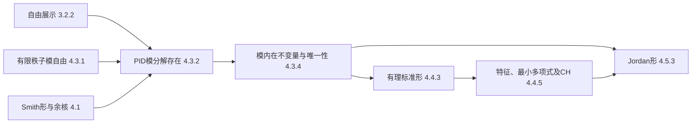
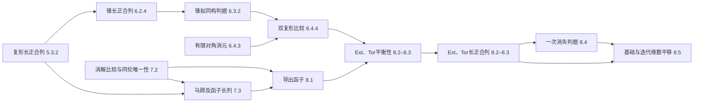

# 核心定理证明依赖审校表

本表覆盖第二卷第 1—7 章、第四卷第 6—9 章的选定核心结果，供后续数学复审定位已检查的证明链。未列入的结果和调用没有因此通过审核。

## 如何使用本表

每行给出稳定标签、适用范围、证明位置、直接前提及已读的代表性调用；完整陈述以源码为准。编号可能随排版变化，复审以标签定位。

“完整证明”“证明概要”“引用结果”“前瞻”说明结果在本书中的论证地位；“核读通过”“已补明”“待核读”说明本轮编辑工作。这两类状态互不替代，也不由选读星号或编译成功决定。选读星号表示默认学习次序中的地位；专题路线仍须选取其目标所需的结果。

只把实际支持证明的一步记为前提；回顾、前瞻与应用另记用途。后续调用列只覆盖已经阅读的段落，不能从检索命中或构建成功推断完整复审。

## 本轮结果与仍须追踪的范围

- 所列核心构造未检出需要改变主结论或修补循环证明的缺口。发现第二卷范畴等价判据的对象选择范围、张量右正合性外侧作用版本的同态条件需要写清，均已修订。第二卷§4.4的多项式余核到循环向量的计算复合、§4.5的有限维循环子空间版本已经补明；这两处的原分类结论保留。
- Smith形到模分类先证明关系核有限，再处理有限矩阵；算子模的挠性来自有限维迭代关系，未预借 Cayley–Hamilton 定理。矩阵子式的唯一性与模内在不变量的唯一性各有证明职责。
- 第四卷的Ext/Tor平衡性使用逐对角有限的双复形比较，不使用后置谱序列。消解可以无限延伸，但第n总次数仍只有有限个位置；左右模和Hom微分符号均须保留。
- 本轮实际输入中，第一卷A.1.6、A.1.11、A.1.12及11.2.2的陈述与证明已核读。第四卷第一编的交换范畴、广义元素、蛇引理、五引理及自然性仅核对所需版本；未由本轮宣布第1—4章完成复审。
- 本轮核心结果的正文证明无需外部文献定理填补。源码中的对照阅读引文不是本表已核验的外部版本；后续确实以外部一般结果为前提时，另记所用版本、定位与假设。
- 第三卷第13章、第15—20章等连续依赖链、三篇样章的全部训练和教学组织、全套课程执行表及目标读者试读还须继续。具体处理见[实质性修订问题记录](实质性修订问题记录.md)，未将它们记为完成。

## 核心论证顺序

下图画出部分主要论证的实际承接；每一箭头的适用条件仍须按后面的条目核对。

## 证明依赖与应用回读

| 位置 | 论证职责 | 本轮检查 |
|---|---|---|
| 第二卷§1.4的有理/Jordan标准形 | 前瞻：先在已给循环子空间或Jordan块上计算 | 主证明归第4章，不将第1章前瞻当作已证一般分解。 |
| 第四卷§6.4的有限长度Euler特征 | 数值应用：调用第二卷命题12.2.5长度可加性 | Grothendieck群等式本身先由两条短正合列与有限求和证明；有限长度应用不成为消解基础的先修。第二卷第12章原证明不属于本轮主体审校范围。 |
| 第三卷第15—21章与第四卷第6—9章 | 工具学习与交换代数应用 | 第三卷现有最小背景及其就地证明保留；详表逐步扩展到第三卷，不能从卷间来回阅读直接判为逻辑循环。 |
| 第四卷§11.2.1–2 | 一般截短判据与短正合列同调维数不等式 | 核读这两段的直接前提为本卷第9章和§11.1，不使用§11.2.3局部应用。§11.1已核代表性调用，尚非本轮整章复审。 |
| 第四卷§11.2.3 | 交换代数应用，可在学习第三卷后回读 | 已改标题与粗体阅读说明；调用第三卷17.1.2、17.1.3、17.2.3时明写交换Noether局部环及有限生成模，第三卷原证明不由此应用反向建立。 |
| 第四卷§18.4有界消解模型 | 调用第16章CE消解与第17章Hom正合性 | 双复形位于有界方向，逐对角有限；全忠实性在相应有界范畴中由屋顶演算和零伦引理直接证明。无界导出范畴中的Hom计算另采用局部化的大小约定。 |

## 第二卷第一至四章

2026-10-04：第一章第二轮修改后，重新核读下列维数、对偶及算子证明；补登广义特征直和、限制与商的零化关系，以及常见不变量不足以分类的正文命题。新增证明未预借第四章的标准形存在性。

### 第1章

| 记录号、结果与稳定标签 | 陈述及决定适用范围的假设 | 证明位置、直接前提与核对结果 | 后续调用及使用范围 | 本书证明状态；本轮审校 |
|---|---|---|---|---|
| B2-01 `b2:thm:vector-basis-extension`，1.1.4 | k为域，V为k向量空间；每个线性无关子集可扩充为基。V由有限S生成时，可只从S补入新向量。 | [§1.1](../Book2/Part01/Chapter01/Section0101.tex)，完整；任意维分支调用已证的跨卷结果并复述论证。 直接前提：有限分支调用 `b2:lem:finite-exchange`：S有限，故无关集大小受限。任意维分支调用第一卷A.1.6 `b1:prop:A-basis-extension`：k确为域，无关性只涉及有限关系；采用选择公理及Zorn引理。已核该跨卷陈述和证明。 | [§1.2](../Book2/Part01/Chapter01/Section0102.tex)泛函延拓与分离：先取U的基，再扩充到V。另[第五章习题解:117](../Book2/Part01/Chapter05/Chapter05.tex)在无限积空间上延拓泛函，属于训练调用。 | 通过。有限与任意维分支没有混用算法含义；无限基存在依赖已声明的选择原则。 |
| B2-02 `b2:thm:vector-dimension`，1.1.5 | k为域，V任意维；任意两组基等势，维数为共同基数，零空间维数为0。 | [§1.1](../Book2/Part01/Chapter01/Section0101.tex)，完整。 直接前提：有限分支用有限交换引理。无限分支用第一卷A.1.12 `b1:prop:finite-support-cardinality` 和A.1.11 `b1:prop:cantor-bernstein`：两基均无限，各展开支集有限且其并覆盖原基。有限支集计数采用AC；已核跨卷证明。 | [§3.1](../Book2/Part01/Chapter03/Section0301.tex)自由模秩不变性：R/m为域，取商后确得该域上的有限支集坐标空间。 | 通过。不能将此基数等式作有限整数式相减，源码已明确区分。 |
| B2-03 `b2:thm:rank-nullity`，1.1.12 | k为域，f:V→W线性，维数任意；`dim V = dim ker f + dim im f`，加法为基数加法。 | [§1.1](../Book2/Part01/Chapter01/Section0101.tex)，完整。直接前提：`b2:prop:quotient-basis` 用于U=ker f，以基的不交分拆给出维数加法公式；`b2:prop:linear-first-isomorphism` 给V/ker f与im f的同构，同构送基到基。证明不使用减法。 | [§1.2](../Book2/Part01/Chapter01/Section0102.tex)矩阵与转置同秩的正文推导：该处V、W均有限维，并先用对偶像与零化子公式。 | 核读通过。任意维公式成立，失效的是无限基数减法、消去及同维真子空间的排除；有限维单满性据此单独说明。 |
| B2-04 `b2:prop:dual-map`，1.2.8 | k为域，f:V→W、g:W→Z线性，维数任意；对偶复合逆序，`ker f*=(im f)^circ`、`im f*=(ker f)^circ`；f单射当且仅当f*满射，f满射当且仅当f*单射。 | [§1.2](../Book2/Part01/Chapter01/Section0102.tex)，完整。直接前提：`b2:prop:quotient-linear-universal` 将在ker f上为零的mu下降到V/ker f；`b2:prop:linear-first-isomorphism` 将该泛函转到im f；`b2:lem:functional-extension` 再将其延拓到W。反向单满性使用分离结论。 | [§1.2](../Book2/Part01/Chapter01/Section0102.tex)调用式 `b2:eq:dual-kernel-image` 推转置秩公式。第五章自然性使用对偶的已定义作用；仅复用记号不额外登记为本命题全部结论的必要依赖。 | 核读通过。任意维延拓继承基扩充与选择公理背景，不借有限维维数计数。 |
| B2-05 `b2:thm:double-dual`，1.2.9 | k为域，求值映射j_V:V→V**；V有限维时j_V同构。对任意维V、W及线性f:V→W，总有 `j_W f = f** j_V`。 | [§1.2](../Book2/Part01/Chapter01/Section0102.tex)，完整。 直接前提：`b2:prop:evaluation-injective` 给单射；有限维对偶基 `b2:prop:dual-basis` 使F∈V**对应有限和 `sum F(eps_i)e_i`，证明满射。自然性直接逐泛函计算，未用有限维。 | [§1.2](../Book2/Part01/Chapter01/Section0102.tex)有限维零化子维数；[§5.2](../Book2/Part01/Chapter05/Section0502.tex)自然双对偶同构证明：有限维只用于分量可逆。 | 通过。与依赖选基的V→V*同构分开；无限维不宣称求值映射满射。 |
| B2-06 `b2:prop:minimal-polynomial-divisibility`，1.3.5 | k为域，V有限维，T∈End_k(V)；存在唯一首一最小多项式\mu_T，且对任意p∈k[t]，`p(T)=0`当且仅当\mu_T整除p。零空间上\mu_T=1。 | [§1.3](../Book2/Part01/Chapter01/Section0103.tex)，完整。直接前提：零空间单独处理；非零时以基像记录自同态得到End_k(V)维数n²，故I,T,…,T^(n²)相关。域上首项可除，带余除法和多项式代入的乘法性给整除断言。未使用Cayley-Hamilton。 | [§1.3](../Book2/Part01/Chapter01/Section0103.tex)循环基证明用最小关系及带余除法。4.4.5重新从循环商识别\mu_T，不因记号重复就登记为对本命题证明的循环调用。 | 核读通过。n²仅为存在性的粗界，正文将更强的deg \mu_T≤n明确留待第四章。求值像k[T]与核(\mu_T)已区分。 |
| B2-07 `b2:prop:coprime-operator-decomposition`，1.3.10 | k为域，V维数任意，T线性；a,b∈k[t]互素且a(T)b(T)=0，则 `V=ker a(T) ⊕ ker b(T)`，两核均T不变。 | [§1.3](../Book2/Part01/Chapter01/Section0103.tex)，完整。直接前提：第一卷11.2.2 `b1:prop:euclidean-algorithm` 的Bézout结论；k[t]为Euclid整环，互素使gcd为单位，且a,b不可能同时为0。算子多项式彼此交换，使两个分量分别落在另一核中。已核跨卷Euclid证明。 | 本节在不同两特征值时作应用，并在 `b2:cor:generalized-eigenspace-decomposition` 中归纳处理分裂最小多项式。4.5.1先回引该广义核分解，再用PID分类确定各主空间的循环部分；没有把分类结论倒作本命题的前提。 | 核读通过。无需有限维、特征零或代数闭；后续调用未穷尽。 |
| B2-07a `b2:cor:generalized-eigenspace-decomposition`，1.3.11 | k为域，V非零有限维，\mu_T在k上分裂为不同(t-lambda_i)的正整数幂；V是各广义特征子空间的直和，并且G_i=ker(T-lambda_i I)^(a_i)。 | [§1.3](../Book2/Part01/Chapter01/Section0103.tex)，完整。直接前提：B2-07对互素因子个数归纳；各核T不变，使归纳可限制到分量。Bézout等式使属于其他特征值的分量不能被(T-lambda_i I)的幂零化，证明广义核与指定幂核相等。 | 本章小结将其与每个分量上的幂零作用相连；4.5.1已直接调用本推论得到实际广义核直和，随后分类各分量。Jordan分类存在性仍由第四章证明，不由本推论代证。 | 核读通过。未使用Jordan标准形或Cayley-Hamilton；基域不要求代数闭。 |
| B2-07b `b2:prop:restriction-quotient-polynomials`，1.3.13 | k为域，V有限维，U是T不变子空间；商算子良定义，qT=bar T q；限制与商的最小多项式的首一最小公倍式整除\mu_T，而\mu_T整除二者乘积。 | [§1.3](../Book2/Part01/Chapter01/Section0103.tex)，完整。直接前提：U不变保证商算子与代表元无关，`b2:prop:polynomial-action-subspace` 给多项式交织式。B2-06给下界；商的零化多项式先把V送入U，再由限制的零化多项式把像送到零，给乘积上界。 | 习题1.15用该正文命题比较幂零指数的max下界与和上界，再检验不变补空间下的相等和达到界的例子。 | 核读通过。兼容U=0、U=V及V=0；原习题的结构性证明已置于正文，原题替换为界的锐性训练。 |
| B2-08 `b2:prop:cyclic-polynomial-quotient`，1.4.3 | k为域，V非零有限维，T线性，v≠0，p=m_(T,v)；`k[t]/(p) → k[T]v`，类f↦f(T)v，为k线性同构，并将乘t对应为T。 | [§1.4](../Book2/Part01/Chapter01/Section0104.tex)，完整。 直接前提：最小向量关系的整除性质使核恰为(p)；`b2:prop:linear-first-isomorphism` 给商空间到像的同构。保持t作用直接由 `(tf)(T)v=T f(T)v` 得到，尚未假定一般循环分解。 | [§4.5](../Book2/Part01/Chapter04/Section0405.tex)Jordan链的等价表述使用这一循环商对应。本命题以V有限维为条件；后续在有限维循环子空间W=k[T]v上调用。 | 通过；后续调用已在Jordan链证明中明确限制到有限维W=k[T]v，见问题D-07。 |
| B2-08a `b2:prop:insufficient-similarity-invariants`，1.4.5 | k为任意域；J4⊕J3⊕J1与J4⊕J2⊕J2的秩、特征多项式、最小多项式相同，但不相似。 | [§1.4](../Book2/Part01/Chapter01/Section0104.tex)，完整。直接计算块的秩、上三角行列式及四阶块的向量关系，得到秩5、特征多项式t^8、最小多项式t^4；平方核维数5与6，由 `b2:prop:similarity-invariants` 排除相似。 | 正文用于说明完整块大小数据的必要性，层数图解释幂核差分；习题1.13改求此类块直和反例的最小阶数7。 | 核读通过。只计算已给定矩阵，不使用一般Jordan分类；原习题的关键反例已置于正文。 |

### 第2章

2026-10-04：第二轮修改后，核读固定向量空间上的算子模对应、交织命题与有限生成定义域的直和同态命题；关键证明已从习题移入正文。核、余核及泛性质所确定同构的交换图同步核对箭头方向。

| 记录号、结果与稳定标签 | 陈述及决定适用范围的假设 | 证明位置、直接前提与核对结果 | 后续调用及使用范围 | 本书证明状态；本轮审校 |
|---|---|---|---|---|
| B2-09 `b2:prop:quotient-module`，2.2.4 | R任意含幺环，M为幺性左R模，L≤M；陪集运算给M/L左模，商映射q满。对左模同态g:M→P，存在唯一g_bar使g=g_bar q，当且仅当g(L)=0。 | [§2.2](../Book2/Part01/Chapter02/Section0202.tex)，完整。直接前提：子模封闭性保证代表元变化仍落在L；g在L上为0保证下降良定义；q满保证唯一性。商模三角图及核、余核分解图的箭头已核对。非交换时没有移动标量次序。 | [§3.2](../Book2/Part01/Chapter03/Section0302.tex)展示的映射条件；[§6.1](../Book2/Part01/Chapter06/Section0601.tex)张量泛性质中取R=Z，关系子群恰被平衡映射零化。 | 核读通过。R不必交换或Noether；关系的全部生成元为0即可使其生成子模为0。 |
| B2-09a `b2:prop:operator-module-intertwiners`，2.2.2 | k为域，V、W为任意维k向量空间，T、S为其线性自同态；F:V→W为k[t]模同态当且仅当F为k线性且FT=SF。模同构当且仅当F可逆；在同一有限维空间上等价于矩阵相似。 | [§2.2](../Book2/Part01/Chapter02/Section0202.tex)，完整。直接前提：2.1的 `b2:prop:operator-module` 已在固定向量空间、延续原k作用的条件下证明双向对应。常数和t给必要性， `b2:prop:polynomial-action-subspace` 的多项式交织式给充分性。 | 正文将第一章的算子相似接到模同构；习题2.3改为幂零算子的自同态、自同构及与零算子之间两个方向的交织计算。 | 核读通过。一般交织判据无需有限维；仅矩阵相似的表述使用有限维。不依赖后续标准形分类。 |
| B2-10 `b2:thm:module-first-isomorphism`，2.2.8 | R任意含幺环，f:M→N为幺性左R模同态；`M/ker f ≅ im f`，同构为类m↦f(m)。 | [§2.2](../Book2/Part01/Chapter02/Section0202.tex)，完整。直接前提：B2-09用于L=ker f，先将值域限制为im f。诱导满射；零像类恰为零类，所以单射。双射模同态的逆线性先已核验。第二、第三同构的实际映射及其核也已写明，再调用第一同构。 | [§4.1](../Book2/Part01/Chapter04/Section0401.tex)Smith余核；[§4.4](../Book2/Part01/Chapter04/Section0404.tex)算子关系矩阵；[§6.4](../Book2/Part01/Chapter06/Section0604.tex)张量右正合；[§12.2](../Book2/Part03/Chapter12/Section1202.tex)Jordan-Hölder比较A/(A∩B)与M/B，已核各核像。 | 核读通过。后续均实际写明或可直接核对核与像，没有用模大小相同代替同构。 |
| B2-11 `b2:prop:regular-hom-endomorphism`，2.2.7 | R任意含幺环，M幺性左R模；Hom_R(R,M)经f↦f(1)与M作交换群同构。以复合为乘法，End_R(R)与R^op为保幺环同构。 | [§2.2](../Book2/Part01/Chapter02/Section0202.tex)，完整。直接前提：左线性迫使f(r)=r f(1)，参数必须在右侧，一般左乘不保左线性。End的加法与复合乘法已在使用前定义。当M=R，右乘u_a复合u_b等于u_(ba)，故必须取反环。 | [§11.2](../Book2/Part03/Chapter11/Section1102.tex)正则双模自同态；[§13.3](../Book2/Part03/Chapter13/Section1303.tex)Artin-Wedderburn从End_R(R)恢复R；[§16.3](../Book2/Part04/Chapter16/Section1603.tex)Morita反向取End_S(S)，环名替换正确。 | 核读通过。反环与左/右乘次序一致；未把一般Hom无条件当作左R模。 |
| B2-12 `b2:thm:module-product-universal`，2.4.4 | R任意含幺环，左模族(M_i)由集合I编号，N为左模；任意同态族f_i:N→M_i唯一合成为f:N→prod M_i，满足所有p_i f=f_i。I可无限或空。 | [§2.4](../Book2/Part01/Chapter02/Section0204.tex)，完整。 直接前提：直积逐坐标模结构；每个f_i线性保证合成线性，所有坐标值唯一决定f。没有有限支集限制。 | [§7.2](../Book2/Part01/Chapter07/Section0702.tex)足够多内射模：逐分量延拓后合成为到任意积的同态，无限族选择已说明用AC。5.3仅作范畴语言回顾，另记为回顾。 | 通过。与余积箭头方向不同；空指标集得到零模。 |
| B2-13 `b2:thm:module-sum-universal`，2.4.5 | R任意含幺环，左模族(M_i)由集合I编号，N为左模；任意g_i:M_i→N唯一合成为g:direct sum M_i→N，满足g iota_i=g_i。元素像由有限支集求和。 | [§2.4](../Book2/Part01/Chapter02/Section0204.tex)，完整。 直接前提：同时扩充有限支集到其有限并集，验证和；左作用逐项保持。每个直和元素为有限个分量嵌入之和，保证唯一性。 | [§7.1](../Book2/Part01/Chapter07/Section0701.tex)任意直和投射：各限制的提升由直和泛性质合并，qg=f逐分量验证。无限族提升选择采用AC。 | 通过。映出无限直积不能套用此结论；源必须为有限支集直和。 |
| B2-13a `b2:prop:finite-hom-direct-sum`，2.4.6 | R任意含幺环，M为有限生成左R模，(N_i)为任意左模族；任意M到直和的同态，其像落在同一个有限坐标子直和中；自然映射给直和Hom到Hom直和的交换群同构。 | [§2.4](../Book2/Part01/Chapter02/Section0204.tex)，完整。有限生成元像的支集取有限并，线性延拓控制全像；坐标嵌入及投影给两侧互逆，兼容自然性。零模、空族已包含。 | 原习题2.15的关键证明已移入正文；原题改为列有限无限矩阵、复合公式及有限行判据。正文坐标投影例说明无限生成定义域只保证逐点有限支集。 | 核读通过。一般只断言交换群同构；不要求R交换或整环。整环条件仅用于与共同非零零化标量的类比。 |

### 第3章

2026-10-04：第三章第二轮核对展示、分裂和图追踪中的构造动机及条件使用位置。自由模秩证明改为准确回引前卷极大理想与域商结论；关系符号与关系向量分开，有限展示比较、分裂修正及蛇引理障碍解释均置于相应构造之前。保留主干证明和习题，关键内容无需迁移。

| 记录号、结果与稳定标签 | 陈述及决定适用范围的假设 | 证明位置、直接前提与核对结果 | 后续调用及使用范围 | 本书证明状态；本轮审校 |
|---|---|---|---|---|
| B2-14 `b2:thm:free-module-universal`，3.1.2 | R任意含幺环，F为有基(e_i)的幺性左R模；对任意左模N与任意像n_i，唯一左线性f满足f(e_i)=n_i。反向：一族元素对全部N及指定像满足该性质，则它为F的基。 | [§3.1](../Book2/Part01/Chapter03/Section0301.tex)，完整。 直接前提：正向由唯一有限基展开定义。反向用坐标自由模E=R^(I)建立g:E→F与h:F→E；两边的唯一性分别保证hg、gh为恒等。未预先把待判元素族当作基。 | [§3.2](../Book2/Part01/Chapter03/Section0302.tex)生成族给自由满射；[§5.1](../Book2/Part01/Chapter05/Section0501.tex)自由-忘却伴随；[§6.1](../Book2/Part01/Chapter06/Section0601.tex)以R=Z构造自由交换群。 | 通过。指标I是集合；像的指定为集合数据，虚线延拓才是模同态。 |
| B2-15 `b2:prop:free-lifting`，3.1.3 | R任意含幺环，F自由左模，q:M→N满，f:F→N线性；存在g:F→M使qg=f。一般不唯一。 | [§3.1](../Book2/Part01/Chapter03/Section0301.tex)，完整。 直接前提：对每个基元选q的原像，再用B2-14线性延拓。无限基时选择原像族采用AC；延拓唯一性只相对于已选原像。 | [§3.2](../Book2/Part01/Chapter03/Section0302.tex)有限展示核，两个自由源和满射都满足条件；[§7.1](../Book2/Part01/Chapter07/Section0701.tex)自由直和因子投射性的反向构造。 | 通过。是投射模/消解之前的提升基础；不把整个提升称为唯一。 |
| B2-16 `b2:thm:free-rank-invariance`，3.1.4 | R非零交换含幺环，I、J为集合；R^(I)与R^(J)同构推出I、J等势。因此该类环上自由模的基数为其秩。 | [§3.1](../Book2/Part01/Chapter03/Section0301.tex)，完整。直接前提：第一卷命题10.2.7 `b1:prop:maximal-ideal-exists` 保证非零交换环有极大理想m，命题10.2.6 `b1:prop:prime-max-quotient` 保证R/m为域。逐坐标模掉m使自由基的像成为剩余域上的基；模同构对应mF与mG，商为(R/m)^(I)、(R/m)^(J)，再应用B2-02。非零性保证零理想为真理想，交换性用于域商；不重复两项前卷证明。 | [§4.3](../Book2/Part01/Chapter04/Section0403.tex)PID模自由秩唯一性：PID确非零且交换；[§8.1](../Book2/Part02/Chapter08/Section0801.tex)自由张量基及有限基情形的秩公式。 | 通过。不推广到零环或一般非交换环；没有提前使用张量积。 |
| B2-17 `b2:prop:module-presentation`，3.2.2 | R任意含幺环，M左模；有自由模展示R^(J)→R^(I)→M，末箭头满且像等于核，故M≅R^(I)/im d。指定n_i诱导M→N，当且仅当全部关系在N中成立；成立时唯一。 | [§3.2](../Book2/Part01/Chapter03/Section0302.tex)，完整。 直接前提：取M与关系模的全体元素为生成族；B2-14给自由映射。B2-10给商同构，B2-09把下降条件化为零化全部关系生成元。J可以无限；d不要求单射。 | [§4.3](../Book2/Part01/Chapter04/Section0403.tex)有限生成PID模：选有限生成族得到R^n→M，随后才证明核有有限基。 | 通过。不混同“所有模有展示”与“有限生成模有有限展示”。 |
| B2-18 `b2:prop:finite-presentation-kernel`，3.2.4 | R任意含幺环，M有限展示；任意有限秩自由满射p:R^n→M的核有限生成。左理想I满足R/I有限展示，当且仅当I作为左R模有限生成。 | [§3.2](../Book2/Part01/Chapter03/Section0302.tex)，完整。直接前提：给定有限展示q:R^s→M的核L有限生成；B2-15构造两方向提升u、v，qu=p、pv=q，小三角图已核方向。先解释往返翻译的差不改变M中的像，再用pvu=p、u(ker p)落在L，得到K=ker p=v(L)+(id-vu)(R^n)，两项均有限生成。环无需交换；没有调用拉回或Schanuel引理。 | [§7.4](../Book2/Part01/Chapter07/Section0704.tex)无限积环的循环商：有限支集理想不有限生成，故商不有限展示。已核这是具体例子的论证，非一般环分类。 | 通过。两个自由模的秩有限是有限生成结论的实质条件。 |
| B2-19 `b2:thm:split-exact-sequence`，3.3.4 | R任意含幺环，0→A-i→B-p→C→0短正合；p有截面、i有缩回、存在theta:A⊕C→B同构且theta iota_A=i、p theta=pi_C三者等价。 | [§3.3](../Book2/Part01/Chapter03/Section0303.tex)，完整。直接前提：从s定义theta(a,c)=i(a)+s(c)，正合性给满射；p theta=pi_C先读出C分量，再由i单射得到theta单射。theta给缩回；缩回把任意原像b修正为b-i r(b)，保持p值并落在ker r，对不同原像之差用ker p=im i消去。相配r、s满足四式，ir与sp为互补幂等投影。 | [§7.1](../Book2/Part01/Chapter07/Section0701.tex)投射等价刻画；[§7.2](../Book2/Part01/Chapter07/Section0702.tex)内射与左端短列分裂；[§13.2](../Book2/Part03/Chapter13/Section1302.tex)半单环判据；[§15.3](../Book2/Part03/Chapter15/Section1503.tex)投射覆盖核为零。 | 通过。比较给定短列时须保持i、p；抽象B≅A⊕C不是所陈述的分裂条件。 |
| B2-20 `b2:cor:free-quotient-splits`，3.3.5 | R任意含幺环，0→A→B-p→F→0短正合，F自由左模，则该列分裂。 | [§3.3](../Book2/Part01/Chapter03/Section0303.tex)，完整。 直接前提：B2-15沿满射p提升id_F得到截面；B2-19把截面转换为给定短列的相容分解。无需A自由或B有限生成。 | 第7章的投射模刻画将同一方法推广到投射商，实际证明改用投射定义与B2-19；这是推广，不能把B2-20误记成所有投射模证明的唯一依据。 | 通过。后续代表性用途已辨明，未穷尽具体训练调用。 |
| B2-21 `b2:lem:short-five`，3.3.6 | R任意含幺环，两行短正合，竖箭头alpha、beta、gamma与水平箭头交换；alpha、gamma均单射则beta单射，均满射则beta满射，均同构则beta同构。 | [§3.3](../Book2/Part01/Chapter03/Section0303.tex)，完整。 直接前提：单射分支将beta(b)=0传到商，再沿i取原像，最后用i'、alpha单射。满射分支先在商端提升，再将误差写成i'(a')并用alpha满射修正。全部条件在证明中实际使用。 | 3.4节首回顾它的图追踪方法；五引理的证明独立展开两个方向，属于方法承接，不把回顾句记为依赖已证短五引理的必要证明边。 | 通过。相同端点并不产生相容中间映射，源码反例保留该区别。 |
| B2-22 `b2:thm:five-lemma`，3.4.1 | R任意含幺环，两行各含五项的左模正合列形成交换图；f1满、f2与f4同构、f5单，则f3同构。 | [§3.4](../Book2/Part01/Chapter03/Section0304.tex)，完整。 直接前提：正合性和交换性逐次提升并修正；单射证明只用f1满及f2、f4单，满射证明只用f2、f4满及f5单。不调用蛇引理或分类定理。 | 本轮未核到后续正文中显式调用此标签的代表性证明；第四卷长正合列相关调用不在本表核读范围，不能据此写成“无后续调用”。 | 通过。没有把所有五条竖箭头同构作为前提。 |
| B2-23 `b2:thm:snake-lemma`，3.4.2 | R任意含幺环，上行A-u→B-v→C→0、下行0→A'-u'→B'-v'→C'正合，竖箭头alpha、beta、gamma交换；得到从ker alpha经ker beta、ker gamma、coker alpha、coker beta到coker gamma的正合列及delta。若u单或v'满，才可分别添首、末0。 | [§3.4](../Book2/Part01/Chapter03/Section0304.tex)，完整；证明在下一小节，一个proof内给完。直接前提：v满先选b，gamma(c)=0与交换性使beta(b)落在im u'，u'单使a'对给定b唯一；商去im alpha消除b的选择。delta(c)=0当且仅当c有来自ker beta的提升。小路径图核对原箭头方向，未把找原像画成逆同态；线性、四个中间位置及条件式端点逐项证明。正号约定为u'(a')=beta(b)时delta(c)=[a']。 | [§3.4](../Book2/Part01/Chapter03/Section0304.tex)蛇自然性用原构造选同一组提升并送到另一图；第三章习题连接映射计算属于训练，不能倒作正文唯一前提。 | 通过。并未在一般陈述中偷加u单或v'满；后续符号须保持同一约定。 |

### 第4章

| 记录号、结果与稳定标签 | 陈述及决定适用范围的假设 | 证明位置、直接前提与核对结果 | 后续调用及使用范围 | 本书证明状态；本轮审校 |
|---|---|---|---|---|
| B2-24 `b2:prop:smith-cokernel`，4.1.2 | R为PID，A为m×n矩阵，P、Q在R上可逆，D=PAQ已是Smith形，非零对角元d1,…,dr；`coker A ≅ direct sum R/(d_i) ⊕ R^(m-r)`，具体同构为原类x↦类Px。 | [§4.1](../Book2/Part01/Chapter04/Section0401.tex)，完整。 直接前提：Q满使D(R^n)=P(A(R^n))；P及逆对应关系子模。对角余核的坐标满射核为D(R^n)，用B2-10。当前命题以标准形已给定为前提，不依赖后面尚未证明的存在性。 | [§4.3](../Book2/Part01/Chapter04/Section0403.tex)模结构存在；[第四章习题解:58](../Book2/Part01/Chapter04/Chapter04.tex)矩形整数矩阵核、余核与P^-1坐标；[A04](../Book2/Appendices/AppendixA/SectionA04.tex)F5[t]余核。 | 通过。自由余核坐标来自零行m-r，核自由方向来自零列n-r，两者没有混同。 |
| B2-25 `b2:thm:smith-normal-form`，4.1.4 | R为PID，K为其分式域，A任意m×n矩阵（含零尺寸、零矩阵、秩亏）；存在P∈GL_m(R)、Q∈GL_n(R)使PAQ为非零对角元成整除链的矩形Smith形；非零对角元数等于rank_K A。 | [§4.1](../Book2/Part01/Chapter04/Section0401.tex)，完整。 直接前提：就地给Bézout幺模二行矩阵及其转置，PID使(a,b)为主理想且有Bézout系数。`b2:lem:pid-ascending-chain` 保证首行、首列或右下块的每次非整除修正共同造成的主元理想升链最终稳定；两次修正之间仅需有限次清行清列。对子块归纳，a整除全部子块项的条件使后续整除链保持。 | [§4.3](../Book2/Part01/Chapter04/Section0403.tex)PID模存在；[§4.5](../Book2/Part01/Chapter04/Section0405.tex)扩域后保留P(t)、Q(t)；[A01](../Book2/Appendices/AppendixA/SectionA01.tex)算法为Euclid环上的执行与应用，不是主证明位置。 | 通过。没有假定任意GL矩阵可拆为通常三类初等矩阵，也没有将任意PID的存在性称为可实现算法。 |
| B2-26 `b2:thm:smith-uniqueness`，4.2.4 | R为PID，A已有Smith形d1整除…整除dr且各非零；`I_j(A)=(d1...dj)`（1≤j≤r），j>r时为0。r及各d_j相伴类唯一；选正整数/首一等代表才获得唯一元素。 | [§4.2](../Book2/Part01/Chapter04/Section0402.tex)，完整。 直接前提：`b2:prop:determinantal-ideal-invariance` 由本节Cauchy-Binet引理完整证明，适用于交换环及幺模变换。标准形整除链保证全部j阶子式被前j项乘积整除，前j行列子式给反向包含。PID为整环，允许除去非零前项乘积。 | [第四章习题解:86](../Book2/Part01/Chapter04/Chapter04.tex)满行秩整数格指数；[A04](../Book2/Appendices/AppendixA/SectionA04.tex)多项式证书用子式独立复核。 | 通过。这里只是固定尺寸矩阵等价的唯一性；模分类的展示无关性仍须B2-29，不将两者混成同一证明。 |
| B2-27 `b2:thm:pid-free-submodule`，4.3.1 | R为PID，N≤R^n，n有限；N自由，且有至多n元的基。 | [§4.3](../Book2/Part01/Chapter04/Section0403.tex)，完整。 直接前提：对n归纳，第一坐标像为主理想(a)。a=0降到n-1；a非零取v，先生成N=Rv+N0，再由整环消去ca=0证明无关。证明不使用一般PID模分类。 | [§4.3](../Book2/Part01/Chapter04/Section0403.tex)有限生成M的关系核；[§12.4](../Book2/Part03/Chapter12/Section1204.tex)Noether反例中只将R=Z[s]的子模看作Z²子模，调用的PID是Z，并未误称Z[s]为PID。 | 通过。所证范围为有限秩环境，恰好足够建立有限生成模的有限展示；不擅加无界秩版本。 |
| B2-28 `b2:thm:pid-module-structure`，4.3.2 | R为PID，M有限生成；`M ≅ R^f ⊕ R/(d1) ⊕ ... ⊕ R/(ds)`，f、s≥0，d_i非零非单位且成整除链；挠子模正是循环商之和，M/t(M)≅R^f。 | [§4.3](../Book2/Part01/Chapter04/Section0403.tex)，完整，当前只承诺存在与挠部分描述。 直接前提：B2-17取有限自由满射；B2-27使关系核具有有限基，才得到有限矩阵。B2-25、B2-24对角化并解释余核；删去单位因子的零分量。R为整环，使自由坐标无挠。 | [§4.4](../Book2/Part01/Chapter04/Section0404.tex)算子V_T有限生成且挠，故自由部分为0；[§7.3](../Book2/Part01/Chapter07/Section0703.tex)PID上任意无挠模的平坦性，只逐个对其有限生成无挠子模用本定理。 | 通过。未从“有限生成”在一般环上推“有限展示”，也未把无穷生成无挠模判为自由。 |
| B2-29 `b2:thm:pid-elementary-divisors`，4.3.4 | R为PID，M有限生成，选不可约元相伴类代表p；`M ≅ R^f ⊕ direct sum M_p`，仅有限多个M_p非零，每个M_p为有限个R/(p^e)之和，e≥1。f、各p指数多重集及非单位不变因子相伴类由M同构类型唯一确定。 | [§4.3](../Book2/Part01/Chapter04/Section0403.tex)，完整。 直接前提：B2-28给存在；紧邻正文用ACC证明PID的素元分解并用显式Bézout公式证明CRT。B2-16对非零交换R给自由秩唯一。层商p^(j-1)M_p/p^j M_p为R/(p)向量空间，维数数出指数≥j的块；相邻差恢复多重集，再左补零组装整除链。 | [§4.4](../Book2/Part01/Chapter04/Section0404.tex)有理标准形唯一性；[§4.5](../Book2/Part01/Chapter04/Section0405.tex)Jordan主分量；[第四章习题解:95](../Book2/Part01/Chapter04/Chapter04.tex)同尺寸矩阵由余核恢复完整Smith形。 | 通过。唯一性取自模内部的无挠商与主分量层商，不依赖固定展示尺寸。 |
| B2-30 `b2:prop:operator-polynomial-matrix`，4.4.2 | k任意域，A∈M_n(k)，V_A为t作用等于A的k[t]模；`V_A ≅ coker(tI-A)`。求值映射eps:sum t^j v_j↦sum A^j v_j满，核恰为(tI-A)k[t]^n。 | [§4.4](../Book2/Part01/Chapter04/Section0404.tex)，完整。 直接前提：模结构已由多项式代入建立。先由te_j=Ae_j产生关系矩阵，再以逐次替换t为A说明约化目的；望远镜恒等式 `(t^j I-A^j)=(tI-A)sum t^(j-1-h)A^h` 给核的反向包含；常数向量给满射，再用B2-10。没有仅检查n条关系成立就断言它们生成核。 | [§4.5](../Book2/Part01/Chapter04/Section0405.tex)在k[t]及L[t]两次使用相应算子模展示；[§4.4](../Book2/Part01/Chapter04/Section0404.tex)把非单位Smith因子与算子不变因子联系。 | 通过。计算衔接O-11已补明：通过求值映射将Smith余核代表送回V，单位因子行跳过。 |
| B2-31 `b2:thm:rational-canonical-form`，4.4.3 | k任意域，V有限维，T线性；唯一首一非常数整除链f1,…,fs使V_T为各k[t]/(f_i)直和，V=0取空链；某基下T为各C(f_i)直和。相似当且仅当整除链相同。无需k无限或多项式分裂。 | [§4.4](../Book2/Part01/Chapter04/Section0404.tex)，完整。 直接前提：V的k基为有限k[t]生成集；每个v有有限迭代关系，故挠。k[t]为PID，B2-28、B2-29给存在唯一。带余除法给循环商基；`b2:prop:operator-similarity-modules` 把保持t作用的同构对应到矩阵相似。 | [§4.4](../Book2/Part01/Chapter04/Section0404.tex)在该基中计算特征和最小多项式；4.5使用主分量分解。F2不可约三次友矩阵例为应用，第一章claim为前瞻，均不倒作前提。 | 通过。分类存在性未预借CH或Jordan；循环向量恢复的计算衔接O-11已补明。 |
| B2-32 `b2:prop:operator-characteristic-minimal`，4.4.5 | k为域，V非零有限维，T的不变因子为首一f1整除…整除fs；`chi_T=prod f_i`、`\mu_T=f_s`、`dim V=sum deg f_i`，因此\mu_T整除chi_T且chi_T(T)=0。零空间另约定\(\chi_T=\mu_T=1\)。 | [§4.4](../Book2/Part01/Chapter04/Section0404.tex)，完整。 直接前提：B2-31的分块基；就地完整证明的 `b2:lem:companion-characteristic` 给各块特征多项式。循环商全模被g零化等价于f_i整除g，整除链使最小共同关系为f_s。 | [§4.5](../Book2/Part01/Chapter04/Section0405.tex)判定\(\chi_T\)与\(\mu_T\)是否分裂相同；[§4.5](../Book2/Part01/Chapter04/Section0405.tex)扩域后多项式不变。9.4明确给任意交换环上的另一证明，未被本证明预借。 | 通过。这是当前域上CH的主要证明位置；特征与最小多项式相同或已知，通常仍不足以决定相似类。 |
| B2-33 `b2:thm:jordan-canonical-form`，4.5.3 | k任意域，V有限维，T线性；存在由k中lambda构成的Jordan块直和，当且仅当chi_T在k上分裂，也等价于\mu_T在k上分裂；存在时每个特征值的块大小和重数唯一，仅排列可变。 | [§4.5](../Book2/Part01/Chapter04/Section0405.tex)，完整；零空间为空分解的平凡情况。 直接前提：`b2:prop:jordan-splitting-primary` 先回引B2-07a的广义特征空间核分解，再用B2-29分类各主空间内部的循环商；`b2:lem:jordan-chain-block` 按逆排(t-lambda)幂基取得上次对角1。唯一性就地计算核幂维数；异特征值块可逆性有有限几何级数公式。 | [§4.5](../Book2/Part01/Chapter04/Section0405.tex)块计数公式；[§7.3](../Book2/Part01/Chapter07/Section0703.tex)命题 `b2:prop:dual-number-flat` 中平方零算子的块只能1或2；[第7章](../Book2/Part01/Chapter07/Chapter07.tex)习题 `b2:ex:07-dual-numbers-flat` 另考查三次幂零算子，t²、t³均在任意k中分裂。 | 通过。不要求代数闭或特征零，只要求给定多项式在当前k中分裂；不可分扩域的幂指数另由B2-36处理。 |
| B2-34 `b2:prop:jordan-kernel-dimensions`，4.5.4 | k为域，V有限维，chi_T在k上分裂，lambda为特征值；c(0)=0、c(r)=dim ker(T-lambda I)^r。大小恰r的块数为 `2c(r)-c(r-1)-c(r+1)`，总块数c(1)，最大块大小为\mu_T中该一次因子指数。 | [§4.5](../Book2/Part01/Chapter04/Section0405.tex)，完整。 直接前提：B2-33证明中 `c(r)=sum min(r,d_j)` 的差分公式；本节主分量命题确定最大指数，友矩阵/块特征多项式确定代数重数。未先假定全部链基已求出。 | [§4.5](../Book2/Part01/Chapter04/Section0405.tex)可对角化判据：分裂且最大块大小1。七维核维数例为已核应用，可先判型但不能代替求换基矩阵。 | 通过。原型数据与实际链基计算明确分开；几何重数和代数重数含义正确。 |
| B2-35 `b2:prop:scalar-extension-invariant-factors`，4.5.6 | k⊆L为任意域扩张，A∈M_n(k)；在k[t]中取得的首一不变因子在L[t]中仍相同，故特征和最小多项式不变。不可约分解不作不变承诺。 | [§4.5](../Book2/Part01/Chapter04/Section0405.tex)，完整。 直接前提：B2-30把两域上的算子分别写成tI-A余核；B2-25给k[t]上的P,Q，其逆仍有k[t]条目，故在L[t]仍可逆。整除链、首一和正次数保持；B2-29唯一性识别因子，B2-32给特征多项式和最小多项式的公式。 | 本节推论 `b2:cor:similarity-descent` 用同一首一链证明任意域扩张下的相似关系可下降；其原理不是将某个复换基矩阵改写为实矩阵。第四章实复标准形习题现计算中央化子维数，跨卷后续未穷尽。 | 通过。改变的是空间k^n→L^n，不将原k^n直接冒充L向量空间；扩张可分性不需要。 |
| B2-35a `b2:cor:similarity-descent`，4.5.7 | k⊆L任意域扩张，n≥1，A、B∈M_n(k)；A、B在L上相似当且仅当在k上相似。 | [§4.5](../Book2/Part01/Chapter04/Section0405.tex)，完整。直接前提：正向以B2-35保留两矩阵的首一不变因子，L上相似使链相同，再用B2-31在k上分类；反向由k上可逆矩阵及其逆进入L后仍可逆。无需扩张有限、可分或k无限。 | 将原实复分类习题中的一般结论移为正文；原题以两种相似类型的中央化子维数比较继续训练扩域计算。 | 核读通过。下降的是相似关系的存在性，未断言给定的L上换基矩阵具有k中的条目。 |
| B2-36 `b2:prop:scalar-extension-elementary-divisors`，4.5.8 | k⊆L任意域扩张，q^e为A的一个初等因子，q在k[t]首一不可约，e≥1；若q在L[t]分解为互异首一不可约q_j的h_j次幂，则贡献初等因子q_j^(e h_j)，重复次数保留；若L分裂chi，所得指数为Jordan块大小。 | [§4.5](../Book2/Part01/Chapter04/Section0405.tex)，完整。 直接前提：B2-29及循环商带余基先写成C(q^e)；原换基在L上仍可逆。各q_j^(e h_j)互素，核与显式Bézout拼接证明CRT满射；不同原q已有的Bézout等式扩域后保持互素。 | [§4.5](../Book2/Part01/Chapter04/Section0405.tex)F2(s)中t²-s不可约、在s=u²后变成(t-u)²的例子，实际得到J2(u)。该例是应用，非一般命题的唯一依据。 | 通过。不可分情况下h_j可大于1，未误把所有扩域后块指数一律记为原e。 |

### 前瞻与主证明位置

| 稳定label与当前编号 | 本轮定位 | 角色及审校判定 |
|---|---|---|
| `b2:claim:rational-canonical-goal`，1.4.4 | [§1.4](../Book2/Part01/Chapter01/Section0104.tex) | 明确前瞻，主要证明为B2-31（4.4.3）。第一章只在已经给定循环向量时计算友矩阵；没有将一般循环分解当作前置工具。 |
| `b2:claim:jordan-canonical-goal`，1.4.6 | [§1.4](../Book2/Part01/Chapter01/Section0104.tex) | 明确前瞻，主要证明为B2-33（4.5.3）。第一章核维数计算只分析已给Jordan块，不反推任意算子已有这种分解。 |

以上两项不能登记为“第一章已完成证明”，也不能登记为第四章分类所调用的已证结果。

### 第4章的算法、结构与训练衔接

| 阶段 | 实际已核内容 | 训练或执行位置 | 边界与下一轮最小处理 |
|---|---|---|---|
| Smith存在性 | 4.1.4用Bézout幺模变换及主元理想ACC给存在；任意PID未默认有Euclid函数或有效表示。 | 4.2.4及[4.2.4小节](../Book2/Part01/Chapter04/Section0402.tex)明确要求相等、整除、商、Bézout系数和单位处理可执行。附录[算法A.1](../Book2/Appendices/AppendixA/SectionA01.tex)只在Z或有效域的一元多项式环上执行。 | 证明与执行没有混写。不增复杂度承诺；一般PID存在结论不等于程序输入协议。 |
| 原矩阵证书 | PAQ=D、P/Q可逆、非零对角元整除链三项共同核验；P更新为EP，Q更新为QF。 | [第四章矩形习题](../Book2/Part01/Chapter04/Chapter04.tex)同时恢复核、余核及原坐标；[对角修复习题](../Book2/Part01/Chapter04/Chapter04.tex)将diag(6,10)修成diag(2,30)。两份解答已逐项核读。 | 训练覆盖零列、单位项与不满足整除链的对角矩阵。P^-1作用于余核生成元，Q作用于核基，源码未混用。 |
| 矩阵唯一性到模唯一性 | 4.2.4恢复固定矩阵数据；4.3.4从模内在层商恢复非单位因子，允许不同尺寸展示。 | [同尺寸展示习题](../Book2/Part01/Chapter04/Chapter04.tex)证明余核同构与同尺寸幺模等价的对应，并用多一个单位项的展示解释不能删尺寸条件。 | 该桥已具备完整证明及训练，不需再增加同类定理或泛泛“分类唯一”说明。 |
| 算子关系到循环基 | 4.4.2得到V_A≅coker(tI-A)，4.1.2给多项式余核生成元P(t)^-1 e_i，4.4.3再取得各循环商基。 | [4.4说明段](../Book2/Part01/Chapter04/Section0404.tex)现已给出与求值映射的复合及循环链的相似换基公式。[A.4.2](../Book2/Appendices/AppendixA/SectionA04.tex)有直接给定循环向量v、构造S=(v,Tv,T²v)并检验TS=SC(f)的完整有理数算例。 | O-11已补明：保留各因子原行号，对deg(g_j)>0的行取v_j=eps(P(t)^-1 e_j)，再合并循环链为S；单位行跳过。 |
| 原基域到Jordan数据 | 4.5.3要求分裂，4.5.4用核幂维数判块；4.5.8保留扩域根重数h_j。 | [4.5七维例](../Book2/Part01/Chapter04/Section0405.tex)从差分取得4、2、1三块；[不可分扩域例](../Book2/Part01/Chapter04/Section0405.tex)区分原指数e与扩域后的e h_j。 | 判定块型与求具体链向量、换基矩阵是两项任务。正文已说明这一差别，不把核维数表称为完整换基算法。 |

## 第二卷第五至七章

审校对象：当前 TeX 源码。核读正文、所用直接输入和代表性后续调用；随后对U1、U2补明条件，正文编辑与构建见问题记录。编号取自本轮读取的 `tmp/build/Book2/Book2.aux`，该文件当时修改时间为 2026-09-26 22:52:25。标签与源码陈述逐项对应，编号识别不被当作数学证明。

本表记录 43 条具名结果。第6.3节主定理的自然性续证、反环交换因子公式、自由满射提供投射对象的存在性，以及第7.4节的 Ext/Tor 前瞻另作说明。后续调用仅列实际核读的代表，未穷尽同卷或跨卷调用；没有读过的调用明记待核读。没有给出全套数学正式定稿或接受结论。

### 两处条件及处理

- U1（问题D-08）：原§5.4.4未充分限定从本质满函子同时选择对象代表的范围。现已与第四卷的相应判据一致，分别给出等价的正向性质、已给代表和同构族时的反向构造、小范畴在选择公理下的等价判据；大范畴明确给定选择数据，或在指定更大宇宙中成为小范畴。有限维向量空间与矩阵范畴的例子亦写明宇宙范围。拟逆的态射计算和自然性证明保留。
- U2（问题D-09）：原§6.4.2的“相容的剩余作用”现明确包含原正合列同态保留变化因子的外侧作用，证明中据此验证张量同态的相容性。群版本、左右变量版本及后续Morita应用保留。只赋予双模结构而不要求原同态保留外侧作用不足：例如N=N''=k²，底映射为恒等，分别令右k[t]作用为(a,b)t=(b,0)和零作用，该底映射便不保留t作用。

### 约定与输入

各行中的环均含幺，模均幺性；左右侧别按行明确写出，未另假定环交换、Noether 或模有限。整环和 PID 按本书的交换含幺非零约定使用。范畴的 Hom 是集合；积与直和的指标是集合。默认张量积先是交换群，外侧模结构需要双模数据。

“完整”记录当前所给结果的数学论证，不表示所有更早基础输入都在此重新奠基。下列输入的相关陈述与使用段已核；更早的全套证明链没有无限递归重审。

| 输入 | 标签/编号及位置 | 本轮使用的精确条件与核读范围 |
|---|---|---|---|---|
| E01 自由模泛性质 | `b2:thm:free-module-universal` 3.1.2；[陈述及证明](../Book2/Part01/Chapter03/Section0301.tex) | 左模、有集合指标基，任意指定像族唯一延伸；核读有限坐标公式及反向基判据。以 \(R=\mathbb Z\) 构造自由交换群。 |
| E02 商模泛性质 | `b2:prop:quotient-module` 2.2.3；[陈述及证明](../Book2/Part01/Chapter02/Section0202.tex) | 左模子模 L；仅当 g(L)=0 时唯一下降。代表元无关、线性及唯一性已核。 |
| E03 第一同构 | `b2:thm:module-first-isomorphism` 2.2.7；[陈述及证明](../Book2/Part01/Chapter02/Section0202.tex) | M/ker f→im f；满射 g 时把 N/ker g 识别成 N''，不凭名字省略核。 |
| E04 短正合的核/余核 | `b2:prop:short-exact-kernel-cokernel` 3.3.2；[陈述及证明](../Book2/Part01/Chapter03/Section0303.tex) | 0→A→B→C→0 的左模列；pf=0 或 gi=0 给带指定映射的唯一分解，已核。 |
| E05 积/直和 | `b2:thm:module-product-universal` 2.4.3、`b2:thm:module-sum-universal` 2.4.4；[积](../Book2/Part01/Chapter02/Section0204.tex)、[直和](../Book2/Part01/Chapter02/Section0204.tex) | 全部为同一侧模，集合指标；积不要求有限支集，直和求值只用有限支集。两证明已核。 |
| E06 自由提升 | `b2:prop:free-lifting` 3.1.3；[陈述及证明](../Book2/Part01/Chapter03/Section0301.tex) | 自由左模沿左模满射提升；无限基逐项选原像采用选择公理，已明写。 |
| E07 分裂 | `b2:thm:split-exact-sequence` 3.3.4；[陈述](../Book2/Part01/Chapter03/Section0303.tex)及[证明](../Book2/Part01/Chapter03/Section0303.tex) | 截面、缩回、尊重 i/p 的直和同构三向；代表元无关及相容式已核。 |
| E08 有限维双对偶 | `b2:thm:double-dual` 1.2.9；[输入](../Book2/Part01/Chapter01/Section0102.tex) | 有限维 V 才要求 j_V 为同构；本轮核其基坐标满射段，第5.2节自然性另直接证明，不假定 W 有限。 |
| E09 PID 模结构 | `b2:thm:pid-module-structure` 4.3.2；[输入](../Book2/Part01/Chapter04/Section0403.tex) | 有限生成 PID 模；无挠时循环商部分为零，因而自由。已核此陈述、有限秩子模归约和当前使用方向；Smith存在、唯一性与分类的链条见同轮第二卷第一至四章记录。 |
| E10 环局部化 | 第一卷正文在本节引用为定理13.2.2 | 当前使用 R 交换、分母含1乘法封闭并允许0；第6.4节对模的等价、运算和零判据已就地重验。前卷环构造全证明仍列待独立复审，未把编号检索算数学通过。 |
| E11 选择/Zorn | `b1:thm:A-zorn`；[Zorn陈述](../Book1/Appendices/AppendixA/SectionA01.tex)、[概要](../Book1/Appendices/AppendixA/SectionA01.tex) | 非空集合偏序、每条链有上界；Baer 中逐项满足。第一卷 Zorn 本身给概要，序数及递归构造未在本轮正式重审；选择公理作为本书采用的基础输入。 |
| E12 有限展示核 | `b2:prop:finite-presentation-kernel` 3.2.4；[陈述及证明](../Book2/Part01/Chapter03/Section0302.tex) | M 有限展示，任意有限秩自由满射的核有限生成。已核 K=v(L)+(1−vu)R^n；只用于第7.4节反例的非有限展示判断。 |

### 代表性后续实质调用

以下只列已实读的代表，不是调用穷尽表。各“通过”仅表示该处使用本表结果的条件和推理吻合，不是给后续整个章节定稿结论。

| 代号 | 当前结果/位置 | 所用核心结果 | 实际核对 |
|---|---|---|---|
| C01 | `b2:thm:multiple-tensor-universal` 8.1.2；[调用处](../Book2/Part02/Chapter08/Section0801.tex) | 6.1.3、6.2.2 | R 在节首和定理中均为交换环，所有 M_j、N 为幺性 R 模。每次二重张量先得到 R 模，再由交换环的线性版本延伸双线性映射；不把一般非交换群版本直接当成 R 线性版本。 |
| C02 | `b2:prop:tensor-dual-symmetric-representations` 8.4.2；[调用处](../Book2/Part02/Chapter08/Section0804.tex) | 6.1.4 | k 为域、V/W 为 G 的 k 线性表示。ρ_V(g)、ρ_W(g) 是合法模同态；k 的交换性提供右/左配对；复合公式和 g^{-1} 保证表示公理。 |
| C03 | `b2:prop:exterior-alternating-universal` 9.1.4；[调用处](../Book2/Part02/Chapter09/Section0901.tex) | 8.1.2（由6.1.3、6.2.3建立） | R 交换，M/L 为 R 模。p=1 单独处理；p≥2 时直接调用第八章多重张量的R线性泛性质，再用交替性消去全部重复输入定义子模。无须特征不为二或 M 自由。 |
| C04 | `b2:prop:compact-projective-finite` 16.1.5；[调用处](../Book2/Part04/Chapter16/Section1601.tex) | 7.1.2 | P 的投射性和紧性均为此方向的假设。投射给分裂自由满射，紧性使截面进入有限子直和，再由相容 qs=1 得有限生成。未由单纯‘紧’推出一般模有限生成。 |
| C05 | `b2:prop:finite-projective-hom-tensor` 7.1.8；[主要证明](../Book2/Part01/Chapter07/Section0701.tex)、[第16章调用处](../Book2/Part04/Chapter16/Section1602.tex) | 7.1.7 | P 作为左 R 模有限生成投射，且有右 S 相容作用。对偶基系数在 p_i 左边；逆式中的 λ_i⊗f(p_i) 有有限和，右 R 作用给 λ_i(p)λ(p_i)，乘法次序吻合。完整陈述和证明现已前移至有限对偶基之后，不再由正文指向章末习题。 |
| C06 | `b2:lem:module-equivalence-structure` 16.3.1；[调用处](../Book2/Part04/Chapter16/Section1603.tex) | 5.4.6 | H 已给为左模范畴等价。零对象、集合直和与有限双积的指定映射被保留；同态加法用对角/余对角表达。核、余核的保存另给逐测试对象的证明，未假装由积保存自动推出。 |
| C07 | `b2:thm:morita-equivalence` 16.3.3；[调用处](../Book2/Part04/Chapter16/Section1603.tex) | 6.1.6、6.4.3、7.1.5 | P 是左 R 有限生成投射生成元，S=End_R(P)^{op}，P 因而是 (R,S) 双模。G=P_S⊗_S− 在第二变量使用直和及右正合版本；F=Hom_R(P,−) 使用 P 左投射而正合。额外 R 作用在固定 P 上，诱导 G 箭头自动保留它。 |
| C08 | `b2:thm:rees-fibres` 20.1.3；[调用处](../Book2/Part04/Chapter20/Section2001.tex) | 7.3.6 | 基环是 PID k[z]，不是非交换代数 A。A[z] 的非零标量多项式不零化非零向量系数多项式；Rees 子模无挠，于是平坦。不要求 Rees 代数有限生成。 |
| C09 | [双模函子的正文构造](../Book2/Part04/Chapter16/Section1602.tex)（无单独 proof 环境） | 6.3.1、7.1.4 | 当前双模为 _R P_S，变量 M 为左 R、N 为左 S；把6.3.1的环对互换后给 G=P⊗_S− 左伴随 F=Hom_R(P,−)。正文确有显式对应，属于实质调用，不因未在 proof 环境就降成纯回顾。 |

### 第五章

下表“位置/状态”的链接均指原始证明起点。同章直接前提用当前编号定位，可在相应行找到标签及证明。条件审校不把回顾、题解或前瞻自动计作直接证明前提。

| 记录号、结果与稳定标签 | 陈述及决定适用范围的假设 | 证明位置、直接前提与核对结果 | 后续调用及使用范围 | 本书证明状态；本轮审校 |
|---|---|---|---|---|
| 5.1.4 `b2:prop:free-forgetful-bijection` | \(R\) 为含幺环，\(X\) 为集合，\(M\) 为幺性左 \(R\) 模，\(F(X)=R^{(X)}\)。基上取值给出 \(\operatorname{Hom}_R(F(X),M)\cong\operatorname{Set}(X,U(M))\)；对 \(a:X'\to X,\ b:M\to M'\) 满足两变量自然性。 | [证明](../Book2/Part01/Chapter05/Section0501.tex)；完整，就地 proof。直接前提：E01；指定像族位于同一个左模 M，基指标为集合。 | 后续实质调用待核读。6.3 的自由/伴随说明是概念联系，不能据此虚记本命题为其全部证明的前提。 | 已核逆映射的存在唯一性及两种复合在每个 x' 上同值；不要求 R 交换或 M 有限。 |
| 5.2.2 `b2:prop:natural-isomorphism-components` | \(F,G,H:\mathcal C\to\mathcal D\) 为函子，\(\eta:F\Rightarrow G\) 自然。其为自然同构当且仅当各分量可逆；自然变换按分量复合。 | [证明](../Book2/Part01/Chapter05/Section0502.tex)；完整，就地 proof。直接前提：自然性定义；范畴的结合律、恒等与可逆态射消去。 | 5.2.4 的有限维结论实质调用本条；其两个函子均限制到有限维向量空间及全部线性映射。 | 分量逆的自然性由原方块左右复合逆得到；复合的方块逐步交换，未另作对象选择。 |
| 5.2.3 `b2:prop:natural-center` | R为含幺环，恒等函子作用在幺性左R模及全部模同态上；自然自变换环为Z(R)，自然自同构对应中心单位。 | [证明](../Book2/Part01/Chapter05/Section0502.tex)，完整。直接由正则模分量在1处的值c和全部f_m:R→M恢复η_M(m)=cm，再比较η_R(r)=rc与cr。逆向用中心条件验证R线性及自然性。 | 原习题5.4的一般结论前移；替代题将目标改为Ab，证明忘却函子的自然自变换环为R，并以矩阵单位区分加法线性和R线性。 | 核读通过。复合对应cd，未误写反环；逆变换仍自然。 |
| 5.2.4 `b2:prop:natural-double-dual` | \(k\) 为域，\(D^2(V)=V^{**},D^2(f)=f^{**}\)。求值映射 \(j_V\) 在全部 \(k\) 向量空间上自然；只在有限维子范畴上断言自然同构。 | [证明](../Book2/Part01/Chapter05/Section0502.tex)；完整，就地 proof。直接前提：E08 的有限维双对偶同构；5.2.2。 | 后续实质调用待核读。第四卷的双对偶说明常回顾 E08，不能仅因主题相同就指定本条为其直接前提。 | 自然性对任意维数直接求值验证；有限维只用于各 j_V 为同构，没有默认无限维时求值映射满射。 |
| 5.2.6 `b2:prop:no-natural-torsion-splitting` | Ab_fg为有限生成交换群及全部群同态的范畴；Q(A)=A/T(A)，q:Id⇒Q自然，各q_A有截面，却不存在自然截面族。 | [证明](../Book2/Part01/Chapter05/Section0502.tex)，完整。直接前提：4.3.2给自由挠商，3.3.5给自由商分裂；同态保持挠元保证Q良定义。Z→Z/2在Q下成为到零群的映射，与s_Z=id矛盾。 | 原习题5.5前移；替代题只限制定义域为同构群胚，目标仍为Ab_fg，用Z⊕C_m的剪切自同构循环置换全部截面。 | 核读通过。区分逐对象截面存在与自然截面存在；群胚只作定义域，未把非可逆商映射当作群胚态射。 |
| 5.3.3 `b2:prop:infinite-product-not-coproduct` | k为任意域，P=k^N配标准坐标嵌入j_n；该对象及指定嵌入不是这族k的余积。 | [证明](../Book2/Part01/Chapter05/Section0503.tex)，完整。直接前提：1.2.3泛函延拓；S=k^(N)，w=(1,1,…)不在S，先在S+kw定义ℓ(s+aw)=a，再延拓到P。 | 原习题5.9前移；替代题构造限制映射P*→k^N，证明满射及核与(P/S)*的自然同构。 | 核读通过。ℓ与零映射在全部j_n上取值相同却不相等，确实击穿唯一性；不以裸对象不同代替泛性质检验。 |
| 5.3.4 `b2:prop:universal-object-uniqueness` | 集合 \(I\) 指标的同一对象族在范畴 \(\mathcal C\) 中有两种积（或余积）实现。存在唯一保持全部投影（或全部结构映射）的同构。 | [证明](../Book2/Part01/Chapter05/Section0503.tex)；完整，就地 proof。直接前提：积/余积定义中的全族存在唯一性。 | 5.3 的拉回/推出唯一性使用同一论证方法；这是方法迁移，不是把本条仅适用于积/余积的结论直接套到任意泛对象。 | 两次泛性质给 u、v；逐投影或逐嵌入判定两个复合为恒等。空族也有效。 |
| 5.3.6 `b2:prop:module-pullback-pushout` | \(R\) 为含幺环；\(f:M\to P,g:N\to P,u:P\to M,v:P\to N\) 都是左模同态。拉回为 \(\{(m,n)\in M\oplus N:f(m)=g(n)\}\)，推出为 \((M\oplus N)/\operatorname{im}(u,-v)\)，配以指定投影或商后嵌入。 | [证明](../Book2/Part01/Chapter05/Section0503.tex)；完整，就地 proof。直接前提：E02 商模及 E05 直和；两个映射的共同目标/共同来源必须对应。 | 7.2.2 的反向证明实质复用推出式 D=(E⊕B)/im(f,-i)；那里另证 j:E→D 单射，没有错误地假定所有推出结构映射都单射。 | 已核分母是子模、推出映射消去全部且仅有的给定关系、分解的良定义与唯一性；不要求 u、v 单射。 |
| 5.3.7 `b2:prop:hom-detects-isomorphism` | 态射 \(u:P\to Q\) 对每个 \(T\) 诱导双射 \(\operatorname{Hom}_{\mathcal C}(T,P)\to\operatorname{Hom}_{\mathcal C}(T,Q)\)，则 u 为同构；任意自然变换 \(\operatorname{Hom}_{\mathcal C}(-,P)\Rightarrow\operatorname{Hom}_{\mathcal C}(-,Q)\) 唯一来自某个态射u的后复合；自然变换可逆当且仅当u可逆。 | [证明](../Book2/Part01/Chapter05/Section0503.tex)；完整，就地 proof。直接前提：局部小的范畴约定、自然性及恒等态射；只需在 T=Q、T=P 的指定步骤使用相应满/单性。 | 后续实质调用待核读。第四卷 Yoneda 是前瞻；本命题并未以尚未证明的 Yoneda 为前提。 | 已核 uv=1_Q 和 vu=1_P；由 α_P(1_P) 恢复所有 α_T。没有只比较 Hom 集基数。 |
| 5.3.8 `b2:cor:regular-module-detects` | R为含幺环，f为左R模同态；Hom_R(R,f)双射当且仅当f为同构。 | [证明](../Book2/Part01/Chapter05/Section0503.tex)，完整。直接前提：2.2.7正则模求值对应，在该对应下后复合就是f本身；双射模同态的逆保持模运算。 | 原习题5.13前移；替代题推广到自由模R^(I)，并在I为空、R非零时用0→R说明不能检测。正文以Z/2测试Z→Q失败对照量词。 | 核读通过。固定对象需有特殊能力，未由一般Hom命题任意删去全部测试对象的量词。 |
| 5.4.2 `b2:prop:fully-faithful-reflects-isomorphism` | 任意函子保持同构；全忠实函子还反映态射可逆，并从 F(X)≅F(Y) 推出 X≅Y。 | [证明](../Book2/Part01/Chapter05/Section0504.tex)；完整，就地 proof。直接前提：函子公理；全性提升反向态射，忠实性反映复合等式。 | 5.4.4 反向构造用于 η_X 可逆；其 F 在该方向已经假定全忠实。 | 两个方向的逆等式都已检查，不能只由全性推出反映同构。 |
| 5.4.4 `b2:thm:equivalence-criterion` | 局部小范畴间函子 \(F:\mathcal C\to\mathcal D\)。若F是等价，则全忠实且本质满；若F全忠实，且已为每个Y同时给定代表G(Y)及同构F(G(Y))→Y，则F是等价。若两范畴在所用宇宙中小，则在选择公理下，等价当且仅当全忠实且本质满。条件已补明，见U1。 | [证明](../Book2/Part01/Chapter05/Section0504.tex)；完整；U1规模条件已补明。直接前提：自然同构的分量消去；5.4.2；反向需要实际给出 Y↦(G(Y),ε_Y) 的同时选择。 | 5.4.6、C06 使用的是已给等价的正向性质；不依赖 U1 所涉及的从一般本质满数据重新选择拟逆的步骤。 | 正向的全、忠实、本质满均逐条证明；反向函子性、η/ε 自然性及可逆性齐备。在对象选择数据可得的范围内证明完整；一般类范围的选择条件已补明，见D-08。 |
| 5.4.5 `b2:prop:coordinate-choice-natural` | k为域；已为每个有限维V给定两族坐标同构c_V,d_V，H_c、H_d按相应坐标处理全部线性映射。 | [证明](../Book2/Part01/Chapter05/Section0504.tex)，完整。直接前提：矩阵拟逆构造及5.2.2；P_V=d_V^(-1)c_V，直接核对H_d(f)P_V=P_WH_c(f)，每个分量可逆。 | 原习题5.16前移；替代题核对三族选择的复合一致性，并计算具体二维矩阵及自然性等式。 | 核读通过。不同拟逆可以不同，但彼此自然同构；没有把HJ在对象上相等写成函子严格相等。 |
| 5.4.6 `b2:prop:equivalence-preserves-universal-objects` | 已给范畴等价 F 保持初始/终止对象及已存在的集合指标积、余积，且保留指定结构映射。 | [证明](../Book2/Part01/Chapter05/Section0504.tex)；完整，就地 proof。直接前提：5.4.4 正向的全忠实与本质满；积/余积定义。 | C06：等价保持零对象与直和，随后用双积的对角/余对角表达同态加法；核、余核另行实证，未由本条自动声称所有正合性。 | 对任意测试对象只选一个同构 F(T)→Y；全忠实提升各分量，泛性质给唯一分解。积与余积方向都已展开。 |

### 第六章

| 记录号、结果与稳定标签 | 陈述及决定适用范围的假设 | 证明位置、直接前提与核对结果 | 后续调用及使用范围 | 本书证明状态；本轮审校 |
|---|---|---|---|---|
| 6.1.3 `b2:thm:tensor-universal` | \(R\) 含幺，\(M_R,{}_RN\) 为幺性模，\(A\) 为交换群，b 双可加且 R 平衡。唯一群同态 \(\widetilde b:M\otimes_RN\to A\) 满足 \(\widetilde b(m\otimes n)=b(m,n)\)；带指定平衡映射的实现唯一到唯一相容同构。 | [证明](../Book2/Part01/Chapter06/Section0601.tex)；完整，就地 proof。直接前提：E01 取 R=Z、基 M×N；E02 取子群 H 为三类关系的生成子群。 | 6.1.4、6.2.2、6.2.3、6.3.1 的平衡映射构造已核；代表性后续 C01、C03 已核。 | 每类关系均被 b 零化；纯张量生成保证唯一；双向分解给唯一同构。所得首先是交换群，不擅加 R 模结构。 |
| 6.1.4 `b2:prop:tensor-maps` | 右模同态 f:M→M' 与左模同态 g:N→N' 诱导唯一群同态 f⊗g；它保持恒等、复合，并在单个变量的同态上可加。 | [证明](../Book2/Part01/Chapter06/Section0601.tex)；完整，就地 proof。直接前提：6.1.3；f、g 分别保留正确侧的 R 作用。 | 6.4.3 中 id⊗g 等箭头的构造；C02 的群张量表示，以 R=k 的交换域作用把两因子配成右/左模。 | 已核 f(mr)⊗g(n)=f(m)⊗g(rn)；复合与可加性在生成元上验证。 |
| 6.1.5 `b2:prop:tensor-free-coordinate` | 带集合基的右自由模 \(M=\bigoplus_i e_iR\) 与左模 N 满足 \(M\otimes_RN\cong N^{(I)}\)；域上的两组基给有限支集的唯一双指标张量坐标。 | [证明](../Book2/Part01/Chapter06/Section0601.tex)；完整，就地 proof。直接前提：6.1.3；右自由坐标唯一、每个元素有限支集；E05。 | 7.3.7 反向在任意右自由 F 的有限个坐标中识别 Ax=0；有限性来自所选 k_i 的有限支集，不是 F 有限秩。 | 正向平衡来自 (r_i r)n=r_i(rn)，反向有限和；相互复合确为恒等。域上系数可放入一个因子，不预用尚未赋予的外侧结构。 |
| 6.1.6 `b2:prop:tensor-direct-sums` | 右模族 (M_i) 与左模 N 满足 \((\bigoplus_iM_i)\otimes_RN\cong\bigoplus_i(M_i\otimes_RN)\)；固定右模、在左变量取直和亦成立。两版本均自然。 | [证明](../Book2/Part01/Chapter06/Section0601.tex)；完整，就地 proof。直接前提：6.1.3、6.1.4；E05；直和有限支集。 | 7.3.4 使用左变量的直和版本；C07 中 G=P_S⊗_S− 使用第二变量版本，侧别吻合。 | 正向确实落入直和；反向由包含映射合成；两复合在相应纯张量上为恒等。左右变量两个版本都给出。 |
| 6.2.2 `b2:prop:tensor-bimodule` | \({}_SM_R,{}_RN_T\) 为幺性双模，则 \(M\otimes_RN\) 有唯一 (S,T) 外侧作用 s(m⊗n)=sm⊗n、(m⊗n)t=m⊗nt；只给一侧就只得到该侧。 | [证明](../Book2/Part01/Chapter06/Section0602.tex)；完整，就地 proof。直接前提：6.1.3；(sm)r=s(mr)、(rn)t=r(nt)。 | 6.2.3、6.3.1 的外侧模结构；C01 的 R 线性张量泛性质，其 R 已明确交换。 | 双模相容保证各固定标量映射平衡；纯张量上检查全部模公理及两侧交换，随后由生成性推广。 |
| 6.2.3 `b2:thm:tensor-associativity-unit` | \({}_AM_R,{}_RN_S,{}_SP_T\) 为双模。指定重括号映射是自然 (A,T) 双模同构；M⊗_R R≅M、R⊗_R N≅N，并保留已有外侧作用。省略外侧结构时为群同构。 | [证明](../Book2/Part01/Chapter06/Section0602.tex)；完整，就地 proof。直接前提：6.1.3 两次；6.2.2；各相邻左右作用匹配及单位元。 | 6.4.3、7.3.3、7.3.4 的单位识别；C03 的多重张量扩张，R 为交换环且 L 为 R 模。 | 已核固定 p 后的 R 平衡、随后 S 平衡，反向两次取张量及双向恒等；单位逆用 m⊗1、1⊗n。 |
| 6.2.4 `b2:prop:bimodule-opposite-action` | 在左 S 模 P 上指定幺性右 R 作用且与 S 作用相容，等价于保幺环同态 \(R^{op}\to End_S(P)\)，r↦D_r。 | [证明](../Book2/Part01/Chapter06/Section0602.tex)；完整，就地 proof。直接前提：自同态环按复合乘法；右模结合律与双模相容。 | 已核 16.2 的 S=End_R(P)^{op}、ps=α_s(p) 右作用构造；不是将 End_R(P) 本身无反环地当作右标量环。 | D_rD_t=D_{tr}，逆向从反环同态恢复 (pr)t=p(rt)；加法与幺性均检查。 |
| 6.3.1 `b2:thm:hom-tensor-adjunction` | \({}_SP_R\)、左 R 模 M、左 S 模 N；Hom_S(P,N) 左 R 作用为 (rf)(p)=f(pr)。存在在 P、M、N 三变量自然的交换群同构 Hom_S(P⊗_R M,N)≅Hom_R(M,Hom_S(P,N))。 | [证明](../Book2/Part01/Chapter06/Section0603.tex)；完整，含[自然性续证](../Book2/Part01/Chapter06/Section0603.tex)。直接前提：6.1.3；6.2.2；本节式 (6.2) 的输入端 R 作用逐公理核对。 | C09 的 Morita 双模伴随已核；7.2.7 使用本节已证的限制标量—余诱导对应，再给对子模延拓的完整证明，不预用抽象保存定理。 | 主 proof 核 Φ/Ψ 的线性、平衡、互逆；自然性续证在 6.3.2 小节，M/N 方块及双模同态 c 的前复合都实读。整体完整，不把 proof 结尾的延后句当作省略。 |
| 6.3.3 `b2:prop:infinite-free-hom-tensor` | P=⊕_{n≥1}Ze_n。Hom(P,Z)⊗_ZQ→Hom(P,Q)的像恰为值具有一个共同正整数分母的同态；e_n↦2^{-n}不在像中。 | [证明](../Book2/Part01/Chapter06/Section0603.tex)；完整。张量有限和取分母乘积；反向用共同分母把同态倍数放入Hom(P,Z)。 | 原习题 `b2:ex:06-hom-tensor-finite-free` 改考有限秩算子及恒等算子，保留无限秩障碍的训练，正文不依赖习题。 | 已核共同分母的必要、充分两方向；有限自由条件与无限坐标逐值有限严格区分。 |
| 6.3.4 `b2:prop:scalar-change-adjunctions` | 保幺环同态 φ:R→S（不需单射）。左 S 模的限制标量有左伴随 S⊗_R−，右伴随 Hom_R({}_RS,−)，后者左 S 作用 (sf)(t)=f(ts)。 | [证明](../Book2/Part01/Chapter06/Section0603.tex)；完整，就地 proof。直接前提：6.3.1 取 P=S 的左伴随特例；右伴随在正文直接构造取值/反取值双射。 | 7.2.7 是 φ:Z→R 的余诱导模型，那里恢复相应公式并据此延拓；6.3 末的商环张量式是对 6.4.4 的前瞻，不参与本条证明。 | 已核 φ(r) 的插入位置、sf 的 R 线性、S 结合律、两逆及两变量自然性；无交换、自由或有限假设。 |
| 6.4.1 `b2:lem:tensor-cokernel` | 右 R 模 M、左 R 模 N 及其 R 子模 K；H 为所有 m⊗k 生成的子群。自然同构 \((M\otimes_RN)/H\cong M\otimes_R(N/K)\)。 | [证明](../Book2/Part01/Chapter06/Section0604.tex)；完整，就地 proof。直接前提：6.1.3、6.1.4；E02；K 必须为 R 子模。 | 6.4.3 取 K=im f=ker g。由原列正合、g 满射，K 是子模，N/K≅N''，所有条件满足。 | 逆公式独立于 n 的陪集代表，平衡与两复合完整；未假定 M⊗K→M⊗N 单射。 |
| 6.4.3 `b2:thm:tensor-right-exact` | 固定右 R 模 M，左模正合尾段 N'→N→N''→0 经张量仍为群正合尾段；固定左模在右变量亦成立。外侧模版本还需原同态保留额外作用，原同态保留外侧作用的条件已补明，见U2。 | [证明](../Book2/Part01/Chapter06/Section0604.tex)；完整；U2外侧条件已补明。直接前提：6.4.1；E03；6.1.4；式 (6.1) 的反环交换因子同构。 | 7.3.2、7.3.7、7.4.2 的正合尾段已核；C07 的额外 R 左作用位于固定 P 上，诱导箭头自动 R 线性，未受 U2 反例影响。 | K=im f=ker g；核由 m⊗k 生成且等于 id⊗f 的像；g 的满射保证末端满射。右变量通过 R^{op} 正确反转。群版本完整；外侧作用的同态相容条件已补明，见D-09。 |
| 6.4.4 `b2:prop:tensor-quotient` | I 为 R 的双边理想，N 左 R、M 右 R。自然同构 (R/I)⊗_R N≅N/IN、M⊗_R(R/I)≅M/MI，分别为左/右 R/I 模同构。 | [证明](../Book2/Part01/Chapter06/Section0604.tex)；完整，就地 proof。直接前提：6.1.3；6.2.2；商模构造。双边性使 R/I 成环并使相应商作用成立。 | 已核本节 R 交换、I/J 为理想时的 (R/I)⊗(R/J)≅R/(I+J)，及整数循环模计算；6.3 末仅提前说明其结论。 | 两个代表元无关检查、逆的商关系、双向恒等及正确侧的 R/I 线性均展开。 |
| 6.4.6 `b2:prop:localization-tensor` | R 交换，Σ 含 1、乘法封闭（允许 0），N 为 R 模。自然 Σ^{-1}R 模同构 \((Σ^{-1}R)\otimes_RN\cong Σ^{-1}N\)，逆 n/s↦(1/s)⊗n。 | [证明](../Book2/Part01/Chapter06/Section0604.tex)；完整，就地 proof。直接前提：6.1.3；6.2.2；本节分式等价、运算及零判据；E10 的环局部化。 | 6.4.7 用本条自然性与零判据证明局部化正合，再在7.3.10解释其平坦性；第三卷的推广仅列前瞻，未在首轮加入通过。 | 通分差式用 u(tn−sn')=0 消去，逆良定义；加法、局部标量及同态自然性逐式核；不假定 R→Σ^{-1}R 或 N→Σ^{-1}N 单射。 |
| 6.4.7 `b2:prop:localization-exact` | R交换含幺，Σ含1且乘法封闭；幺性R模短正合列局部化后仍为Σ^{-1}R模短正合列，允许0∈Σ。 | [证明](../Book2/Part01/Chapter06/Section0604.tex)；完整。6.4.6自然性及6.4.3给右端；分式零判据与原单射给左端。 | 7.3.10的平坦性说明与有限交局部化练习；原练习 `b2:ex:06-localization-injective` 改考有限交及无限交的反例。 | 同态代表无关已核；未先假定局部化环平坦，无循环证明。 |
| 6.4.8 `b2:cor:tensor-finite-presentation` | R交换含幺，M有R^m→R^n→M→0有限展示，N任意幺性R模。M⊗_RN自然同构于N^n/im A_N。 | [证明](../Book2/Part01/Chapter06/Section0604.tex)；完整。6.4.3与6.1.5将张量展示识别为坐标正合列，明确列向量及系数作用。 | 7.4.1计算(x,y)⊗(x,y)；原练习 `b2:ex:06-tensor-presentation` 改考模3、模4及Q上的关系坐标。 | 不要求N平坦；只使用右正合性，允许零次直和，商映射公式及自然性已核。 |

### 第七章

| 记录号、结果与稳定标签 | 陈述及决定适用范围的假设 | 证明位置、直接前提与核对结果 | 后续调用及使用范围 | 本书证明状态；本轮审校 |
|---|---|---|---|---|
| 7.1.2 `b2:thm:projective-characterizations` | 幺性左 R 模 P：投射 ⇔ 每个满同态 B→P 有同态截面 ⇔ P 为某自由左 R 模的直和因子。 | [证明](../Book2/Part01/Chapter07/Section0701.tex)；完整，就地 proof。直接前提：E01 用底集合构造自由满射；E06 自由提升（无限基用选择公理）；E07 分裂。 | 7.3.4、7.1.5；C04 的投射紧对象有限生成，其投射前提已在陈述中给定。 | 三个蕴含各有构造；最后从自由模的提升复合投影/包含返回 P。任意模的自由满射就地给出，故同时供应足够多投射对象。 |
| 7.1.3 `b2:prop:projective-sums-summands` | 集合指标的任意左 R 投射模直和投射；投射模的直和因子仍投射。 | [证明](../Book2/Part01/Chapter07/Section0701.tex)；完整，就地 proof。直接前提：投射定义；E05；无限族各分量提升的选择公理。 | 7.1.6 反向用有限自由模的直和因子投射；原自由模由 E06 投射，条件齐备。 | 各分量提升经直和泛性质合成，qg=f 在每个分量核对；直和因子用相容 i,p，非任意嵌入。 |
| 7.1.4 `b2:prop:hom-left-exact` | 左 R 模短正合 0→A→B→C→0 与任意左模 P、E，给出协变 Hom_R(P,−) 及反变 Hom_R(−,E) 的左正合群列；不声称末项满射。 | [证明](../Book2/Part01/Chapter07/Section0701.tex)；完整，就地 proof。直接前提：E04 核/余核的唯一分解；E02。 | 7.1.5、7.2.2 的 Hom 正合刻画；C09 的左正合性解释，额外 S 作用由输入端给定。 | 已核后复合 i 的单性、前复合 q 的单性；两种中间核分别经子模与商下降；非交换环上目标只取 Ab。 |
| 7.1.5 `b2:cor:projective-hom-exact` | 左 R 模 P 投射 ⇔ Hom_R(P,−) 保持所有短正合列的完整正合性 ⇔ 所有右端为 P 的短正合列分裂。 | [证明](../Book2/Part01/Chapter07/Section0701.tex)；完整，就地 proof。直接前提：7.1.4；投射定义；7.1.2；E07。 | C07：P 是左 R 投射生成元，故 Hom_R(P,−) 正合；有限生成性负责直和，未混入本条的正合条件。 | 任意满射与其核组成短正合列，故补 Hom 的末端满射确实覆盖全部提升问题；分裂只在 P 位于商端时断言。 |
| 7.1.6 `b2:prop:finite-projective-summand` | 左 R 模 P 有限生成且投射 ⇔ P 是某有限秩自由左模 R^n 的直和因子 ⇔ 某幂等自同态 E∈End_R(R^n) 的像；交换环上可写成幂等矩阵。 | [证明](../Book2/Part01/Chapter07/Section0701.tex)；完整，就地 proof。直接前提：E01 的有限自由满射；7.1.2/7.1.3；E07。 | 7.1.7、7.4.2 及 16.1 的有限投射生成元两个分解条件已核；它们的有限生成/投射假设都有明确来源。 | 截面存在由投射性，反向由标准基的有限个投影像生成；E=sq 与 im E⊕ker E 给幂等像等价；不要求环 Noether 或一般秩不变性。 |
| 7.1.7 `b2:prop:finite-dual-basis` | 左 R 模 P 有限生成投射 ⇔ 有有限 p_i 与左线性 φ_i:P→R，使 p=Σ φ_i(p)p_i；不要求 p_i 独立。 | [证明](../Book2/Part01/Chapter07/Section0701.tex)；完整，就地 proof。直接前提：7.1.6；有限自由模的左坐标及相容分裂 q,s。 | C05 的 P^*⊗_R M→Hom_R(P,M) 逆式，P 在陈述中左有限生成投射；已核 λ_i(p)λ(p_i) 的乘法次序。 | 双向均构造 q、s 且 qs=1；φ_i(p) 放在 p_i 左边，非交换时次序保持。 |
| 7.2.2 `b2:prop:injective-characterizations` | 左 R 模 E 内射 ⇔ Hom_R(−,E) 反向保持短正合列 ⇔ 所有左端为 E 的短正合列分裂。 | [证明](../Book2/Part01/Chapter07/Section0702.tex)；完整，就地 proof。直接前提：7.1.4；内射定义；E07；E02/5.3.6 的推出式。 | 后续实质调用待核读。7.2.3 的 Baer 证明可直接从内射定义出发，不把本条的线性排列误记为其必要前提。 | 反向商 D 的分母为子模；因 A⊂B，j:E→D 单射；缩回合成 g 延拓 f。没有预假定子模都有补模。 |
| 7.2.3 `b2:thm:baer-criterion` | 含幺环 R、幺性左模 E：E 内射 ⇔ 每个左理想 I⊂R 的每个左线性 f:I→E 都延到 R；等价于存在 e 使 f(a)=ae。检验全部左理想，不只有限生成者。 | [证明](../Book2/Part01/Chapter07/Section0702.tex)；完整，就地 proof。直接前提：内射定义；Zorn 输入 E11；环正则左模的映射由 1 像决定。 | 7.2.5 以 R=Z 检验所有整数理想，零理想另处理。跨卷的 Baer 应用未在本轮穷尽核读。 | 延拓对是集合偏序，非空，链并同态良定义；I={a:ab∈N} 是左理想；h'(n+rb)=h(n)+re 的代表无关、左线性及严格扩大均核。 |
| 7.2.5 `b2:thm:divisible-injective` | 交换群 D 按整数倍成为幺性 Z 模。D 内射当且仅当对每个 n>0，乘 n:D→D 满射；商群D/A也可除；0→Z→Q→Q/Z→0不分裂，虽中间项与右项内射。 | [证明](../Book2/Part01/Chapter07/Section0702.tex)；完整，就地 proof。直接前提：内射定义；7.2.3；整数理想均为 0 或 nZ。 | 7.2.6 与 7.2.8 取 D=Q/Z；已核可除性由有理数代表除以 n 得到，因而内射。 | 必要方向延拓 nZ→D 得 nx=d；充分方向取 nx=f(n)，给出全部理想的延拓；商群用代表元除法；假设缩回ρ:Q→Z会导致2ρ(1/2)=1，故不分裂，且不把可除误作无挠。 |
| 7.2.6 `b2:lem:qz-separates` | 交换群 A 中任意非零 a，有加法群同态 χ:A→Q/Z 使 χ(a)≠0。 | [证明](../Book2/Part01/Chapter07/Section0702.tex)；完整，就地 proof。直接前提：7.2.5 与内射延拓定义；循环子群的结构。 | 7.2.8 对 M 的底加法群检测每个非零 m；指标 H 正是 Hom_Z(M,Q/Z)，没有误改成 Hom_R。 | 有限阶 n>1 取 1/n+Z；无限阶取 1/2+Z；先在 <a> 给非零值再延拓，不要求 χ 为任何额外 R 线性。 |
| 7.2.7 `b2:lem:coinduced-injective` | R 含幺，交换群 D 是内射 Z 模，则 J=Hom_Z(R,D)，配左 R 作用 (rf)(s)=f(sr)，为内射左 R 模。 | [证明](../Book2/Part01/Chapter07/Section0702.tex)；完整，就地 proof。直接前提：D 的内射定义；6.3.4 的限制标量—余诱导对应。恢复公式后，用底交换群上的内射性延拓，再转回R线性映射。 | 7.2.8 用 D=Q/Z 已由 7.2.5 内射；每个 J 因而内射，随后用积泛性质合成延拓。 | sr 的次序、左作用结合律、α(m)(1) 与 χ(sm) 两逆、对子模限制的相容全部核；R 不要求交换。 |
| 7.2.8 `b2:thm:enough-injectives` | 任意含幺环 R 的每个幺性左模 M 都嵌入一个内射左模；不附加有限生成或 Noether 条件。 | [证明](../Book2/Part01/Chapter07/Section0702.tex)；完整，就地 proof。直接前提：7.2.5、7.2.6、7.2.7；E05 的积；集合指标 H 的各延拓选择用 AC。 | 同轮第四卷8.1、9.1的内射消解调用见B4-07-01、B4-08-01，版本与侧别已经匹配。7.2 末‘第四卷将构造内射消解’是前瞻，不作为本定理的反向依据。 | ι(m)_χ(s)=χ(sm) 左线性；非零 m 被 s=1 分量检测；任意积内射的分量延拓过程已证明。 |
| 7.3.2 `b2:prop:flat-exact` | 左 R 模 M 平坦 ⇔ −⊗_R M 把所有右 R 模短正合列变为短正合群列。 | [证明](../Book2/Part01/Chapter07/Section0703.tex)；完整，就地 proof。直接前提：平坦定义；6.4.3 的第一变量版本。 | 7.3.7 必要方向使用 K、R_R^n、I 的短正合列；所有对象为右模，M 为固定左模。 | 先由右正合性保尾端，再由平坦性补单射；任意单射与余核构成短正合列，反向覆盖定义。 |
| 7.3.3 `b2:prop:flat-torsionfree` | R 为交换含幺整环，M 为平坦 R 模，则 M 无挠。 | [证明](../Book2/Part01/Chapter07/Section0703.tex)；完整，就地 proof。直接前提：平坦定义；6.2.3 单位同构。 | 7.3.6 的必要方向，PID 本身是交换整环；不把此必要条件当作一般整环上的充分条件。 | 非零 a 的乘法 R→R 单射，张量后为 M 上乘 a；整环的交换性使所用乘法是对应的模同态。 |
| 7.3.4 `b2:thm:projective-flat` | 自由左 R 模平坦；平坦左模的集合直和与直和因子仍平坦；因此左投射模平坦。 | [证明](../Book2/Part01/Chapter07/Section0703.tex)；完整，就地 proof。直接前提：6.2.3 单位；6.1.6；7.1.2。 | 7.3.6 的有限自由子模、7.4.2 的反向投射⇒平坦均满足所需条件。 | 诱导映射分解为直和分量；直和单射逐分量检查；自由直和因子的投射刻画适用，不预用 Tor。 |
| 7.3.5 `b2:lem:tensor-directed-union` | 左 R 模 M 是一族有向子模之并，任意两项进入共同较大项；各项平坦则 M 平坦。 | [证明](../Book2/Part01/Chapter07/Section0703.tex)；完整，就地 proof。直接前提：6.1 的自由交换群/有限关系商构造；平坦定义。 | 7.3.6 取全部有限生成子模；两项进入其和，和仍有限生成，各项已由 PID 结构自由。 | 零张量的见证是有限个生成关系的整数线性组合，能放到单个后续子模；不先假定阶段张量映射单射。 |
| 7.3.6 `b2:thm:pid-flat-torsionfree` | R 为 PID、M 为任意 R 模，不要求有限生成。M 平坦当且仅当无挠。 | [证明](../Book2/Part01/Chapter07/Section0703.tex)；完整，就地 proof。直接前提：7.3.3；E09 的有限生成无挠模自由推论；7.3.4、7.3.5。 | C08 的 Rees 代数以 k[z] 为基环，k[z] 是 PID；仅用其无挠性，未偷加 Rees 有限生成。 | 无挠继承给有限生成子模，PID 结构定理应用时有限性确实满足；最后有向并恢复任意 M。 |
| 7.3.7 `b2:thm:flat-finite-relations` | 含幺环 R、幺性左模 M。平坦 ⇔ 每个有限关系 Σ a_i x_i=0 有有限分解 x_i=Σ_j b_ij y_j，且 Σ_i a_i b_ij=0；允许 t=0。 | [证明](../Book2/Part01/Chapter07/Section0703.tex)；完整，就地 proof。直接前提：7.3.2；6.4.3；6.1.5；自由右模映射与核/像构造。 | 推论7.3.8及定理7.3.9、命题7.3.10已核；7.4.2现直接调用推论7.3.8处理有限展示中的全部关系。 | 必要方向取右线性 ρ(e_i)=a_i；充分方向先按关系条数归纳同时分解，再处理 K⊂F，最后自由满射把任意 U⊂V 归约；系数乘法次序保持不变。 |
| 7.3.8 `b2:cor:flat-finite-relation-systems` | 任意含幺环上的平坦左模；有限条关系共用一组 y_j、b_ij，满足 x_i=Σ_j b_ij y_j 及 Σ_i a_li b_ij=0。 | [证明](../Book2/Part01/Chapter07/Section0703.tex)；由7.3.7的单关系分解及其证明中的关系条数归纳得到。 | 7.4.2的有限展示平坦推出投射直接调用本推论，不再调用未编号的证明步骤。 | 非交换环上系数乘法顺序为 a_li b_ij，不把列公式解释为左模同态。 |
| 7.3.9 `b2:thm:flat-ideal-criterion` | R 为交换含幺环，M 为 R 模。M 平坦 ⇔ 每个有限生成理想 I 的 μ_I:I⊗_R M→M，a⊗m↦am，均单射；不要求 R Noether。 | [证明](../Book2/Part01/Chapter07/Section0703.tex)；完整，就地 proof。直接前提：6.4.3；6.1.5；7.3.7。 | 第三卷局部检测/完备化调用待核读。7.3.10 的当前证明直接用 7.3.7，而非因排在本条后面就记成本条的调用。 | 给任意一条有限关系取 I=(a_i)，由单射及右正合性获得 K⊗M 原像，展开得有限关系分解；有限性在系数表，不在全环。 |
| 7.3.10 `b2:prop:localization-flat` | R 交换，S 含 1、乘法封闭，允许 0∈S。S^{-1}R 作为 R 模平坦。 | [证明](../Book2/Part01/Chapter07/Section0703.tex)；完整，就地 proof。直接前提：7.3.7；E10 环分式零判据；有限通分。 | 6.4.7已证局部化正合及6.4.6张量识别给另一依据；本条另用有限关系解释分母的作用；不将这一结论越界推成完备化平坦。 | x_i=r_i/s，uΣ a_i r_i=0；取 b_i=ur_i、y=1/(us)，得 x_i=b_i y 及 Σ a_i b_i=0；交换性与 0∈S 情形明确。 |
| 7.4.2 `b2:thm:fp-flat-projective` | 任意含幺环 R、幺性左模 M：有限展示且平坦 ⇔ 有限生成且投射。 | [证明](../Book2/Part01/Chapter07/Section0704.tex)；完整，就地 proof。直接前提：7.3.8 的有限关系组分解；E01；7.1.6；7.3.4。反例另用 E12。 | 后续实质调用待核读。无 Noether 环上的‘循环平坦不投射’反例已实读；证明未把仅有限生成当作有限展示。 | 有限展示一次给全部有限关系；x=By、AB=0 使 h:M→R^t 良定义且 gh=1。逆向 K 为有限自由模的投影像而有限生成，不需 Noether。 |
| 7.4.3 `b2:cor:noetherian-fg-flat-projective` | R左Noether，有限生成平坦左R模M投射。 | [证明](../Book2/Part01/Chapter07/Section0704.tex)；完整。最后坐标投影归纳证明R^n子模有限生成，再得M有限展示，用7.4.2。 | 随后的循环平坦非投射反例解释Noether及有限展示的必要范围。 | 不要求环交换；像为左理想，核归约为R^{n-1}子模，有限提升生成K。 |

### 具名结果以外的必要记录

| 项目 | 位置/当前编号 | 证明状态与依赖审校 |
|---|---|---|---|---|
| 反环交换张量因子 | `b2:eq:tensor-opposite-swap`，式 6.1；[就地验证](../Book2/Part01/Chapter06/Section0602.tex) | 完整的无编号验证。M_R、{}_RN 分别转为左/右 R^{op} 模；原平衡关系成为目标的反向关系，交换两次为恒等。6.4.3 的第一变量右正合性确实依赖这一方向转换。 |
| 投射对象存在 | [7.1.2证明中的自由满射](../Book2/Part01/Chapter07/Section0701.tex) | 完整构造：以 P 的底集合为基取自由左模，e_p↦p 给满射；E06 使其投射。不为没有独立标签的段落杜撰“足够投射”结果编号。 |
| 单位、余单位与三角恒等式 | [6.3节具体计算](../Book2/Part01/Chapter06/Section0603.tex) | 完整的正文计算。η_M(m)(p)=p⊗m、ε_N(p⊗f)=f(p)；两种复合分别在纯张量和 Hom 函数的每个 p 上为恒等。没有声称 η、ε 各自都是同构。 |
| 有限关系组同时分解 | [7.3.7证明中的加强版](../Book2/Part01/Chapter07/Section0703.tex) | 完整：按矩阵行数归纳，取 B=B_1B_2，保持非交换乘法顺序，统一得到 x=By、AB=0。7.4.2 所需工具在此已给，不依赖习题或第四卷。可为检索便利增设无编号说明或单独引理，但当前论证并未缺失。 |
| 局部化分式构造 | [6.4节构造](../Book2/Part01/Chapter06/Section0604.tex) | 对模的等价关系、加法/标量代表元无关和零判据已实读；不预假定局部化单射。环局部化的更早证明按 E10 如实留在未重审范围。 |
| Ext/Tor 三类刻画 | [7.4节前瞻](../Book2/Part01/Chapter07/Section0704.tex) | 明示为第四卷将证明的结果。第5–7章所核证明未使用它们作前提；尤其平坦判据和内射存在不是以尚未定义的派生函子循环证明。 |

## 第二卷第八章

本轮核读多线性、生成关系、对称商及表示作用的证明；Schur–Weyl 双中心化子等式仍为第五卷承担证明的前瞻，未把两种作用交换冒充该等式的证明。原增广商、三次对称化及扩张标量习题的关键内容已先告知作者并补入正文，原题分别改为理想幂及非可逆自同态、四次轨道计算、双数环换标量计算。单射性与中心化子的反例也在正文直接解释，相关习题改作进一步计算。

| 结果与稳定标签 | 陈述的适用范围 | 证明位置与依赖核对 | 本轮处理 |
|---|---|---|---|
| 定理8.1.2：多重张量泛性质，`b2:thm:multiple-tensor-universal` | 交换含幺环、有限多个任意幺性模；表示分别对各变量线性的映射，不要求自由性。 | [§8.1](../Book2/Part02/Chapter08/Section0801.tex)：三变量时先固定末变量，把前两变量合成为线性映射，再证明这些映射随末变量线性变化，得到第二次张量映射；按同一方法归纳一般有限因子数。纯张量生成性给唯一性，不误称源空间直积上的线性映射。 | 完整证明；保留原标签与编号。 |
| 命题8.1.4：张量基，`b2:prop:multiple-tensor-basis` | 各因子有任意集合指标的自由基；纯基张量构成基。有限秩公式只在各基有限时读作整数乘积。 | [§8.1](../Book2/Part02/Chapter08/Section0801.tex)：每个展开只涉及有限支集；坐标多线性映射检测独立性。非零交换环的秩含义回引3.1.4，不把有限基假设用于一般基结论。 | 扩大原命题至任意自由基，证明完整。 |
| 定理8.2.3：张量代数泛性质，`b2:thm:tensor-algebra-universal` | 交换含幺底环、任意幺性底模，目标为结合含幺R代数，结构标量在中心。 | [§8.2](../Book2/Part02/Chapter08/Section0802.tex)：多线性乘积逐次诱导映射，按直和合并；目标结合性保证连接乘积。一般模保留线性关系，只有自由基才给自由字代数。 | 完整证明；结构映射不要求单射。 |
| 命题8.2.5、8.2.6：商关系与齐次商，`b2:prop:algebra-relations-universal`、`b2:prop:homogeneous-ideal-quotient` | 结合含幺R代数按全部关系生成的双边理想取商；继承分次须理想齐次。 | [§8.2](../Book2/Part02/Chapter08/Section0802.tex)：核为双边理想；齐次生成关系展开两侧因子后逐次留在理想。Weyl算子模型只用作非零性证据，不把一个满足关系的模型视为全部关系已知。 | 完整证明；区分商代数存在与原分次下降。 |
| 命题8.2.7：增广一次商，`b2:prop:tensor-augmentation-indecomposables` | 任意幺性R模；增广I为全部正次分量，I²恰为次数至少二的分量，I/I²自然同构于M。 | [§8.2](../Book2/Part02/Chapter08/Section0802.tex)：零次投影给增广；纯张量分解成非空串说明I²的反向包含。无自由、平坦假设。 | 从重要习题补入正式命题及完整证明；替换题研究全部I的幂及一次商不能检测自同态可逆性。 |
| 定理8.3.2、命题8.3.3：对称泛性质与余不变量，`b2:thm:symmetric-algebra-universal`、`b2:prop:symmetric-power-universal` | 交换含幺底环、任意模；对称代数目标须交换；各正次对称幂表示对称多线性映射。 | [§8.3](../Book2/Part02/Chapter08/Section0803.tex)：相邻交换生成全部置换差；齐次关系理想在次数d的部分恰为这些差的子模。不变子模与此商分别定义。 | 完整证明；自然限制映射写明为包含后取商。 |
| 命题8.3.6、例8.3.7：对称化与三次轨道，`b2:prop:symmetrization-characteristic`、`b2:exm:cubic-symmetrization-orbits` | d!可逆统一保证平均同构；ke⊕kf的三次限制商映射矩阵为diag(1,3,3,1)。 | [§8.3](../Book2/Part02/Chapter08/Section0803.tex)：平均零化置换差，两复合为恒等；四个轨道的系数和支集给不变基。特征二仍同构，特征三有二维核，故阶乘条件充分但并非每个具体模上都必要。 | 完整证明及计算；四次替换题矩阵diag(1,4,6,4,1)已独立核算。 |
| 命题8.3.8：扩张标量，`b2:prop:tensor-symmetric-base-change` | R、S交换含幺，R→S保幺，M任意；S⊗T_R(M)及S⊗Sym_R(M)分别自然分次同构于新底环构造。 | [§8.3](../Book2/Part02/Chapter08/Section0803.tex)：先核对扩张代数乘法的平衡关系；两种泛性质分别构造往返同态，以一次生成元及结构标量核对互逆和自然性。不使用S平坦。 | 从重要习题补入正式命题及完整证明；原题改为双数环的非平坦扩张及诱导映射的核、像。 |
| 命题8.4.3：Hom张量表示，`b2:prop:hom-as-tensor-representation` | k域、V有限维、W任意；有群表示时，V*⊗W的求值同构与Hom共轭作用等变。 | [§8.4](../Book2/Part02/Chapter08/Section0804.tex)：底层自然同构调用6.3.2 `b2:prop:finite-free-hom-tensor`，恢复逆式但删除重复的完整坐标证明；纯张量直接核对等变性。Hom不变量等于等变映射本身不要求V有限维。 | 完整证明；明确旧同构与新增群结构的不同职责。 |
| 命题8.4.7、断言8.4.8：作用交换与Schur–Weyl，`b2:prop:commuting-tensor-actions`、`b2:claim:schur-weyl-preview` | 作用交换对任意域、任意空间成立；双中心化子断言限定有限维复空间、d≥1。 | [§8.4](../Book2/Part02/Chapter08/Section0804.tex)：两种复合在纯张量上相同，仅推出两个中心化子包含；平凡群反例表明包含可能严格。反向包含证明归第五卷第7.3节。 | 交换性已完整证明；双中心化子仍是明确前瞻，未登记为本卷已证。 |

## 第二卷第九章

本轮核读交替关系、外幂基、分次乘法、行列式及收缩的构造。已先告知作者，将外幂不保单射、域上楔积独立判据、收缩反交换和含单位序列的正合性从习题补入正文；原题改为全部外幂核、外幂与矩阵秩、楔乘与收缩的混合关系、单位理想的 Bézout 构造。额外导航与醒目标志未采用；一般正则序列的正合性仍由第三卷承担，第四卷另给第二证明。

| 结果与稳定标签 | 陈述的适用范围 | 证明位置与依赖核对 | 本轮处理 |
|---|---|---|---|
| 命题9.1.2：交替与反对称，`b2:prop:alternating-implies-skew` | 交换环、任意模、p≥1；交替必反对称。目标模能消去2是反向的充分条件，不断言对给定映射也是必要条件。 | [§9.1](../Book2/Part02/Chapter09/Section0901.tex)：两个位置代入x+y，交叉项相消；反向仅得2ℓ=0。p=1条件为空。 | 保留正确假设；矩阵判据区别A^t=-A与对角线为零，特征二仍须后者。 |
| 命题9.1.4、9.1.5：外幂泛性质与单射反例，`b2:prop:exterior-alternating-universal`、`b2:prop:exterior-injection-failure` | 交换环、任意模；外幂表示交替多线性映射。反例取任意域k、R=k[x,y]、I=(x,y)。 | [§9.1](../Book2/Part02/Chapter09/Section0901.tex)：张量泛性质后消去全部重复输入；反例用线性项的交替配对到R/I检测x∧y≠0，而∧²R=0由循环生成直接得到。 | 泛性质完整证明；反例补入正式命题，原题进一步算出∧²I≅R/I及全部核。 |
| 定理9.2.2、命题9.2.3：外幂基与分次交换，`b2:thm:exterior-power-basis`、`b2:prop:exterior-graded-commutativity` | 交换环上有限自由模有递增指标外幂基；任意模的齐次乘法有(-1)^{pq}符号，奇数次齐次平方为零。 | [§9.2](../Book2/Part02/Chapter09/Section0902.tex)：展开给生成，交替坐标求和检测每个系数；重复输入项按置换配对。奇数平方按纯楔积的同侧及交叉项直接消去。 | 不借行列式的未证结论，不除阶乘或2；解释检测映射的设计。 |
| 命题9.2.4、9.2.5：代数泛性质与直和，`b2:prop:exterior-algebra-universal`、`b2:prop:exterior-direct-sum` | 交换底环、任意模；目标结合含幺代数。一次映射的所有像平方为零。直和分解不需要模自由。 | [§9.2](../Book2/Part02/Chapter09/Section0902.tex)：u(x+y)²=0给反交换，重复因子给各次交替映射；直和的分次张量乘法移过中间两块产生(-1)^{bc}，核对结合性与双向生成元恒等。 | 说明只检查一组基上的平方不足够；符号由交换因子产生。 |
| 命题9.2.6：楔积与独立，`b2:prop:wedge-linear-independence` | 任意域k、任意维向量空间V、p≥1；非零纯楔积等价于输入独立。一般环上非零楔积不保证母模成基。 | [§9.2](../Book2/Part02/Chapter09/Section0902.tex)：相关组可解出一个输入；独立组先在有限span应用外幂基，再用与补空间的直和分解保留非零分量。 | 从习题补入正式命题，9.3与Plücker恢复调用它；原题研究∧^pA非零、秩及子式。 |
| 定理9.3.2、9.3.3：行列式乘法与Cauchy–Binet，`b2:thm:determinant-multiplicativity`、`b2:thm:cauchy-binet` | 任意交换环、有限自由模；矩形矩阵子式包含p=0及中间维数不足时的空和约定。 | [§9.3](../Book2/Part02/Chapter09/Section0903.tex)：秩一最高外幂的自同态给内在标量，换生成元只乘单位；复合与各阶外幂的矩阵乘法分别给两个公式。 | 无典范生成元不影响内在标量；非零行列式与单位区分明确，充分可逆判据交给9.4.1。 |
| 命题9.4.1、定理9.4.2：伴随与Cayley–Hamilton，`b2:prop:adjugate-identity`、`b2:thm:exterior-cayley-hamilton` | 任意交换环、n≥1；det单位等价于矩阵可逆，χ_A(A)=0。 | [§9.4](../Book2/Part02/Chapter09/Section0904.tex)：余子式展开，非对角项用重复行列的零行列式识别；adj(tI−A)系数满足递推，左乘A^j后相邻项抵消。 | 不未经核对就将矩阵系数多项式代入t=A；不使用本节结果反向证明第四章域上PID分类。 |
| 命题9.4.3：四维Plücker判据，`b2:prop:plucker-four-dimensional` | 任意域、二次外幂k⁴；可分解当且仅当p12p34−p13p24+p14p23=0。非零纯楔积才恢复相应二维子空间。 | [§9.4](../Book2/Part02/Chapter09/Section0904.tex)：必要性展开十二项配对；反向先选非零子式，前两行归一后另四个子式确定四个未知数，最后子式由关系保证。 | 解释构造目的及齐次坐标；平方判据须特征非二，不能覆盖所有域。 |
| 命题9.4.4、推论9.4.5：收缩与反交换，`b2:prop:exterior-contraction`、`b2:cor:contractions-anticommute` | 交换环、任意模M、λ:M→R线性；收缩是延伸λ的唯一次数−1分次导子，平方为零。两个收缩反交换。 | [§9.4](../Book2/Part02/Chapter09/Section0904.tex)：位置符号由分次乘法规则产生；重复输入与两次删除各按对消去。反交换由ι_(λ+μ)²展开，不除2。 | 反交换从习题补入正式推论；原题验证楔乘与收缩的混合关系及四维算子矩阵。 |
| 命题9.4.6：含单位序列正合，`b2:prop:koszul-unit-contractible` | 任意交换环、n≥1、a1单位；h=a1^{-1}e1∧满足dh+hd=id，Koszul各项正合。 | [§9.4](../Book2/Part02/Chapter09/Section0904.tex)：收缩乘法公式给等式，dξ=0时ξ=d(hξ)给像=核，含零次及最高次。 | 从习题补入正式命题，提供正合特例；原题通过Bézout组合处理单位理想及整数序列2,3。一般正则序列不在此预用。 |

## 第二卷第十章

本轮吸收概念辨析、构造动机及证明设计意见，不增加分段导航、醒目标志或比较表。已先告知作者，将一维平方类判据、特征二中相同极化型的反例、伴随算子的像与核关系及一维Clifford模型补入正文正式结果；原题改为平方类扩域、保持群计算、正定与不定型下的自伴随算子、代数自同构及幂等元训练。原有对角化、惯性定律及伴随命题编号保留。

| 结果与稳定标签 | 陈述的适用范围 | 证明位置与依赖核对 | 本轮处理 |
|---|---|---|---|
| 命题10.1.2、定理10.1.4：完美配对与正交补，`b2:prop:finite-perfect-pairing`、`b2:thm:orthogonal-complement` | 任意域、有限维空间；非退化性给出对偶同构。对称或反对称型的正交补有统一侧别；环境非退化时有维数及双正交公式，子空间限制型非退化时可分离正交直和。 | [§10.1](../Book2/Part02/Chapter10/Section1001.tex)：型将向量变为线性泛函；同构后接对偶限制，核正是正交补。存在补分量由限制型表示泛函，唯一性由交为零。 | 分开环境非退化、限制型非退化与正定；不把正交补自动当作普通线性补空间。 |
| 定理10.1.5：交替型标准形，`b2:thm:alternating-form-normal` | 任意域、有限维空间，允许整体退化及特征二。 | [§10.1](../Book2/Part02/Chapter10/Section1001.tex)：选非零配对、归一化为一，分离行列式为一的二维块，再向正交补归纳。 | 解释二维分离的设计，不除以二；特征二仍同时检查交替条件与块的非退化性。 |
| 定理10.2.2、10.2.4：对角化、平方类与惯性，`b2:thm:quadratic-diagonalization`、`b2:thm:sylvester-inertia` | 对角化及一维非退化型平方类判据限特征不为二的域；惯性定律原陈述限实数域。 | [§10.2](../Book2/Part02/Chapter10/Section1002.tex)：沿非零长度方向调整以消去配对，按维数归纳；一维等距为基缩放。正负指数通过定号子空间的最大维数确定。 | 一维判据并入既有正式定理及证明，原题以F5与有理数扩域应用替代。第一卷E.3及第三卷G.3仍回引原10.2.2、10.2.4，未改变其适用范围。 |
| 命题10.2.6：特征二的极化反例，`b2:prop:quadratic-char-two-polar-failure` | F2上的二维二次型q0=xy、q1=x²+xy+y²。 | [§10.2](../Book2/Part02/Chapter10/Section1002.tex)：展开极化得到同一可逆交替矩阵；三个非零向量上的取值排除等距。 | 反例提升为正文命题，原题比较等距群。非退化极化型仍不能恢复整个二次型。 |
| 引理10.3.5、定理10.3.6—7：反射、消去与分解，`b2:lem:orthogonal-reflection`、`b2:thm:witt-cancellation`、`b2:thm:witt-decomposition` | 特征不为二、有限维；反射仅要求反射方向非零长度，允许环境退化。消去与Witt分解要求有关二次空间非退化。 | [§10.3](../Book2/Part02/Chapter10/Section1003.tex)：反射由一维分量取负导出；对齐共同直线后限制到正交补，逐维消去。全各向同性子空间先嵌入相应双曲和，再用唯一性得Witt指数上界。 | 不以形式相减证明消去，不凭各向异性部分无零点直接断言多维上界；典范商型与选择补空间分开。 |
| 定理10.3.9：Witt群，`b2:thm:witt-group` | 特征不为二的域、有限维非退化二次型，按增添双曲平面取等价类。 | [§10.3](../Book2/Part02/Chapter10/Section1003.tex)：先构造一维<a,-a>的双曲基，再对角化得到相反型为逆元；良定义与各向异性代表唯一性分别核验。 | 将忽略双曲部分的目的放在定义前，群证明回用已有计算；附录B的Witt乘法不是本节前置。 |
| 命题10.4.4：内在伴随与像、核，`b2:prop:form-adjoint-operator` | 带对合的域、有限维空间、第一变量共轭线性而第二变量线性的非退化ε-Hermitian型，ε为正负一；不要求正定。 | [§10.4](../Book2/Part02/Chapter10/Section1004.tex)：共轭线性泛函空间与V等维，非退化配对给出表示同构，从而定义伴随；配对证明复合反序。限制泛函满射给正交补维数，再得像正交补等于伴随核及秩相同。 | 相关习题结论并入原正式命题，未将共轭线性泛函误当作普通对偶；替代题用不定型的非零自伴随平方零算子检验正定假设。 |
| 定理10.4.8、例10.4.9、命题10.4.10：Clifford构造与模型，`b2:thm:clifford-universal`、`b2:exm:clifford-hyperbolic-plane`、`b2:prop:clifford-line-models` | 构造与一维模型允许任意域及退化型；双曲平面矩阵模型限特征不为二。一般维数回引附录B只限特征不为二的有限维情形。 | [§10.4.3](../Book2/Part02/Chapter10/Section1004.tex)：张量泛性质后商去平方关系；q=0回到外代数。双曲平面模型先按字长约化，再用矩阵检测独立；一维模型由两次泛性质建立互逆同态。 | 不预设自然映射单射。实一维正、负、零模型的证明补入正式命题，原题比较代数自同构、幂等元及幂零元。 |

## 第二卷第十一章

本轮保留原结构与结果编号，吸收构造动机及证明设计意见；额外分段导航、醒目标志和新图表不采用。已先告知作者，把群代数泛性质、矩阵包络作用、多项式正则双模商模型及一般角块Hom对应补入正文正式结果；四道原习题改为商群关系、乘积代数的对角作用、截断多项式双模及具体角块复合计算，保留19题。一般Schur–Weyl等式仍为第五卷承担证明的前瞻。

| 结果与稳定标签 | 陈述的适用范围 | 证明位置与依赖核对 | 本轮处理 |
|---|---|---|---|
| 命题11.1.3—4：表示与结构常数，`b2:prop:algebra-modules-representations`、`b2:prop:structure-constants` | 任意域；模与表示对应不限维数，幺性及底域标量须一致。结构常数限有限维空间，允许零维；结合律为二次方程，固定乘法后的单位条件关于单位坐标线性。 | [§11.1](../Book2/Part03/Chapter11/Section1101.tex)：乘法由双线性及6.1.3张量泛性质线性化；交织等式在向量上就是模线性。三线性将基上的结合条件推广到任意输入。 | 第三输入指标改为ell，两个P及一个P逆分别说明输入与输出坐标；幂零性作为代数不变量，不以乘法表不同直接排除同构。 |
| 命题11.1.6：群代数泛性质，`b2:prop:group-algebra-representations` | 任意域、任意群及非零结合含幺目标代数；表示与群代数模的对应还包括零空间。 | [§11.1.3](../Book2/Part03/Chapter11/Section1101.tex)：群基向量的逆保证限制落入单位群，有限线性延拓保持乘法，基上唯一性给互逆。预复合群同态及后复合代数同态在每个基向量上核对自然性。 | 原命题扩充，原习题改为G/N商及全部关系核的计算。零空间单独处理，不从非零目标泛性质遗漏零模。 |
| 定理11.2.2、命题11.2.3：包络作用与正则自同态，`b2:thm:enveloping-bimodules`、`b2:prop:regular-bimodule-endomorphism` | 任意域、结合含幺代数；双模两侧k标量一致，不要求代数交换或有限维。 | [§11.2](../Book2/Part03/Chapter11/Section1102.tex)：a⊗bop作用为amb，复合的右侧次序为db；反向限制到两个因子恢复相容双模。正则模同态由一的像决定，双模条件进一步迫使该像在中心。 | 双边理想是正则Ae模子模在正文说明；右End作用使用复合反环，不以“左右交换”省略右模结合律。 |
| 命题11.2.4：正则包络模型，`b2:prop:regular-enveloping-models` | 任意域，矩阵模型n≥1；另为多项式环k[t]的正则双模。 | [§11.2末](../Book2/Part03/Chapter11/Section1102.tex)：矩阵单位张量读取E_jℓ并写入E_im，给出来源与目标基的双射；多项式情形用首一x−y除法证明全部核为(x−y)。 | 两模型完整证明移入正式命题；原题改为k×k包络核及k[t]/(t^n)的零化子，不能由单侧忠实性推整个包络作用忠实。 |
| 命题11.3.2—5：幂等分解与角块，`b2:prop:regular-orthogonal-decomposition`、`b2:prop:peirce-decomposition`、`b2:prop:idempotent-module-decomposition`、`b2:prop:corner-endomorphism` | 模投影及角块Hom对应覆盖含幺环与幺性左模；若为k代数，Hom对应还k线性。中心幂等元才给代数乘积，非中心时只作左模分解。 | [§11.3](../Book2/Part03/Chapter11/Section1103.tex)：右乘e是左正则模投影；乘左右幂等元分离Peirce块。Hom由e的像b∈eAf唯一决定；h_c∘h_b对应bc，端点相同时导出角环的反环。 | 一般Hom公式并入原11.3.5及完整证明，原题改为矩阵块的两个复合与像、核；实读16.3满幂等角环命题的回引，任意环版本与其假设匹配。 |
| 命题11.4.1、定理11.4.2、命题11.4.3：中心化子及具体模型，`b2:prop:commutant-endomorphism`、`b2:thm:regular-double-centralizer`、`b2:prop:tensor-factor-centralizers` | 一般算子族的包含及四撇等式不限维数；正则双中心化子不限维数；独立张量因子命题限定非零有限维空间。 | [§11.4](../Book2/Part03/Chapter11/Section1104.tex)：11.1交织条件识别End；正则算子由T(1)确定；副本投影使算子块对角，矩阵单位使全部对角块相等。有限张量基覆盖全部矩阵单位；无限维对角投影族给不满射反例。 | A≅L(A)、Aop≅R(A)区别明确；三角代数的标量交换子不能逆推不可约。两个习题只作已证理论的应用，不作正文证明的唯一前提；Schur–Weyl反向包含仍归第五卷7.3。 |

## 第二卷第十二章

本轮保留原标题、64个原标签与20道习题，吸收证明设计与概念区分意见，不增加分段导航、醒目标志或新图表。已先告知作者，将三角环的左右长度、整数模上的Fitting投影和局部环中不幂零的非单位补入正式命题，将任意正交幂等元族的长度界并入原命题。四道原题改为扩大上右双模、同时涉及二三五主分量的算术分解、形式幂级数的递推求逆及达到投影数上界的条件。Artin模不必有限生成，不采用审稿末尾把两者排成强弱链的表述。

| 结果与稳定标签 | 陈述的适用范围 | 证明位置与依赖核对 | 本轮处理 |
|---|---|---|---|
| 命题12.1.3、定理12.1.5：Noether判据与短正合列，`b2:prop:noetherian-submodules-fg`、`b2:thm:chain-conditions-exact` | 含幺环与幺性左模，不要求交换。交与像判别要求子模可比。 | [§12.1](../Book2/Part03/Chapter12/Section1201.tex)：不断添加生成元产生严格升链；反向以有限生成元的共同阶段捕获整个并。交、像稳定后用12.1.4检测中间链。 | 极大与最大、逐链稳定与统一长度界分清；Prüfer子群分类完整展开，不从Artin性推出有限生成。三角环的左右作用分别为K、k标量。 |
| 定理12.2.3—4、命题12.2.5—6：Jordan–Hölder及长度，`b2:thm:module-jordan-holder`、`b2:thm:finite-length-chain-conditions`、`b2:prop:length-additive`、`b2:prop:finite-length-endomorphism` | 含幺环与幺性左模；长度与合成重数只在合成列存在且唯一性证明之后使用。 | [§12.2](../Book2/Part03/Chapter12/Section1202.tex)：以选定合成列的层数强归纳，A/C与M/B交叉配对；Noether提供极大真子模，Artin迫使下降到零。短正合列拉回并拼接合成列。 | 不在Jordan–Hölder证明中预用长度。p²循环模与两个p阶模说明相同商层不保证分裂。12.2.5编号保留，供第四卷Euler–Poincaré调用。 |
| 命题12.2.8：三角环的左右长度，`b2:prop:triangular-left-right-length` | 有限域扩张k⊂K，次数d；左、右正则模，右长度解释为左反环模长度。 | [§12.2末](../Book2/Part03/Chapter12/Section1202.tex)：按列得到三个简单左层，按行得到上右块的d个k层及两个简单商。 | 原习题结论提升为正文完整命题；两侧有限长度不代表长度相等。 |
| 命题12.3.4：局部环判据，`b2:prop:local-ring-criterion` | 非零含幺环，不要求交换；单位须有两侧逆。 | [§12.3.1](../Book2/Part03/Chapter12/Section1203.tex)：先用幂等元使一侧逆变两侧逆，再证非单位集合的加法及两侧乘法封闭；极大左理想存在用第一卷定理A.1.4，链并条件就地核验。 | 非单位的有限和仍非单位作为正式结论，Krull–Schmidt可准确引用。局部性是环的性质，不等于局部化构造。 |
| 引理12.3.5、定理12.3.6：Fitting与局部End，`b2:lem:fitting`、`b2:thm:indecomposable-local-end` | Fitting要求有限长度幺性左模；局部End推出非零模不可分解不限长度，逆方向及非单位幂零需要有限长度。 | [§12.3.2](../Book2/Part03/Chapter12/Section1203.tex)：稳定核在2n处检测零交，稳定像给出校正项；不可分解使一个分量为零，有限几何和使1−f可逆。 | 核、像的稳定界是可取上界，不是最小指数。两方向的有限性作用分开，未将一般局部环的非单位都称为幂零。 |
| 命题12.3.7—9：正交投影及具体边界，`b2:prop:orthogonal-idempotent-decomposition`、`b2:prop:fitting-integer-projections`、`b2:prop:local-ring-nonnilpotent` | 投影细分不限长度；任意正交非零族的个数界限有限长度。算例为整数模Z/72乘二；反例为固定素数p的Z_(p)正则模。 | [§12.3末](../Book2/Part03/Chapter12/Section1203.tex)：任意有限子族像直和的长度不超过原模；算术模型具体核对核、像、两投影与逆；局部反例以严格降链及整环性质核验。 | 正交族不预设无限和有定义；三个原习题的教学内容回到正文，其中一个并入原命题，另两个新增在旧结果之后。 |
| 定理12.4.2、推论12.4.3：Krull–Schmidt与消去，`b2:thm:krull-schmidt`、`b2:cor:finite-length-cancellation` | 有限长度幺性左模；比较非零不可分解分量的同构类型和有限重数，不声称嵌入位置唯一。 | [§12.4.2](../Book2/Part03/Chapter12/Section1204.tex)：局部环有限和产生可逆项，修正左逆使A₁分裂嵌入B₁；在M中实际换入A₁后，两个补模都同构于M/A₁，才归纳。 | 不用一般消去律证明Krull–Schmidt；消去在唯一性之后由整数重数获得。 |
| 例12.4.4—5：存在性与唯一性失效，`b2:ex:no-indecomposable-decomposition`、`b2:ex:krull-schmidt-nonunique` | 无限乘积环的循环正则模；Z[√−5]及其非主理想I的Noether模。 | [§12.4.3](../Book2/Part03/Chapter12/Section1204.tex)：无限内部直和的有限支集排除单位元；I²=2R后选择行列式为二的矩阵，伴随条目属于I，逆映射的实际值域回到R²。 | 区分理想乘积I²与模直和I⊕I。选取行列式为二是构造方法，不是一般必要条件；Noether子模有限生成回引PID自由子模定理。 |

## 第二卷第十三章

本轮依据62项第二轮审稿意见核读半单性、反环及分类参数的证明；额外分段导航、醒目标志、图表和分级不采用。已先告知作者，将Schur逆命题和无限维反例、矩阵块中心与中心幂等元、多项式循环模无重因子判据从习题提升为正文命题；四道原题分别改为一般算子模与对角化、Q⊕Z的自同态及投影、限制标量后的有理函数模、有限矩阵环中的非中心幂等元计数，保留20题。Artin–Wedderburn唯一性的原普通论证改为完整正式推论，原标题及旧正式编号保留。无限直积的半单性必须指定标量环；极大左理想是单个循环生成元的核，不能一般地等同于整个简单模的零化子。

| 结果与稳定标签 | 陈述的适用范围 | 证明位置与依赖核对 | 本轮处理 |
|---|---|---|---|
| 定理13.1.2、命题13.1.3：半单模判据与稳定性，`b2:thm:semisimple-module-characterizations`、`b2:prop:semisimple-subquotients` | 含幺环与幺性左模；判据与子商、任意直和稳定性不限有限生成。有限生成判据另陈述为等价条件。 | [§13.1](../Book2/Part03/Chapter13/Section1301.tex)：第一处Zorn以有限关系保证链并仍直和且与N零交；第二处用循环生成元保证真子模链并仍真。补模把简单商实现为模内子模；投影后的简单子模不必是原坐标分量。 | p²不分裂扩张的证明集中保留一次；有限个生成元的支集并给出有限简单分解，供13.2正则模使用。 |
| 引理13.1.4、推论13.1.5、命题13.1.6：Schur及假设边界，`b2:lem:schur`、`b2:cor:schur-algebraically-closed`、`b2:prop:schur-hypothesis-counterexamples` | 一般简单左模的End为除环；标量结论要求代数闭基域和非零有限维简单模。 | [§13.1末](../Book2/Part03/Chapter13/Section1301.tex)：简单来源消去核、简单目标确定像；有限维与代数闭给特征值，非零核迫使f−λI为零。Q和k(t)反例完整证明。 | 不逆推End为除环的模必简单；不对无限维算子使用特征值存在性。块矩阵按复合解释，旧习题的讲解责任回到正文。 |
| 定理13.2.2、命题13.2.3：半单环及所有模分裂，`b2:thm:semisimple-ring-characterizations`、`b2:prop:semisimple-projective-injective` | 含幺环与全部幺性左模；不把一个半单模误当作在原环上投射或内射。 | [§13.2](../Book2/Part03/Chapter13/Section1302.tex)：正则模的任意直和是自由半单模，自由满射及商稳定性给全部左模半单；由1的有限支集得到正则模有限长度。分裂截面给提升，缩回给延拓，反向分别用恒等映射。 | 半单环的有限性与半单模可有无限分量分清；无限直积作自身正则模与换成F2或Z标量的例子不混用。 |
| 命题13.2.4：简单模零化子交，`b2:prop:simple-annihilator-intersection` | 非零含幺环，简单幺左模的一组同构类代表；代表族为集合。 | [§13.2末](../Book2/Part03/Chapter13/Section1302.tex)：左到右在1+L求值；右到左让非零s遍历S，并对每个s使用r↦rs的极大左理想核。 | 不采用Ann(R/L)=L这一错误简化；M2(k)列模给Ann(S)=0但单向量核非零非双边。Z的联合忠实简单作用不使扩张分裂，故半本原不推出半单。 |
| 定理13.3.1、命题13.3.3：Artin–Wedderburn及单Artin环，`b2:thm:artin-wedderburn`、`b2:prop:simple-artinian` | 含幺环；半单含零环空乘积。单环非零；单Artin命题使用左降链得到极小非零左理想。 | [§13.3](../Book2/Part03/Chapter13/Section1303.tex)：正则模End按简单类型分块，复合产生矩阵乘法；End_R(R)=Rop后取整体反环，再以转置得到Mn(Eop)。逆向左右正则模按列、行分解，非交换除环系数次序逐项核验。 | 不把单环等同于简单正则模或除环；全部极小左理想之和在右乘下封闭，因为右乘左线性、其像零或简单。 |
| 命题13.3.4—5、推论13.3.6：重数、中心幂等元及唯一性，`b2:prop:semisimple-multiplicity`、`b2:prop:matrix-centers-central-idempotents`、`b2:cor:artin-wedderburn-uniqueness` | 重数命题要求有限生成半单左模，Hom通过预复合成为右End(S)空间；中心模型为除环上的正阶矩阵环有限积，允许空积。 | [§13.3末](../Book2/Part03/Chapter13/Section1303.tex)：循环来源使Hom的坐标有限支集；Schur消去不同类型，每个同类型副本贡献一维。与矩阵单位交换恢复中心，极小非零中心幂等元内在确定块；End列模=Dop恢复系数环。 | 原唯一性普通论证纳入完整推论；重数和除环同构类型可恢复，不声称矩阵单位、补模或具体坐标典范。 |
| 命题13.4.1：有限维半单代数，`b2:prop:finite-dimensional-semisimple-algebra` | 有限维结合含幺半单k代数；平方和公式额外要求k代数闭。 | [§13.4](../Book2/Part03/Chapter13/Section1304.tex)：简单模是A的商，先得到其k维数有限，再用Schur标量推论。AW构造保持中心k标量，矩阵及列条目数给维数公式。 | 不删除一般公式中的dim_k D；实复数与四元数说明有限维不等于元素总数有限。 |
| 定理13.4.2、推论13.4.3：有限除环及有限半单环，`b2:thm:wedderburn-little`、`b2:cor:finite-semisimple-rings` | 除环本身有限；有限半单含幺环是有限域矩阵环的有限积。 | [§13.4末](../Book2/Part03/Chapter13/Section1304.tex)：环中心化子的左基按中心基展开给m_x整除n；其非零元给群中心化子。类方程减去非中心项迫使Φ_n(q)整除q−1，复单位根估计同一正整数得到矛盾。只用第一卷分圆多项式整数性与因式分解，不用其不可约性。 | 中心化子环与中心化子群分开；非交换维数乘法不假设系数交换；估计保留q=2及n=2的边界情形。 |
| 命题13.4.4：循环模及循环群代数判据，`b2:prop:semisimple-cyclic-polynomial` | k域，f非零非常数；模半单与商环半单均按同一商作用。循环群C_m要求m≥1。 | [§13.4末](../Book2/Part03/Chapter13/Section1304.tex)：互素不可约因子用第一卷CRT得到域商；重复因子给k[t]/(p²)的不分裂商。t^m−1与其导数互素，或在坏特征中成为非平凡p次幂。 | 一般循环判据由习题移入正文；第四章算子模联系不依赖一般Maschke，后者完整证明仍归第五卷1.3。 |

## 第二卷第十四章

本轮按65项审稿意见核读简单作用、根、提升及稠密性；不采用额外导航、醒目标志、关系图或人为分级。已先告知作者，将单位与矩阵模根提升、上三角根、幂零理想下无须有限生成的提升、完整有限插值关系判据及有限秩例的中心化子证明纳入正文。对应原题改为有限环单位计数、分块环根、由剩余有限生成性推原模有限生成及反例、除环上的具体插值、有限条目与有限秩的稠密子代数比较；一般不可删减生成组另用k⁴支持判据训练。保留22题与原标题、旧标签及旧正式编号。

| 结果与稳定标签 | 陈述的适用范围 | 证明位置与依赖核对 | 本轮处理 |
|---|---|---|---|
| 命题14.1.2：共同作用核，`b2:prop:radical-simple-annihilators` | 含幺环、幺性简单左模；作用落在加法群自同态环End_Z(S)，简单同构类代表为集合。 | [§14.1.1](../Book2/Part03/Chapter14/Section1401.tex)：回引13.2.4对每个非零向量的循环商核，核与全模零化子不混同；零环以空族交处理。 | 极大左理想商首先是模。E12平方为零而E21E12非幂零，解释单个幂零元与整个理想的差别。 |
| 定理14.1.3、推论14.1.4—5：单位与左右根，`b2:thm:jacobson-unit-criterion`、`b2:cor:jacobson-left-right`、`b2:cor:nil-ideal-radical` | 一般含幺环；判据对全部环元素量化。nil理想要求每个元素幂零，理想幂零额外给共同乘积指数。 | [§14.1.2](../Book2/Part03/Chapter14/Section1401.tex)：先证1−ab/1−ba双侧逆公式，再以左逆仍在1+J中得到另一侧逆；反环单位相同给右极大理想交。 | Jacobson引理写进正式单位判据。理想左乘封闭性保证rx仍幂零，不由x自身幂零冒推。 |
| 命题14.1.6—7：商与矩阵根，`b2:prop:radical-quotient`、`b2:prop:matrix-radical` | 双边理想商；n≥1。任意环不加链条件。 | [§14.1.3](../Book2/Part03/Chapter14/Section1401.tex)：商环简单模为被I零化的原简单模；Mn(R)简单模通过E11角环与R简单模对应，E1i读取、Ei1写回给同构，最后逐条目取共同核。 | 正式命题含简单模同构类对应；测试族缩小允许商根严格增大。 |
| 命题14.1.8：有限长度零交判据，`b2:prop:finite-length-radical-zero` | 有限长度幺性左模；一般环。 | [§14.1末](../Book2/Part03/Chapter14/Section1401.tex)：DCC压缩为有限个极大子模的零交，嵌入有限简单直和，用13.1.3子模半单；R/J的R与商环子模相同。 | 不删除有限长度，不把换系数环当作自动改变半单性。 |
| 推论14.1.9、命题14.1.10：单位提升与上三角根，`b2:cor:units-lift-radical`、`b2:prop:triangular-radical` | 含幺环，I⊆J(R)，矩阵n≥1；上三角例k域，n≥1，非零根最小指数n适用n≥2。 | [§14.1末](../Book2/Part03/Chapter14/Section1401.tex)：商逆提升后分别构造左、右逆；矩阵根公式给矩阵提升。严格上三角乘积的递增指标界及非零矩阵单位链核对幂零指数，坐标商简单模共同忠实排除额外根。 | 两项原习题重要结果改为完整正文；新题改变环、计算单位群大小或比较分块与逐位置上三角的指数。 |
| 定理14.2.1、推论14.2.2、命题14.2.3：非交换Nakayama与提升，`b2:thm:noncommutative-nakayama`、`b2:cor:nakayama-generators`、`b2:prop:nakayama-surjectivity-test` | 有限生成幺性左模与双边理想I⊆J(R)；I幂零时无需模有限生成。映射只需目标有限生成。 | [§14.2.1—2](../Book2/Part03/Chapter14/Section1402.tex)：自然数最小生成组，右乘封闭使系数落在I，1−a为单位便可删生成元；M/N有限生成无需N有限生成。幂零版本逐次代入到I^r=0。 | 模k(t)的零点阶下界说明有限生成不可去；满射判据中的核可能在来源IP里全部消失，不能检测单射。 |
| 命题14.2.4—5：最少生成元，`b2:prop:local-minimal-generators`、`b2:prop:semisimple-top-generators` | 局部环上用左剩余除环维数；一般公式另假设R/J为有限个正阶除环矩阵块，M有限生成。 | [§14.2.3](../Book2/Part03/Chapter14/Section1402.tex)：左系数非零时以左逆解向量，任意基提升生成。B正则模每类容量n_i，由半单商分裂和13.3.4重数唯一性得到m_i≤rn_i，再取最大上整。 | k×k不可删减不等于最少；Z/J(Z)不半单；M2(k)的S³例先独立计算容量及最少两个生成元。 |
| 定理14.3.4：半本原次直积，`b2:thm:semiprimitive-subdirect` | 非零含幺环；本节为左本原，不能一般改右本原。 | [§14.3.2](../Book2/Part03/Chapter14/Section1403.tex)：Ann(R/L)是L中最大双边理想，商环才使简单模忠实；核之交为J。反向每坐标满射保留根包含，整体单射排除非零共同核。 | 单个忠实与一族共同忠实的量词分开；Z→各Fp对有限坐标可用第一卷CRT，不能推无限直积满射。 |
| 定理14.4.2、推论14.4.3—4：稠密与关系判据，`b2:thm:jacobson-density`、`b2:cor:density-finite-dimensional`、`b2:cor:density-compatible-relations` | 含幺环、幺性简单左S，右D=End_R(S)op；有限组关系在D上。全矩阵商要求dim_D S有限。 | [§14.4](../Book2/Part03/Chapter14/Section1404.tex)：Lv_n=0使末值由前值确定，归纳满射给F:S^(n−1)→S，再按坐标限制分解为自同态，违反右无关；误差在L作用中修正。一般关系使有限span上的T良定义，取基归回稠密性。 | 有限拓扑为有限点精确一致，基邻域相等及交可合并。有限基决定全算子，右坐标给Mn(D)而非Mn(Dop)。完整关系推论取代原习题讲解责任。 |
| 定理14.5.1、命题14.5.2：Burnside与无限维反例，`b2:thm:burnside-matrix-algebra`、`b2:prop:finite-rank-density-counterexample` | Burnside为代数闭域上的非零有限维空间及含恒等的不可约k子代数，不要求特征零；有限秩例为任意域及无限维空间。 | [§14.5](../Book2/Part03/Chapter14/Section1405.tex)：13.1.5使自同态为标量，14.4.3覆盖有限基；无限例用秩一算子证简单及标量中心化子，有限坐标泛函构造插值，可数基右移在任意标量扰动后像无限维。 | 有限维在特征值与全算子两处使用。实复数及有理数二次域反例恢复正确D；标量中心化子、双中心化子与有限拓扑闭包不混同。 |

## 第二卷第十五章

本轮依据93项第二轮审稿意见核读有限维代数、根与基座、幂等元提升、投射覆盖及基本角的论证，吸收证明思路和实际理解障碍，不采用额外分段导航、醒目标志、图表或分级。已先告知作者，将子商的根与基座公式及反例、分别提升不相容、非满角的高次根幂反例、同箭图不同代数改为完整正文命题；幂等元提升的整数反例并入原定理，目标同构时每个覆盖提升可逆并入原唯一性定理。六道原题改为三角子商中新基座、完整正交提升组分类、非同构映射的覆盖提升、任意所选三角角的根幂、三步零关系及素数幂商幂等元的分类。保留22题、76个旧标签、原标题和旧正式编号；新增四个命题均在所属节原结果之后。

| 结果与稳定标签 | 陈述的适用范围 | 证明位置与依赖核对 | 本轮处理 |
|---|---|---|---|
| 命题15.1.3、定理15.1.5：半单商与根幂零，`b2:prop:finite-algebra-semisimple-quotient`、`b2:thm:finite-algebra-radical-nilpotent` | 有限维结合含幺k代数；半单层结论限所写有限维幺左模。正整数幂界N≤dim_k A另要求A非零。 | [§15.1](../Book2/Part03/Chapter15/Section1501.tex)：14.1.2给根共同零化全部简单模；14.1.8以有限长度和根零得到半单。有限维降链先稳定，稳定项有限生成后用14.2.1 Nakayama消去。 | nil的逐元素量词与幂零的统一混合乘积量词分清；k[[t]]缺少稳定项，不能说Nakayama失效。伴随分次只记录乘积模下一层；截断多项式的可恢复性为具体分次模型。 |
| 定理15.2.2、命题15.2.3、15.2.5—6：根、基座与Loewy层，`b2:thm:module-radical-jm`、`b2:prop:module-socle-annihilator`、`b2:prop:loewy-series`、`b2:prop:radical-socle-subquotients` | 有限维结合含幺k代数及有限维幺左模；最大性中的半单目标或来源可不有限。子商N自动有限维。 | [§15.2](../Book2/Part03/Chapter15/Section1502.tex)：简单商的共同零化给JM包含极大子模交，半单商投影排除反向遗漏；基座取被J零化子模。J幂公式逐次应用，Nakayama给非零层严格下降，12.2.5长度可加给LL≤ℓ及等号条件。 | 最大半单商按Hom预合成、最大半单子模按像包含准确解释。根的子模交包含可严格，双数反例已正式完整证明。T3的顶层与基座重数不匹配；P3有End=k仍非简单，正文完整计算。 |
| 定理15.3.3—4、命题15.3.13：单个与正交提升，`b2:thm:idempotent-lifting`、`b2:thm:orthogonal-idempotent-lifting`、`b2:prop:idempotent-lift-compatibility-counterexample` | 一般含幺环与幂零双边理想；正交组有限、和为一；平方零矩阵反例在任意域、任意特征成立。 | [§15.3.2及节末](../Book2/Part03/Chapter15/Section1503.tex)：修正c=(1−2a)(a²−a)与a交换，误差方程因此可线性整理，不需除二；R/I^r至R/I^(r+1)的核平方零。共轭元素匹配右正则模两组分解，模I为一给可逆；补角单位1−e使余下提升同时正交。 | 整数商反例并入原提升定理，完整证明理想不幂零及3类不能提升。分别幂等不保证整组相容的反例移入正式命题，原题改分类全部相容组并计数q²。 |
| 命题15.3.5、15.3.7—8：多余核、本原幂等元与简单覆盖，`b2:prop:finite-superfluous-radical`、`b2:prop:primitive-projective-indecomposable`、`b2:prop:primitive-projective-cover` | 多余核判据限有限维代数与有限维幺左模；Ae投射且本原 iff 不可分解只要求结合含幺k代数；构造简单覆盖另需有限维。 | [§15.3.3](../Book2/Part03/Chapter15/Section1503.tex)：极大性将L+N推到P，反向Nakayama用于P/L；诱导顶层映射的核为(ker p+JP)/JP。Ae是正则模的右乘投影像，11.3.5反环End使投影对应正交分解。矩阵块秩一列模和非零循环商穷尽简单模。 | 投射目标的覆盖必同构正式写入15.3.5，截面和多余核只证明一次，分类处回引。不把最少自由生成的来源当作覆盖；覆盖来源有限维明确依赖目标有限生成。 |
| 定理15.3.9—11、命题15.3.12：存在、分类、唯一与极小，`b2:thm:projective-cover-existence`、`b2:thm:indecomposable-projective-simple`、`b2:thm:projective-cover-uniqueness`、`b2:prop:projective-cover-minimality` | 有限维结合含幺k代数；存在和唯一的目标有限维，分类及极小性覆盖来源有限生成。极小性的比较来源Q仅须投射，允许无限生成。 | [§15.3.4—6](../Book2/Part03/Chapter15/Section1503.tex)：简单顶层的投射来源相加，投射性提升映射，Nakayama恢复满射，小核判据给覆盖。唯一性对给定qa=hp取反向b，小核分别给ba、ab满射，来源有限维后12.2.6使其可逆。极小性由a(ba)^−1构造截面，未使用Q有限性。 | 覆盖同构类型唯一但具体同构未必唯一；目标同构时每个提升可逆已正式陈述。Hom(Q,S_i)按后复合为左Δ_i空间，与13.3预复合的右侧别区别明确，不将Δ_i直接替换成k。 |
| 命题15.4.1—3：角根与自同态剩余除环，`b2:prop:corner-radical`、`b2:prop:projective-endomorphism-residue`、`b2:prop:split-simple-endomorphisms` | 有限维结合含幺k代数；任意幂等元角以e为单位，无须满性；简单End为标量另须k代数闭。 | [§15.4.1—2](../Book2/Part03/Chapter15/Section1504.tex)：取角商的核eJe幂零，商角为矩阵块角的半单积，14.1.6给根相等。单位提升直接调用14.1.9。End(P)到简单顶层的满射由投射性提升；核的任意N个不同自同态复合都提高N层，故为幂零理想。 | 非交换左模约定保留D_i=Δ_i^op；基域标量结论直接调用13.1.5。未把高次根幂的满性条件错移到一次角根公式。 |
| 命题15.4.5—6、15.4.9：基本满角与根幂，`b2:prop:basic-corner`、`b2:prop:full-corner-radical-powers`、`b2:prop:nonfull-corner-radical-powers` | 有限维结合含幺k代数；一次根公式适用任意角，高次幂等式要求AeA=A；零代数按空积、e=0处理。 | [§15.4.3](../Book2/Part03/Chapter15/Section1504.tex)：相容提升每块全部对角幂等元，只取一种投射类型的一份。AeA+J=A后由1−j单位恢复实际满性；插入1=∑a_t e b_t才给高次幂反向包含。T3漏选第二顶点时(eJe)²=0而eJ²e=kE13，逐项核对。 | 基本保留顶点除环，分裂基本再要求除环为k；M2(C)实角说明两概念不同。满性是生成整个双边理想，不能写成角子代数在k代数意义下生成A；一般模范畴等价仍留16.3证明。 |
| 定义15.4.7、命题15.4.8、15.4.10：箭图与生成，`b2:def:basic-algebra-quiver`、`b2:prop:basic-algebra-arrow-generators`、`b2:prop:quiver-does-not-determine-algebra` | 有限维结合含幺分裂基本k代数，允许s=0；模的顶点分解是底层k向量空间分解。 | [§15.4.3及节末](../Book2/Part03/Chapter15/Section1504.tex)：幂等元选择模J只差排列，展开f_jxf_i−e_jxe_i的两项均在J²；J=L+J²将余项逐次提高，根幂零终止后得到生成。T3和商掉kE13的代数同箭图，二步复合与维数直接区分乘法。 | x∈e_jJe_i左作用从i到j，而右乘给Be_j→Be_i；两个方向在正文分别计算。各e_iM未必为子模。仅有箭头不能恢复路径关系，本卷不循环引用第五卷9.1、9.5的路径理论。 |

## 第二卷第十六章

依据66项第二轮审稿意见核读全部幺左模范畴上的Morita定理。吸收构造动机、条件作用及证明设计，未新增分段导航、醒目标志、图表或分级。已先告知作者，将迹理想、对象检测与生成元的区别、三条件缺失的反例、行列互逆配对、满角的双边理想与商环对应及与除环等价的判据写成正式结果；非零对象检测并入原满角命题，有限展示和环链条件并入原不变量命题，均有完整证明。原21题保留，其中12题改为迹理想计算、高次幂零对象检测、缺失矩阵分量、Hom满射像、无限矩阵支集、非满三角角、矩形双模、非交换换基、正则模长度、具体有限自由展示、除环恢复及矩阵理想计算。63个旧标签、标题及旧编号保持，新结果均放在所属节旧结果之后。紧对象只使用有限生成蕴含紧、投射且紧蕴含有限生成，不按审稿建议无条件扩大反向的适用范围。

| 结果与稳定标签 | 适用范围 | 证明及依赖核对 | 本轮处理 |
|---|---|---|---|
| 定理16.1.2、命题16.1.7—16.1.9：`b2:thm:generator-characterizations`、`b2:prop:trace-generator-criterion`、`b2:prop:object-detection-not-generator`、`b2:prop:progenerator-hypothesis-counterexamples` | 含幺环及幺左模；迹判据不要求投射或有限生成。双数反例适用任意非零幺左模；三条件反例的k为任意域。 | [§16.1](../Book2/Part04/Chapter16/Section1601.tex)：求值像为全模由商映射和忠实性得到；1的原像有限支集给有限分裂满射。迹理想右乘用f_r(p)=f(p)r，不颠倒非交换系数。双数的每个非零模都有被ε消去的元素，右乘ε却在所有P像上为零。 | 生成元要求检测同态，区别于Ann(P)=0或只检测对象。三例分别说明生成、投射、有限生成不能由另外两项代替。原题以新数据检查各失败机制。 |
| 命题16.1.5、16.1.6：`b2:prop:compact-projective-finite`、`b2:prop:matrix-morita-equivalence` | 含幺环及全部幺左模；compact到有限生成的反向另要求P投射；矩阵大小n≥1。 | [§16.1](../Book2/Part04/Chapter16/Section1601.tex)：有限生成使所有生成元像共有有限支集；投射给自由满射的截面，紧性使截面落于有限自由子模。矩阵单位E1i读取，Ei1恢复，两复合及自然性逐式核对。 | 未将等价保持有限生成误写成保持生成元个数；正则矩阵模对应R^n，而不是R。 |
| 命题16.2.1、16.2.2：`b2:prop:morita-adjunction-maps`、`b2:prop:matrix-row-column-bimodules` | 幺性(R,S)双模与全部幺左模；行列模型R任意含幺环、n≥1。 | [§16.2](../Book2/Part04/Chapter16/Section1602.tex)：调用6.3.1伴随、7.1.8有限投射Hom–张量。S作用按预复合给出，反环使右复合的次序合法。单位、余单位的自然性及三角恒等式用同一伴随公式验证；矩阵配对用S及R两种平衡关系。 | P对应正则S；η_S与ε_P无需生成元条件，却不能替代所有对象的检验。行列配对、一般M上的余单位及其逆在正式命题中完整给出。 |
| 定理16.3.2、16.3.3：`b2:thm:morita-converse`、`b2:thm:morita-equivalence` | 全部幺左模范畴的等价；反向构造要求P有限生成、投射且为生成元，S=End_R(P)^op。 | [§16.3](../Book2/Part04/Chapter16/Section1603.tex)：双积的对角、余对角恢复加法；全忠实、直和保持及S的一处求值转移紧性，投射时恢复有限生成。自然ν_S和右乘r_s验证Φ≅Hom(P,−)的S线性。正向两次用生成元，分别给M及其核取P直和满射；前两列同构经余核诱导第三列同构。 | 每项同构明确来源，不附加加性假设；任意直和与余核使结果覆盖全部模，不只有限生成模。旧正式编号不变。 |
| 推论16.3.4—16.3.5：`b2:cor:morita-inverse-bimodules`、`b2:cor:morita-left-right` | P有限生成投射生成元；Q=Hom_R(P,R)取所写(S,R)双模作用。 | [§16.3](../Book2/Part04/Chapter16/Section1603.tex)：P⊗_SQ→R为R上的余单位；Q⊗_RP→S由有限对偶基将T写为∑λ_i(x)T(p_i)。两种S作用分别对应T∘α_s、α_s∘T。右模通过−⊗_RP、−⊗_SQ及双模张量结合恢复。 | 两个双模同构的外侧作用及反环次序完整核对；未把左模识别误当成环乘法相同。 |
| 命题16.3.6—16.3.7：`b2:prop:full-idempotent-morita`、`b2:prop:full-corner-ideal-correspondence` | 含幺环；e幂等，角以e为单位。理想、商环对应另要求ReR=R，含I=R的零商环。 | [§16.3](../Book2/Part04/Chapter16/Section1603.tex)：Re正则直和因子；有限1分解给分裂满射及δ_M(m)=∑a_i e⊗e b_i m。反向复合只移动e b_i r e∈eRe。非满时R/ReR非零但取角为零。两次插入1恢复R(eIe)R=I，角理想逐项恢复，商角核为eIe。 | 满性、生成与非零对象检测正式等价；求值逆移入完整证明，原公式标签保留。非自由矩阵角模有正文维数证明，不把非自由理想自等价题当唯一讲解。 |
| 命题16.4.1—16.4.3：`b2:prop:morita-center`、`b2:prop:morita-submodule-lattices`、`b2:prop:morita-invariants` | 含幺环及全部幺左模的等价；不要求有限维或给定k线性结构。 | [§16.4](../Book2/Part04/Chapter16/Section1604.tex)：中心自然自变换调用5.2.3的`b2:prop:natural-center`，等价搬运用β及全忠实。子模以单射像和因子关系恢复；不可分解性用幂等投影。有限展示将P^b补成有限自由S^t，核为imH(d)⊕Q；链条件从P与S的两组有限直和因子传递。 | 正式补入有限展示与环左Noether、左Artin，不由保持某个模的链条件直接跳到环。有限生成有向子模判据包含零模边界。k线性的矩阵等价仍改变k维数及最少生成元数；型只讨论额外指定的数据。 |
| 推论16.4.5：`b2:cor:morita-division-ring` | R非零含幺环；除环为某个除环，不指定矩阵大小。 | [§16.4节末](../Book2/Part04/Chapter16/Section1604.tex)：矩阵环等价给单Artin的正向；反向等价传送全部模半单和唯一简单类型，13.3 Artin–Wedderburn使分解只有一个矩阵因子。双数环唯一简单类型但不半单。 | 完整结果移入正文；替代题利用简单模End=D^op恢复除环同构类型，不能由一种简单类型单独推出半单性。 |

## 第二卷第十七章

依据67项第二轮审稿意见核读全部源码，吸收侧别、换底域、条件作用及证明设计建议，未增加分段导航、醒目标志、分级或新图表。已先告知作者，将纯不可分非单性、子域次数整除、最大交换仍有幂零元、四元数张量平方与参数变换、正规化子无群截面补入正文；整除结论并入原17.2.3，其余合为五个新命题，均有完整证明。原19题保留，其中七题改为可分二次张量的幂等元与根、张量平方的四个本原投影、2+3矩形交换块、次数条件非充分、分裂矩阵正规化子截面、具体参数换基及范数、重复Jordan块的中心化子。63个旧标签、原标题与全部旧编号保持。独立数学复核确认新题计算与Skolem–Noether侧别，收紧非平凡幂等元题干及新基坐标到原基坐标的方向。

| 结果与稳定标签 | 适用范围 | 证明及依赖核对 | 本轮处理 |
|---|---|---|---|
| 定义17.1.1、命题17.1.2：`b2:def:central-simple-algebra`、`b2:prop:csa-division-description` | 域k、非零有限维含幺结合k代数；除代数中心恰为指定k。 | [§17.1](../Book2/Part04/Chapter17/Section1701.tex)：单代数中心是域的论证不需要有限维，有限维只保证中心是有限扩张。矩阵环中心和Artin–Wedderburn分类分别回引第13章。 | 单、中心及分裂分开判断，维数平方只相对于实际中心域；M2(C)的实与复结构作具体对照。 |
| 定理17.1.3：`b2:thm:csa-enveloping-isomorphism` | 非零有限维含幺结合k代数。 | [§17.1](../Book2/Part04/Chapter17/Section1701.tex)：正则双模的右除环End_{A^e}(A)^op=k，使有限维稠密性目标为全部End_k(A)。反向任意理想被全部线性算子保持，非零向量可送到任意向量；全部End的中心化子只含标量回引第11章。 | 明确有限和左右乘的含义及矩阵单位读写，不把单个纯张量误写为任意线性算子。 |
| 定理17.1.5、命题17.1.6、推论17.1.7、定理17.1.8：`b2:thm:csa-base-change`、`b2:prop:csa-descent-from-extension`、`b2:cor:csa-algebraic-closure-splits`、`b2:thm:csa-tensor-product` | 原代数中心单；扩域任意，不要求有限或可分；自同态交换扩域公式要求原空间有限维。 | [§17.1](../Book2/Part04/Chapter17/Section1701.tex)：有限矩阵单位识别扩域后的End；理想基和含1的基比较给下降。代数闭包上只有一个矩阵因子，维数n²确定次数n。两个包络作用张量后正是张量代数的左右乘。 | A⊗Aop的矩阵阶数为dim_kA，而非deg A；反代数的Brauer逆元意义仅预告第18章定义。 |
| 命题17.1.9：`b2:prop:inseparable-base-change-counterexample` | p素数，k=Fp(t)，α^p=t，L=k(α)。 | [§17.1节末](../Book2/Part04/Chapter17/Section1701.tex)：t的因子指数排除p次方；μ=(X−α)^d，d<p时系数−dα迫使α∈k，从而μ=Xp−t。左右L基比较识别张量商，ε非零且生成真理想。 | 原关键题正式移入，替代题比较可分二次张量的两域乘积及纯不可分幂零现象。 |
| 定理17.2.1、推论17.2.2：`b2:thm:csa-centralizer`、`b2:cor:csa-centralizer-factorization` | A中心单，B非零简单含幺k子代数；L=Z(B)，允许L/k不可分。 | [§17.2](../Book2/Part04/Chapter17/Section1702.tex)：E=B⊗_kAop转为两个中心单L代数张量；End_E(A)为左乘中心化子。r²d、mrd、m²d分别计算E、A、C维数，先独立得单性及维数，再用于C得双中心化子，交集给实际中心L。 | 当L≠k时B⊗_LC的目标为C_A(L)，不能写成整个A；正则域嵌入给维数反例。保留原图和表。 |
| 命题17.2.3、17.2.4、17.2.6：`b2:prop:csa-self-centralizing-field`、`b2:prop:maximal-field-splits-csa`、`b2:prop:maximal-commutative-not-field` | 含k子域L⊂A；次数整除适用任意子域，包含极大推出自中心化另要求A为除代数。交换块反例k任意，单Jordan块n≥2。 | [§17.2](../Book2/Part04/Chapter17/Section1702.tex)：中心化子在L上维数s²，n²=d²s²给d整除n；L[c]在除代数中有限维整环才为域。原A的右L空间上的左A作用及右标量给分裂同构。M4上五维交换块逐条目求中心化子，单Jordan块用循环向量及正则交换模求中心化子。 | 正式证明分裂域未必嵌入、最大交换非域；新题说明必要整除也非充分及重复块的额外自同态。 |
| 定理17.2.5：`b2:thm:csa-separable-splitting` | 任意域上的中心单代数；无限域的取点与有限域的Wedderburn分类分别处理。 | [§17.2](../Book2/Part04/Chapter17/Section1702.tex)：结式行列式检测χ与χ′互素；非零Ω系数多项式在无限子域上有非零值。互异特征值及Cayley–Hamilton确定μ_H=χ_H；命题4.5.6使左乘算子μ扩域不变，通过在单位元求值及分裂同构得到μ_a=μ_{L_a}=μ_{(L_a)_Ω}=μ_{L_H}=μ_H。 | 全部最小多项式改用μ并标明对象和域；由等式得到系数属于k，不预借第18章下降。可分子域与其正规闭包区别，第一卷15.1.2及19.1.1保证有限Galois分裂域。 |
| 定理17.3.1、推论17.3.2、17.3.3：`b2:thm:skolem-noether`、`b2:cor:csa-automorphisms-inner`、`b2:cor:csa-field-normalizer` | 非零有限维简单源B和中心单环境A，全部嵌入保幺；不要求Z(B)/k可分。 | [§17.3](../Book2/Part04/Chapter17/Section1703.tex)：同一底空间两种E作用只改左B作用。单Artin的一种简单类型使维数决定重数；右正则线性F由u=F(1)恢复，逆同构给双侧逆，B线性给共轭方向。正规化子核为中心化子单位群，满射逐个使用嵌入定理。 | 非简单源的两分量重数反例完整对应证明失败处；区分逐个提升与相容群截面，实际无截面例指向正文新命题。 |
| 命题17.4.2—17.4.4、17.4.5及定理17.4.6：`b2:prop:quaternion-basis-splitting`、`b2:prop:quaternion-norm`、`b2:prop:quaternion-norm-similitudes`、`b2:prop:quaternion-division-or-split`、`b2:thm:quaternion-splitting` | char k≠2，a,b非零；二次域范数另要求a非平方。 | [§17.4](../Book2/Part04/Chapter17/Section1704.tex)：Clifford平方约定回引第10章；矩阵基证明独立性，17.1下降给中心单。反代数检验共轭，qbar(q)为内在标量且分裂后等于行列式；相似乘子及群同态次序用右乘v逆。两种次数分解给非可逆等价分裂；范数零点的v≠0允许除域范数，j(v)=zbar(v)的平方和反交换说明显式构造。 | 只从核得到商群到相似群的单射；平方参数不误当二次域。齐次方程的Z=0和Z≠0两种情形均核对。 |
| 命题17.4.7、17.4.8、17.4.9：`b2:prop:quaternion-tensor-square`、`b2:prop:quaternion-parameter-changes`、`b2:prop:quaternion-normalizer-nonsplit` | char k≠2，a,b非零；范数改参需非平方a；无截面例为实四元数及其复子域。 | [§17.4节末](../Book2/Part04/Chapter17/Section1704.tex)：共轭Q→Qop及包络作用给(q⊗r)x=qxbar(r)和M4同构；交换生成元、换ij和换uj均恢复原生成元并由四维得同构。q=z+wj的交换/反交换坐标给两族正规化元，(zj)²=−abs(z)²排除二阶提升。 | 三个关键习题移为正文完整命题，替代题保留投影、范数换基、正规化子截面计算。张量平方的Brauer类阶结论仅在下一章定义后解释。 |

## 第二卷第十八章

依据69项第二轮审稿中的内容意见核读全章，不采纳分段导航、醒目标志、分级与额外图表建议。先告知作者，将扩域后的指数约束、一般约化迹配对与满射性、因子集选择无关性、循环进位正规形、交叉积迹公式及周期二指数四例子的两级分裂计算补入正文；非零角保持 Brauer 类并入原除代数代表命题。全部有完整证明，只有三个新正式结果，其余扩充原结果且不改变旧编号。保留22题，其中八题改为指数候选、迹零超平面、不可分坐标恢复、范数与幂零性、循环下降逆参数、子群限制、齐次迹对偶基及奇数扩域后的分裂塔。68个旧标签、原标题和全部旧编号保持。三项独立数学复核通过，并补齐一般纯不可分题设与正文特殊例子之间的幂基论证。

| 结果与稳定标签 | 适用范围 | 证明及依赖核对 | 本轮处理 |
|---|---|---|---|
| 命题18.1.2及定理18.1.3：`b2:prop:brauer-division-representative`、`b2:thm:brauer-group` | 指定域k上的非零有限维中心单代数；范畴等价保持Hom空间的k线性；取角要求非零幂等元。 | [§18.1](../Book2/Part04/Chapter18/Section1801.tex)：矩阵稳定化允许两侧重数不同；简单模自同态反环恢复除代数与中心标量。幂等算子的像与核分解给eAe=M_s(D)，以e为单位。张量矩阵单位证明良定，A⊗Aop=End_k(A)给出逆元。 | 第一类对合只使2[A]=0，不由此断言指数至多二。集合论说明放脚注；次数、指数、周期自然说明，不另加表。 |
| 命题18.1.5及18.1.6：`b2:prop:index-splitting-degree`、`b2:prop:index-after-base-change` | 任意扩域有e整除d；有限扩域另有d/e整除扩域次数。 | [§18.1节末](../Book2/Part04/Chapter18/Section1801.tex)：最小有限分裂次数由左D列空间维数及17.2可分最大子域得到。D_L=M_s(E)中E^s的k维数为se²[L:k]，其D维数给td²，得[L:k]=ts。 | 部分分裂的定量结论移入新命题；原题改为指数十二在不同扩域次数下的候选与必要条件，不把整除约束误当实现性。 |
| 命题18.2.1、定理18.2.2及18.2.3：`b2:prop:cyclic-algebra-construction`、`b2:thm:cyclic-algebra-central-simple`、`b2:thm:cyclic-algebra-norm-splitting` | 有限循环Galois扩张、非零底域参数；n=1单独约定为底域。 | [§18.2](../Book2/Part04/Chapter18/Section1802.tex)：生成关系产生进位公式，乘法按k双线性延拓；两次进位数都为总指数除以n的商。中心与最少非零系数证明分开，右乘只置换指标并乘非零数；最大子域的分裂映射作用在原C的右K空间。一维K空间使u只能作用为bσ，幂关系等价范数方程。 | 泛性质回引8.2代数展示与11.1模作用；恢复u=b^{-1}v及同维论证证明参数换范数的代数同构。 |
| 定理18.3.1及命题18.3.3：`b2:thm:reduced-characteristic-descent`、`b2:prop:regular-reduced-characteristic` | 任意底域与任意分裂域，次数可以在底域中为零。 | [§18.3](../Book2/Part04/Chapter18/Section1803.tex)：ρ_g用g和g^{-1}抵消半线性，Skolem–Noether给共轭；矩阵系数受g作用而特征多项式不变，从而下降。有限分裂域嵌入另一分裂域的代数闭包后比较。左乘矩阵逐列重复n次，给正则χ为约化χ的n次幂。 | 约化Cayley–Hamilton的系数已在中心；坏特征不能从正则迹除以n，E11例子保留。 |
| 定理18.3.4：`b2:thm:reduced-field-comparison` | 含k的子域E，有限次数e；不要求E/k可分。 | [§18.3.2](../Book2/Part04/Chapter18/Section1803.tex)：17.2.3给e整除n；同一左乘算子在左E基与分裂列坐标中各算一次χ。首一不可约因子指数在整数中比较，不在底域除以n。 | 纯不可分Fp(t)例按幂基得零迹及子域限制配对全退化；四元数非标量μ为二次，标量μ_c=T−c而χred=(T−c)²。 |
| 命题18.3.5、18.3.6及18.3.7：`b2:prop:reduced-trace-norm-properties`、`b2:prop:reduced-base-change`、`b2:prop:involution-reduced-trace-form` | 任意中心单k代数；β非退化与Trd满射无需对合，也不要求特征不整除次数；对合部分明确k线性、反乘法和平方为恒等。 | [§18.3.3](../Book2/Part04/Chapter18/Section1803.tex)：矩阵可逆性通过左乘行列式降回k；泛型坐标逐单项式下降，涵盖扩域后新元素。矩阵单位与Gram行列式证明β=Trd(xy)非退化，β(1,−)非零给满射；反自同构与转置复合为内自同构，再证对合迹型对称。 | 正文给范数不加法反例；重要一般迹结论补入原18.3.7。替代题计算迹零超平面的根与不可分子域的外部坐标读取。 |
| 命题18.4.3、18.4.4及18.4.5：`b2:prop:crossed-product-central-simple`、`b2:prop:crossed-product-split-coboundary`、`b2:prop:split-algebra-factor-set` | 有限Galois K/k，G可非交换；余圈及矩阵提升均归一化。 | [§18.4](../Book2/Part04/Chapter18/Section1804.tex)：结合律产生余圈方程，缩放基元产生cδb。分裂表示的维数使K空间为一维，半线性标量给余边。矩阵提升只差标量，改变模型ρ'=Ad(P)ρ时C'_g=PC_g g(P)^{-1}给原余圈。中心化子分解使B_c⊗A分裂。 | 全部选择无关在原正式命题证明；[A]=−[B_c]保留逆类约定。原题改为循环右K分裂模型的U^{-i}给参数a^{-1}的显式计算。 |
| 定理18.4.6及推论18.4.7：`b2:thm:relative-brauer-cocycles`、`b2:cor:cyclic-relative-brauer` | 有限Galois扩张；循环范数商部分n≥2。 | [§18.4.2](../Book2/Part04/Chapter18/Section1804.tex)：本原元素与CRT给K⊗K坐标幂等元。g⊗h使单位坐标移到gh^{-1}，对角角只留同步指标，乘法为cd；18.1非零角原则给群运算。同类同次数得实际同构，Skolem–Noether调整使标准K固定，逐系数得像只能在Kv_g。满射使用因子集逆。循环幂基将任意余圈化成进位形式，u^n参数在k中，换bu给范数。 | 不依赖第四卷消解理论；实际阅读章节12.1—12.2的稳定标签仍为1101、1102。原进位题替换为子群限制及范数商映射。 |
| 命题18.4.8：`b2:prop:crossed-product-reduced-trace` | 有限Galois扩张及归一化余圈，包括平凡群。 | [§18.4节末](../Book2/Part04/Chapter18/Section1804.tex)：分裂模型是原B_c的右K空间W，左乘a_hu_h使列g移到行hg；只有h=1贡献对角系数g^{-1}(a_1)，其和为域迹。 | 原公式题移为完整命题，替代题计算逆指标齐次分量配对及显式迹对偶基；第一卷可分迹对偶基编号已核对为18.3.3、18.3.4。 |
| 定理18.5.1、例18.5.2及推论18.5.3：`b2:thm:period-divides-index`、`b2:exm:period-two-index-four`、`b2:cor:period-index-biquadratic-tower` | 任意底域的周期整除定理；具体例与塔在实二重Laurent域上。 | [§18.5](../Book2/Part04/Chapter18/Section1805.tex)：分裂除代数的d阶矩阵行列式使c^d成为余边，另一整除关系只来自矩阵重数。斜Laurent环的首项逆和逐次数有限几何级数给除环；抽象k映入u²,v²中心域，奇偶展开给16维基，逐层交换计算中心，满射及同维识别四元数张量。两因子各由一个平方根分裂，指数四迫使总次数恰四，中间指数恰二。 | 不用分析收敛。分裂塔移为正文推论；原题改为任意奇数次数扩域后指数、周期及最小二次塔。 |

## 第二卷第十九章

逐项核对62项第二轮意见，落实有关讲解、证明设计、适用条件和习题归属的内容，不增加分段导航、醒目标志、图表或阅读分级。已先告知作者，将单元素幂集的 Ore 障碍、逆零因子的单射性障碍、整环右 Ore 与一致性等价及上三角环的半素性边界写为正式结果；正特征幂迹反例并入原迹零引理，截断多项式模在定义后完整计算。新增正式结果只在各节末，原定理编号不变。六道原题改为有逆元的展示与单分式的区别、中心与非中心幂等元逆化、本质子模包含判据、分式除环限制模及自同态环、一致维数非可加性、特征大于阶数的有限幂迹判据；保留20题、20份解答、66个旧标签及全部原标题。两项独立数学复核通过，修正增长比较中生成空间仅含标量时的正整数上界，并统一“求值”术语。

| 结果与稳定标签 | 适用范围 | 证明及依赖核对 | 本轮处理 |
|---|---|---|---|
| 引理19.1.2、19.1.3：`b2:lem:ore-common-denominators`、`b2:lem:ore-additive-classes` | 非零含幺环与双侧正则右 Ore 集；共同分母在S中，乘子未必在S中。 | [§19.1](../Book2/Part04/Chapter19/Section1901.tex)：su属于S时利用Ore方程补出右消去律；有限共同倍数由归纳产生。关系传递性、任意通分的相等分子、共同分母与两对代表元的选择无关均分别证明。 | 先用实际右分式乘积说明方程来源，左右按最终分母位置命名。整数S=<2,6>说明正则乘子三可不在S内。 |
| 定理19.1.4及命题19.1.5：`b2:thm:right-ore-localization`、`b2:prop:ore-clearing-denominators` | 非零含幺环、正则右Ore集；泛性质对保幺环同态。 | [§19.1.3](../Book2/Part04/Chapter19/Section1901.tex)：加法分式群的End_Z中，L_s分别证单射与满射；L_u可逆来自L_u=L_s^{-1}L_w。分式算子在[1,1]处取值建立双射，算子复合给结合律。su=w使f(u)=f(s)^{-1}f(w)被迫可逆，验证延拓的加乘与唯一性。 | 左右同时存在时按同一泛性质证明互逆；非中心矩阵例逐步换分子和合并逆元，明确t^{-1}s^{-1}=(st)^{-1}。 |
| 命题19.1.6及19.1.7：`b2:prop:single-element-ore-obstruction`、`b2:prop:zero-divisor-inversion` | 自由含幺域代数；原环嵌入后使指定元素成为单位；直积环中的非零幂等元例。 | [§19.1节末](../Book2/Part04/Chapter19/Section1901.tex)：连接字证明x^n双侧正则，首字母排除yx^n=xb。嵌入与可逆像分别消去两侧零化元；k×k使(1,0)可逆时零化第二坐标，完整构造唯一投影因子映射。 | 重要原题移入正文正式命题；新题构造带x逆的展示、证明原自由代数仍嵌入并检验不具单个右分式形，另比较中心幂等元商与M2(k)的非中心幂等元。 |
| 引理19.2.2、19.2.3及命题19.2.4：`b2:lem:essential-tools`、`b2:lem:uniform-submodule-existence`、`b2:prop:uniform-dimension-structure` | 幺性右模；有限一致维数或Noether条件；本质维数等价须有限一致维数。 | [§19.2.1](../Book2/Part04/Chapter19/Section1902.tex)：本质原像与有限交、有限直和完整证明；嵌套分裂构造独立族，有限维数或ACC排除无限过程。抽取一致子模直到本质，逆向以商去一个与剩余族交零的Ui作归纳。 | 2Z与向量空间给低技术本质例；除环向量空间一致 iff一维。截断多项式理想对应(t^i)给udim1、长度m，原题换为socle包含判据及两个本质子模的不同长度。 |
| 引理19.2.6、19.2.7及19.2.8：`b2:lem:essential-annihilator-zero`、`b2:lem:one-sided-regular-goldie`、`b2:lem:goldie-ideal-regular-element` | 非零含幺半素右Goldie环；半素性排除的是非零幂零双边理想，不排除幂零元素。 | [§19.2.2](../Book2/Part04/Chapter19/Section1902.tex)：右零化子ACC给按包含极大的本质零化子，不用Zorn；L²非零与ya位于本质右理想制造严格包含。等udim使sR本质，推出单侧正则变双侧。一般N以有上界整数udimV最大选(V,v)，u+v对U⊕V是对角单射的三角算子，扩大维数产生矛盾。 | 先说明三假设的具体职责，紧贴原像与三角算子说明为何选择这些对象；未加依赖图或编号阶段。 |
| 定理19.2.9及推论19.2.10：`b2:thm:goldie-sufficiency`、`b2:cor:goldie-rank` | 非零含幺半素右Goldie环；全部双侧正则元素作分母；本章只证明充分方向。 | [§19.2.2](../Book2/Part04/Chapter19/Section1902.tex)：λ_a^{-1}(sR)正是所有使at位于sR的候选乘子，本质性给正则t。Q中本质E与R的交本质，含正则单位迫使E=Q。清分母给有限udim，按最大udim选与J交零的K，使J⊕K本质；通过Qop应用此前左模半单刻画与Artin–Wedderburn，再取反环。 | 清分母双向保持独立族，udimR等于Q右正则模长度。M_n(C)按n个简单行模解释，不能将n²个矩阵坐标当作Goldie秩。 |
| 推论19.2.11及命题19.2.12：`b2:cor:domain-uniform-ore`、`b2:prop:essential-without-semiprime` | 非零含幺整环，允许非交换；任意域上的二阶上三角环。 | [§19.2节末](../Book2/Part04/Chapter19/Section1902.tex)：Ore共同倍数非零 iff任意两非零右理想交非零；所有非零分式分子可逆给除环。T2中首列零理想本质且零化E11，有限维保证右Goldie，严格上三角理想平方零破坏半素；正则元恰为单位，Q仍为原环。 | 原重要题改为分式除环的右R限制模及End_R(Q)=Q、一般T_n中最后列及商的一致维数，揭示udim不按短正合列相加。 |
| 命题19.3.3及19.3.6：`b2:prop:finite-dimensional-pi`、`b2:prop:free-algebra-not-pi` | 任意域、非零含幺结合代数；自由代数有两个生成元。 | [§19.3](../Book2/Part04/Chapter19/Section1903.tex)：恒等式为所有求值同态核的交；标准多项式交替性用排列配对，特征二也成立。高于维数的外幂为零给粗标准恒等式。Xi↦xy^ix的xx分界使不同字保持不同，逐项排除非零候选PI。 | 外幂证明保留一个完整论证，区别有限维、PI与交换性；与Ore失败作分别证明。 |
| 引理19.3.4及定理19.3.5：`b2:lem:trace-zero-nilpotence`、`b2:thm:amitsur-levitzki` | 迹零引理在交换含幺Q代数；反例在特征p的域；AL在任意交换含幺环。 | [§19.3.2](../Book2/Part04/Chapter19/Section1903.tex)：d(t)=det(I−tY)的导数由伴随矩阵及幂迹级数计算，ic_i=0消去需i为单位。I_p全部正次幂迹零而不幂零，正式并入原引理，d=1−t^p指出失效步骤。外代数中奇次迹交换符号给零，Y=X²位于交换偶次子代数，普通CH使Y^n=0；读取最高外积系数得到标准式。 | Z[z]嵌入Q[z]说明整数多项式本身已为零，随后用Z[z]→R特化，不将Q直接映到正特征。原题改为n<p时只需前n个幂迹及n=p边界。 |
| 命题19.4.1、19.4.3、19.4.4及19.4.5：`b2:prop:growth-comparison`、`b2:prop:gk-independent`、`b2:prop:gk-basic-examples`、`b2:prop:gk-matrix-quotient` | 非零有限生成含幺域代数，生成空间有限维且含一；子代数也要求含幺与有限生成，商非零。 | [§19.4](../Book2/Part04/Chapter19/Section1904.tex)：补一使V^n包含所有长度至多n的字；有限基的共同长度上界取至少一，空间包含使长度只变固定倍数。对数换底、cn指标及非负上极限比较证明独立性，常数倍可比n^d给GK=d。单项式与总次数格点对应，矩阵单位使W^n=M_m(V^n)。 | 只说明基本矩阵Morita模型的增长，不声称一般Morita不变；局部化先查有限生成，gcd(d,td+1)=1给有限分母遗漏的倒数，k(t)不在当前定义范围。综合题分别计算分式环、udim2和GK1。 |

## 第二卷第二十章

逐项核对60项第二轮意见，吸收讲解、证明设计、适用条件与记号方面的建议；路线图、比较表、醒目标志和人为阅读分级未采用。章首、小结用具体模型说明生成性与独立性各自的依据，不把有限展示、单次约化终止、歧义消解、有效匹配和补全有限混同。主符号改用 symb，σ 保留给 Ore 自同态。已经先告知作者，将核心习题结论补入正文正式结果，十三道原题换为有实质变化的训练；原重叠与包含歧义的两个训练点都保留。新增五个正式命题只放在各节末，两个原算例环境改为命题并保留计数位置与稳定标签。29题、29份解答、97个旧标签、原标题及全部旧编号保持。三项独立数学复核通过；Weyl 的矩阵单位另在小素数上精确核验。原内导子题补齐保幺环自同态假设。

| 结果与稳定标签 | 适用范围 | 证明及依赖核对 | 本轮处理 |
|---|---|---|---|
| 定理20.1.3、20.1.4、20.1.5及命题20.1.7：`b2:thm:rees-fibres`、`b2:thm:filtered-generator-lifting`、`b2:thm:filtered-noetherian-transfer`、`b2:prop:filtered-domain-converse-failure` | 域上含幺结合代数，非负穷尽乘法滤过；模使用相容穷尽且有下界的滤过。平坦性在中心 PID k[z] 上。 | [§20.1](../Book2/Part04/Chapter20/Section2001.tex)：内部 zR 的分量为 F_(n−1)z^n，不能用环境求值核代替；λ^n 缩放给非零纤维核。最高商片匹配后降次，子模取交得到商片单射。粗化 F_n k[x]=degree≤2n 的每层基完整给出 gr=k[u,v]/u²。 | 主符号乘积可能降次而为零；平坦不保证同构纤维或同零因子性质。反例移为正文命题，原题改为 Rees 的 U²=ZV 展示；原通常多项式 Rees 题改为二变量加权构造。 |
| 定理20.2.2、20.2.4及命题20.2.6：`b2:thm:weyl-normal-basis`、`b2:thm:weyl-center-simplicity`、`b2:prop:weyl-finite-dimensional-representations` | Weyl 基与辅助忠实作用在任意域；单性及无非零有限维幺性表示在特征零；中心自由秩及截断矩阵商在任意特征p域。 | [§20.2](../Book2/Part04/Chapter20/Section2002.tex)：长度、逆序数下降只给生成性；D=∂X+Y 使 D^j(1)=Y^j，独立性不需要阶乘可逆。中心按指数取余得到 p² 基；迹障碍完整证明。H=XD 的素域特征值给常数投影，X^iE0D^j/j! 构造全部矩阵单位，维数上界给商同构。 | 不把普通多项式的正特征非忠实作用与辅助作用混同。原三个核心题分别改为零中心商的有限模分解、中心值平移的矩阵纤维、中心分式的 p² 维除代数，保持原表示/中心知识点。 |
| 定理20.3.2及命题20.3.4：`b2:thm:quantum-plane-normal-basis`、`b2:prop:quantum-plane-center` | 域k、q非零；中心有限秩使用q的精确阶ℓ，而非仅q^ℓ=1。 | [§20.3](../Book2/Part04/Chapter20/Section2003.tex)：移动jr对字母得到q^(jr)，预定独立基上的三重乘积指数验证结合律。齐次扭曲保留在伴随分次；中心按精确阶取余给ℓ²基。 | q=1与特征二边界明确；对比量子中心受参数阶、Weyl中心受特征影响，两种机制不同。 |
| 命题20.4.1、20.4.10、20.4.12：`b2:prop:pbw-filtered-criterion`、`b2:prop:heisenberg-enveloping-weyl`、`b2:exm:incompatible-pbw-relations` | 任意域上的含幺结合代数、有限生成元；Heisenberg参数λ任意，非零λ才作缩放。一般PBW完整证明仍归第五卷第15章。 | [§20.4](../Book2/Part04/Chapter20/Section2004.tex)：一次滤过包含常数与生成元；Rees Z²补齐最高次数。Lie理想与结合理想有矩阵反例，j的单射性只在PBW后取得。Heisenberg两个方向用泛性质，λ0商多项式、非零λ商Weyl，基分别由已有模型得到。zyx两展开强迫x0；实际商的基以H=Y∂Y+Z作用于一独立证明。 | 两展开差与Jacobi差只差符号；不能说实际gr看不见坍缩，只能说写出的最高关系不足。坏PBW原例改命题；旧辨认商题改为 y^r 导子的加权Ore模型，Heisenberg旧题改为特征零的非标量中心忠实表示与正特征简单忠实表示。 |
| 定理20.5.2及命题20.5.4、20.5.5、20.5.6：`b2:thm:ore-extension-construction`、`b2:prop:differential-cyclic-module`、`b2:prop:differential-companion-coordinates`、`b2:prop:ore-right-normal-form` | 含幺环、自同态和左扭曲导子；右自由正规式须自同构。微分方程在交换微分域上，算子首一且阶m≥1。 | [§20.5](../Book2/Part04/Chapter20/Section2005.tex)：结合律强迫扭曲Leibniz；End_Z自由模中T^i(1)读取左系数，算子复合给结合律。左倍数首项消去给唯一余式；Hom到函数模才是解。模坐标δv+Av、取值δY=A^T Y完整推导。σ逆给右生成、σ单射给右独立；k×k反例甚至没有右表达。 | 新题分别计算双侧零化集合、反环的−δσ^−1扭曲导子、换基矩阵中的P^−1δP项及实际系统。微分模与第三、五卷附录为延伸；本卷就地完成解同态、常数域线性及坐标。 |
| 定理20.6.2及命题20.6.4、20.6.5：`b2:thm:diamond-lemma`、`b2:exm:infinite-noncommutative-groebner`、`b2:prop:diamond-ambiguity-failures` | 域、有限字母、双侧连接相容良序、首一规则与有限右侧；规则族可无限。算法另须有效系数和规则匹配。 | [§20.6](../Book2/Part04/Chapter20/Section2006.tex)：最大字良序归纳证明任意约化终止，首步选择按分离/包含/重叠比较；正规映射的核双向等于关系理想。xy^nx首字反链排除指定序下所有有限GB；换序的xy→x²无自歧义而给单关系GB。两项失败的实际商以互逆赋值完整计算。 | 原无限GB例改命题并补字序对照；原题改为新基中的乘法、中心和单性。两歧义原题改为参数重叠相容判据、参数包含引起生成元或整个商消失。收窄有效规则表述，不将无限GB等同不可计算或同分次维数等同同乘法。 |

## 第二卷附录A

逐项核对37项第二轮审稿意见，落实证书条件、坐标职责、算法不变量与终止、有效表示和一般环障碍、模检验及近似输入的适用范围；新增表格、醒目标志、算法外分段导航等结构性建议未采用。已在移动前告知作者，将关键习题说明补成四个正式命题及完整证明，均追加在本节旧结果之后；五道原题换为有实质变化的训练，保留13题、13份解答、36个旧标签、原标题及全部旧编号。两项独立数学复核通过，另用精确算术核验整数及多项式证书、有理相似与双侧逆，并穷举Z/12Z上矩形方程的1728个来源向量核验全部解。

| 结果与稳定标签 | 适用范围 | 证明及依赖核对 | 本轮处理 |
|---|---|---|---|
| 命题A.1.2、A.1.3：`b2:prop:A-smith-solving`、`b2:prop:A-smith-certificate-validation` | 前者为PID上已给定可逆Smith等价；后者为整数矩阵，正对角归一化，固定矩形尺寸。算法在整数或有效给定的域上的一元多项式环执行。 | [§A.1](../Book2/Appendices/AppendixA/SectionA01.tex)：B=PAQ及P/Q可逆同时保持，左E更新P、右F更新Q；精确商清零与非零余数降主元区分；右下障碍二维图只记录有关坐标，不暗示其余行条目不变；局部下降与有限主元阶段给全局终止。证书使用第4章Smith定义和唯一性。 | 原方程命题补齐余核及P⁻¹代表元，源轴与目标轴记号分开；新正式命题含diag(2,3)、合法diag(1,6)证书和有理缩放反例。原题换为模所有奇素数可逆仍不为整数GL的输出。 |
| 命题A.2.1、A.2.4、A.2.5：`b2:prop:A-nonprincipal-obstruction`、`b2:prop:A-bezout-coefficient-ring`、`b2:prop:A-diagonal-annihilators` | 非主障碍在域上的二元多项式环；Bézout对比F5[t]与Z[t]；零化子公式在任意交换含幺环、已给定可逆矩形对角化下成立，不假定PID或整环。 | [§A.2](../Book2/Appendices/AppendixA/SectionA02.tex)：条目理想双向包含证明换基不变及不可对角化；g非零及整环消去给2×2 Bézout变换det1。一般对角系统逐坐标给解存在性和差属于Ann，余核由P诱导；Z12乘4的核、像、余核及非自由性完整证明。 | 明确有效编码/环运算不由存在定理提供，ACC不给统一位成本；同式在不同系数环的单位性质不同。两道原题换为新多项式理想的F4商和三变量矩形零因子方程，保留相应训练。第三卷Fitting理想只为延伸阅读。 |
| 命题A.2.2、A.2.3：`b2:prop:A-modular-rank`、`b2:prop:A-bounded-congruence` | 整数矩阵模素数；有界整数与两两互素模数。与0比较用M>B，两个有界整数比较用M>2B。 | [§A.2](../Book2/Appendices/AppendixA/SectionA02.tex)：非零模子式证明有理秩下界，精确UV分解给上界；有界倍数原理逐条目验证PAQ=D。粗界不利用稀疏性、相消或行列大小。 | 保留原正式证明，不另立重复结果；模等式以后继续检查GL与正规Smith条件。原界习题换为PC−I的mH²+1界和整数候选逆证书，从detP detC=1推得整数双侧逆。 |
| 命题A.4.1：`b2:prop:A-pointwise-ranks-lose-multiplicity` | 任意域k、不同正整数r,s；逐点秩相同在所有扩域K/k及每个a∈K成立。F5上4/8次幂取值相同另限于F5的点。 | [§A.4](../Book2/Appendices/AppendixA/SectionA04.tex)：对角余核为k[t]/t^r和k[t]/t^s，带余除法给不同k维数；R线性同构必k线性，故排除模同构。具体多项式证书、P逆恢复和有理循环基证书就地逐项计算。 | 正式补入全部逐点秩遗漏重数；原题改为M_r⊗R/(t^ℓ)，只用本卷命题6.4.4商环张量计算得到维数min(r,ℓ)，说明截断恢复指数。μ/χ、先证明逆及矩阵等价/算子相似的区分补清。 |

§A.3区分未知输入区间与固定输入下算法舍入误差；二进制浮点数本身为确定的二进有理数，与其代表的目标实数、十进字符串指定的1/10和区间输入分别说明。复核时收紧“域上的一元多项式环”的单位条件，并将各类输出的可逆性检查统一准确表述为工作环中的单位，而非泛称非零行列式。

## 第二卷附录B

逐项核对60项第二轮意见，吸收具体动机、旧知识恢复及证明思路建议，未增加表图、醒目标志、分段导航或阅读分级，并去除Albert证明中的原有三处加粗阶段标题。先告知作者，将关键习题的解释补为五个正式结果及完整证明，并扩充原相似命题；新结果追加在各节旧结果之后。六道原题换为有实质变化的训练，保留20题、20份解答、59个旧标签、原标题及全部旧编号。独立复核Albert构造、相似双向关系和六道替换习题；精确枚举有限域点并核验有理反射矩阵。

| 结果与稳定标签 | 适用范围 | 证明及依赖核对 | 本轮处理 |
|---|---|---|---|
| 定理B.1.2、命题B.1.4：`b2:thm:B-clifford-basis`、`b2:prop:B-clifford-center` | 特征不为二、有限维；基定理允许退化，中心命题另要求非退化及n≥1。 | [§B.1](../Book2/Appendices/AppendixB/SectionB01.tex)：外乘与收缩的平方和极化关系产生表示；作用于1并取最高外次数检测独立。正交单项式交换符号及I△{j}双射排除不同项抵消，穷尽中心。 | 补清Koszul符号和PBW型比较；正式给体积元平方及中心偶奇公式，中心与偶部分的交为k。原题改为Cl(2,1)的中央幂等分裂，具体矩阵计算只保留在相邻原题。 |
| 命题B.2.4、B.2.8：`b2:prop:B-discriminant-witt`、`b2:prop:B-even-clifford-not-classifier` | 非退化型、特征不为二；同偶代数反例为实三元型。 | [§B.2](../Book2/Appendices/AppendixB/SectionB02.tex)：完整极化张量配对及双曲张量引理保证Witt乘法；带符号判别式保留(-1)^(nm)，限制到基本理想才成为一般群同态。三维偶代数用已证四元数公式，实判别式与惯性排除等距。 | 不将已证I²包含于核写成等号；范数陪集分类给出等距方向和清分母的同余矛盾。原题改为任意域上三元缩放的偶代数不变及等距充要条件。 |
| 定理B.3.3：`b2:thm:B-albert-involution` | 特征不为二、有限维中心单代数；存在第一类对合当且仅当2[A]=0。 | [§B.3](../Book2/Appendices/AppendixB/SectionB03.tex)：用Brauer类使D⊗D分裂；Sand只定义Goldman元，标准张量表示检验flip。1−g非单位给真右理想，矩阵环简单右模维数N与单位交零给补空间；投影反乘法及σ²逐式核验，最后扩展到M_r(D)。 | 明确n=degD、N=dimD及degB=N，恢复每个构造的用途；不用阶段标题。完整证明依《The Book of Involutions》Remark (3.11)的原有出处，不将充分性只留给引用。 |
| 命题B.3.7：`b2:prop:B-similar-forms-adjoint` | 固定具有恒等或非平凡平方恒等自同构的域、ε=±1、非退化ε-Hermitian矩阵；有理数反例为对称二元型。 | [§B.3](../Book2/Appendices/AppendixB/SectionB03.tex)：矩阵中心给同伴随公式的固定域标量；换基P给Int(P⁻¹)σ_HInt(P)，反向用P*HP与H'给出型相似。Q上3I与I使用B.2已证范数障碍。 | 把同伴随对合、内共轭对合和等距分开；正式纳入同对合及同正交子群却不等距的反例。原题改为13和7两个缩放因子的不同范数行为。 |
| 推论B.3.10：`b2:cor:B-odd-index-no-involution` | 特征不为二、中心单代数的Brauer类非零且指数为奇数。 | [§B.3](../Book2/Appendices/AppendixB/SectionB03.tex)：本卷周期整除指数，第一类对合使周期整除2，非零类使周期大于1；三条约束矛盾。 | 原奇素数除代数题改为互素有限扩域和矩阵代数，调用本卷指数扩域命题，不把矩阵次数的奇偶误作周期障碍。 |
| 命题B.4.2、B.4.3、B.4.4：`b2:prop:B-spin-action`、`b2:prop:B-spin-reflection-pair`、`b2:prop:B-finite-spin-image` | 特征不为二、非退化、dimV≥1；归一化要求q(z)q(w)=c²≠0；有限计算指定F5。 | [§B.4](../Book2/Appendices/AppendixB/SectionB04.tex)：偶元与体积元交换，以伴随分次最高外次数求det；中心命题给标量核，归一化再给±1。极化关系给反射次序，反序范数给c⁻¹zw；F5穷尽圆参数及SO矩阵。 | 反序、自同构、Clifford共轭分别说明，扭转伴随在偶部分恢复普通共轭；R倍角、Q平方障碍及F5非满射都在正文证明。原反射和有限域题改为Q的5/12反射对与F7的全部像。 |

## 第二卷附录C

逐项处理64项第二轮意见中的内容与证明建议；不新增表图、醒目标志、分段导航或阅读分级。局部化、剩余域纤维、平展分裂分清不同操作和假设。先告知作者，将关键解释写成五个正式命题及完整证明，并扩充原中心和底环变换命题；六道原题换为实质不同的计算或反例。18题、18份解答、54个旧标签、原标题和全部旧正式编号保留。三项独立复核通过，六道替换题的计算和同构核验完成，并补齐截断环题的域假设；平展引用对照本地原文印刷页210—212核实。第二卷676页编译、编号、引用、三类索引及472项书签核验通过，818个受保护文件未变。

| 结果与稳定标签 | 适用范围 | 证明及依赖核对 | 本轮处理 |
|---|---|---|---|
| 定义C.1.1、命题C.1.2：`b2:def:azumaya-algebra`、`b2:prop:azumaya-field-matrix` | 非零交换含幺基环；代数底模忠实有限生成投射，结构同态取值于中心。 | [§C.1](../Book2/Appendices/AppendixC/SectionC01.tex)：回用第17章包络映射判据，矩阵单位逐项对应End底模的基算子。 | M_n(Z)有非零真理想而所有剩余纤维中心单；k×k的一分量商说明忠实性独立；H说明原基域上不必分裂。 |
| 引理C.2.1、C.2.2、命题C.2.3：`b2:lem:azumaya-local-toolkit`、`b2:lem:azumaya-projective-base-change`、`b2:prop:projective-basic-open-basis` | 消失的局部化判据允许任意模；纤维消失要求有限生成；纤维同构要求来源有限生成、目标有限投射。忠实有限投射才有迹单位及任意变基后的忠实性。 | [§C.2](../Book2/Appendices/AppendixC/SectionC02.tex)：零化子选点、Nakayama提升基并杀核、目标投射使满射分裂；回引16.1的正式迹理想判据，有限分母与误差延伸局部逆，单位理想给有限覆盖。 | 分开局部化模和纤维；不将忠实性单独当作生成元或任意变基不变的条件。 |
| 定理C.2.4、命题C.2.6、定理C.2.7：`b2:thm:azumaya-fiber-criterion`、`b2:prop:azumaya-center`、`b2:thm:azumaya-etale-splitting` | 纤维判据预设忠实有限投射底模；任意非零交换目标基环，毋须平坦。中心断言同时涵盖End(P)。平展分裂须谱覆盖，允许单个图表有零纤维。 | [§C.2](../Book2/Appendices/AppendixC/SectionC02.tex)：有限投射Hom变基与域上判据检测包络映射；秩一算子与迹单位求中心；平展反向用覆盖检测非零模，再平坦下降核、余核。 | 平展正向的点附近有限可分分裂提升仍是外部输入，明确省略步骤及Grothendieck原出处，未登记为本书完整证明。 |
| 命题C.2.8、C.2.9、C.2.10：`b2:prop:C-fiber-hypothesis-boundaries`、`b2:prop:C-generic-fiber-insufficient`、`b2:prop:C-unit-fiber-criterion` | Q作为Z模；任意域上的双数环和k[t]子代数；单位判据只要求代数底模有限投射，不要求忠实或Azumaya。 | [§C.2](../Book2/Appendices/AppendixC/SectionC02.tex)：完整计算纤维反例、投射截面矛盾、四维内在纤维与条目求值的差别；左乘同构给双侧逆。 | 原题换为Z[1/2]及三阶截断环商、双侧含t的矩阵子代数、Z/4矩阵全参数单位与核向量训练。 |
| 定理C.3.3、引理C.3.4、命题C.3.5：`b2:thm:ring-brauer-group`、`b2:lem:azumaya-end-centralizer`、`b2:prop:azumaya-zero-split` | Azumaya Brauer群采用忠实有限投射模的End稳定因子；中心化子允许任意中央R代数，分裂模要求忠实有限投射。 | [§C.3](../Book2/Appendices/AppendixC/SectionC03.tex)：传递性显式合并附加模，逆元直接来自定义；有限交换子方程局部化。P*逆双模消去E因子，构造T为Q的有限直和的直和因子，恢复忠实性。 | 自同态因子允许非自由模与局部秩变化；零类反向不依赖未证明的下降或只以引用省去T的验证。 |
| 命题C.3.6、C.3.7：`b2:prop:ring-brauer-base-change`、`b2:prop:C-base-algebra-structure` | 非零交换环同态；纤维类只有零类的必要条件，不声称逆向。基环反例为k×k。 | [§C.3](../Book2/Appendices/AppendixC/SectionC03.tex)：变基保持稳定等价，零类映为零；中央幂等元和分量维数排除指定R代数同构。 | R[t]四元数用一个非零纤维类排除全局零，C[t]变基杀类；原题换为k³的半线性换分量及H×H的分步扩域和类的阶。 |
| 命题C.4.1、C.4.2：`b2:prop:split-azumaya-morita`、`b2:prop:C-line-twist-invariance` | Morita模P须忠实有限投射；线丛L处处秩一，张量不变性允许任何有限投射P，包括零模。 | [§C.4](../Book2/Appendices/AppendixC/SectionC04.tex)：仅从给定P提取局部坐标，交叠共轭由两次写Tp得到；对偶模把第16章反环约定换成E，明确双模和左右函子。标量映射经纤维检测，End张量公式给线丛不变性。 | 非主I的前提在12.4正文算例完整证明，本节补双对偶基和主开覆盖；原线丛题改为I⊗I→2R的显式逆与R⊕I的张量不变。模范畴保留中心和幂零指数，R与H由简单对象End区分。 |

## 第二卷附录D

逐项核对55项第二轮意见，未采用新增导航、表图或醒目标志的建议。保留正确的紧算子ε估计，并将关键解释从习题中补为八个正式命题及完整证明；九道原题改考有实质区别的边界与计算，十八题及全部旧标签、标题、编号保留。三项独立数学复核通过，第二卷686页编译、引用、三类索引及472项书签核验通过，817个受保护文件未变。

| 结果与稳定标签 | 适用范围 | 证明及依赖核对 | 本轮处理 |
|---|---|---|---|
| 命题D.1.2、D.1.3、D.1.4：`b2:prop:operator-cstar`、`b2:prop:bounded-weyl-impossible`、`b2:prop:D-compact-not-finite-rank` | 复Hilbert空间的有界算子；Weyl障碍要求非零含幺Banach代数；无限秩例取ℓ²(N)。 | [§D.1](../Book2/Appendices/AppendixD/SectionD01.tex)：正交投影及补投影均收缩，有限ε网仍给ε误差；对角截断范数精确为1/(n+1)。 | 区分抽象另选范数与具体算子范数、有限秩与紧性、有界表示与共同定义域上的无界作用；替代题考加权移位到紧算子的距离。 |
| 引理D.2.3、定理D.2.5、D.2.6、命题D.2.7：`b2:lem:banach-spectral-inputs`、`b2:thm:gelfand-duality-external`、`b2:thm:continuous-functional-calculus`、`b2:prop:cstar-star-hom-isometry-unital` | 非零含幺复Banach或C*代数，连续演算要求正规元；Gelfand要求交换。 | [§D.2](../Book2/Appendices/AppendixD/SectionD02.tex)：谱非空、闭有界与多项式谱映射展开；谱半径及指数谱映射仍引用Blackadar固定校订本。Gelfand、连续演算及同态等距在输入下完整证明。 | Δ(A)与σ_A(a)分开，极大理想商除代数的非可逆元只有零；正规性保证交换，环境谱不变恢复正确函数定义域。全空间固有映射与开子集固有映射分开，补零连续与趋零均证明。 |
| 引理D.3.3、D.3.5、定理D.3.6：`b2:lem:cstar-square-positive`、`b2:lem:positive-functional-cs`、`b2:thm:gns-unital` | 含幺非零复C*代数及正泛函；GNS给态配以单位循环向量。 | [§D.3](../Book2/Appendices/AppendixD/SectionD03.tex)：负谱部构造与非零谱相等排除负平方；正锥等于全部x*x；Cauchy–Schwarz识别根空间。 | N只要求左理想，具体矩阵说明非双边；同一不等式分别给左乘良定义和有界，唯一性由闭等距像与循环稠密性给满酉。 |
| 命题D.3.7、D.3.9、D.3.10、定理D.3.8：`b2:prop:norming-state-external`、`b2:prop:cstar-unitization-representation`、`b2:prop:cstar-star-hom-general`、`b2:thm:gelfand-naimark-unital` | 达到范数的态先在含幺情形；添幺只对非零非含幺代数；一般同态不预设保幺或连续。 | [§D.3](../Book2/Appendices/AppendixD/SectionD03.tex)：Hahn–Banach保范及单位取值后单独证明正性；Hilbert直和检测每个非零平方。左正则范数的对合等距、C*恒等式、坐标界与完备性逐项验证。 | 添幺表示和非含幺单射延拓无循环；不把纯代数直和当已完备Hilbert空间。 |
| 命题D.3.11、D.3.12：`b2:prop:D-density-gns`、`b2:prop:D-positive-not-hom` | M_n(C)态分类允许n=1，r=rankρ≥1；非同态反例要求n≥2。 | [§D.3](../Book2/Appendices/AppendixD/SectionD03.tex)：矩阵单位恢复唯一ρ；GNS商等距到aρ^(1/2)，维数nr，左自然作用总忠实，态忠实恰ρ可逆；转置平方表达式保正但E12E21破坏乘法。 | 态与表示忠实分开；三道替代题考最大化态的极点、直和GNS核变化及保正线性投影的非子代数像。 |
| 定理D.4.2、命题D.4.6及D.4.8、D.4.9、D.4.10：`b2:thm:operator-bicommutant`、`b2:prop:finite-projection-models`、三个D新命题 | 双交换子要求含环境恒等算子且自伴；投影等价只使用指定von Neumann代数内部算子；无迹态例取B(ℓ²(N))。 | [§D.4](../Book2/Appendices/AppendixD/SectionD04.tex)：有限放大的投影条目在交换子中，给同一个算子的共同逼近；完整证明伴随SOT反例、上三角双交换子、幂等范数和双等距无迹态。 | 有限性依赖环境；I∞与不可分下标约定、II_1与有限维、没有迹态与III型分开。I型一般结构和类型理论仍指明Blackadar。三道替代题考酉网极限、缺单位条件及Toeplitz迹态；斜投影题另考几何距离。 |
| 命题D.5.4、D.5.2：`b2:prop:D-group-full-reduced-quotient`、`b2:prop:integer-group-cstar` | 任意离散群全到约化自然同态；整数群使用归一化弧长测度的Fourier模型。 | [§D.5](../Book2/Appendices/AppendixD/SectionD05.tex)：连续演算截断给同像且范数受控的原像，提升可求和差分级数证明闭像；整数群三种闭包及L∞乘法交换子均展开。 | 稠密像不自动等于满射；自由群II_1因子及其迹、投影性质完全引用Blackadar III.3.3.2—7，本附录只说明部分机制。 |
| 断言D.5.3、命题D.5.5：`b2:claim:cstar-tensor-extrema`、`b2:prop:D-tensor-completion` | 非零复C*代数的代数张量；一般极值定理包括非含幺情形；函数实例为C([0,1])。 | [§D.5](../Book2/Appendices/AppendixD/SectionD05.tex)：最大范数交换表示唯一延拓及含幺最大性展开；空间范数的表示无关性与极小性明示外部输入；取值泛函证明函数张量单射，Stone–Weierstrass稠密，Vandermonde排除有限分离和。 | 区分Hilbert与代数两次完备化、有限维矩阵不增元素与函数极限增元素；替代题改考有理函数极点及有限截断的精确分离秩。 |

## 第二卷序言、编导读与后记

本轮只修订六处书前、编首和书后文字及既有依赖图，不新增正式结果或习题，不改变证明归属和章节纲要。内容意见的适用范围按现有正文核对；审稿结论仍未明确，不因编译通过而推断接受。

- 第一编：4.1承担换基计算；5章的拉回、推出由指定映射构造。7.1.3使用Hom–张量实现，7.2.3的余诱导也需6章；未将二者登记为张量积前可读。模局部化在6.4直接构造，标量环的分式运算来自第一卷13.2，可在读到该处时补读。I=(x,y)的完整关系与非平坦性回引第7.4节正文例的稳定标签`b2:exm:torsionfree-not-flat`，不依赖习题解答。
- 第二编：平均对称化要求d!在底环中为单位，特征零对一般环不足。9.4.3构造Koszul复形，本卷另证单位序列的正合性；正则序列的一般正合性仍由第三卷15.2—15.3承担。行列式乘法和各阶子式以外幂解释，未将全部应用列为前置。
- 第三编：11.2的包络代数使用6章张量积，乘法良定义就地证明，与8章自由张量代数不同；11.4的张量作用例子则回用8章。12章有限长度给Fitting与局部自同态环，13章Artin–Wedderburn给简单重数，14章Nakayama给满射和多余核，15章幂等提升在本章证明；依赖图保留12→14并补13→15及12→15。
- 第四编：16章的Morita理论适用于一般含幺环，17—18章研究有限维中心单代数且共同调用第一卷的有限扩张、可分性和有限Galois理论。中心化子定理对简单子代数不强加中心可分条件，可分最大子域与正规闭包则用于构造有限Galois分裂域。19章的Ore/Goldie、恒等式与增长彼此区分；20章的一般PBW声明完整证明在第五卷15.2，具体代数的正规基与重写结果按本章已证范围叙述。Rees两个特殊纤维就地证明，平坦性调用7章PID上无挠平坦。

四附录的工具与边界在后记具体说明：A的精确证书、B的Clifford/对合/Spin、C的剩余域纤维及分裂、D的不同完备化。未把Azumaya底模局部自由性等同于原基环上的局部矩阵分裂，也未把已有局部化和群作用误写成后卷才首次引入。希伯来姓名脚注的现有双向排版已经正确，定向核验后保留共享定义。本次独立内容复核、源码及编译核验通过：第二卷686页，472项书签，3166个原编号与817个受保护文件未变。

## 第二卷修订稿全书复核

2026-10-05：核对本次12项复核意见，修订14处源码文件。未增加标题、表图、阅读分级或正式编号环境；证明中的逻辑层次通过原有陈述和连续论证说明，审稿分级仍未明确。

| 结论或调用 | 本次处理及证明位置 |
| --- | --- |
| 命题2.3.5，`b2:prop:annihilator-ideals` → 定理D.3.6，`b2:thm:gns-unital` | 将原习题2.10的商模零化子公式及最大双边理想性质并入既有正式命题与证明，写明含幺、幺性条件。原题改为乘积环上两个商模及其忠实直和的计算，保留原标签和题号。GNS定理正式给出核为该最大双边部分；有界性与稠密性保证完备化不改变核，不再以习题解答充当正文前提。 |
| 命题13.3.4的有限生成半单模重数证明 | 直接调用命题13.1.3取得有限简单直和，以预复合给出右自同态除环作用；逐项写明Schur消失与一维贡献，删除无限支集绕行。 |
| 第15.1节层比较；命题15.4.8，`b2:prop:basic-algebra-arrow-generators` | 两个具体模的根层和简单因子相同，但扩张均不分裂且模不同构；不将其完整伴随分次作用混为相同。原箭头生成命题加入投射模第一根层及角块维数重数公式，分裂基本假设和左模方向完整。T3的第二根层回用原计算，解释为二步路径而非新箭头。 |
| 第17.1节扩域；第20.1节滤过；附录D.4算子拓扑 | 以核、余核说明扩域检测给定映射，四元数反例排除任意新同构的下降；矩阵相似下降另依赖不变因子。截断多项式代数区分递增、递减滤过从同一元素读取的部分。截断投影强收敛，但不满足有限拓扑的精确一致邻域，未将两种稠密性定理互换。 |
| Albert判据；命题B.3.6，`b2:prop:B-unitary-adjoint` → 附录D.1 | 先算反自同构平方的内共轭，解释同Brauer类为何尚不足以使任意反自同构成为对合。指定不定伴随对合的非零X满足X†X=0，正式排除一切C*范数；D.1回引此计算，不重复证明。 |

第5、14、18章小结分别补有限维范围、充分条件措辞和分裂域上的矩阵大小，原正文结论保留。审稿本次撤回附录D双交换子证明的旧ε/2意见：正交投影I−P为压缩，原ε估计正确；本次未改该证明。

本次独立数学核验、源码、纲要、章节结构、书签与索引检查通过；仅重编第二卷，PDF692页、472项书签，3166个原引用编号及809个受保护文件未变。三处PDF一致，无编译错误、溢出、缺字或未定义引用；36条Underfull及既有提示保留。这些核验不替代审稿分级。

## 前两卷整体核对与跨卷终校

本次报告认为前两卷主干可以稳定，并支持转入定稿校订；其抽查范围和结论不等于全书无遗漏认证，也没有新增正式审稿分级。本轮保留完整的Smith终止性、模素数循环型提升、根式塔正规化及Morita全模推广证明；只分开命题15.4.8的三项既有陈述，并把既有阅读说明落实到具体操作，未新增分段标题、阅读标签或例子。

经目标陈述、证明和当前AUX逐项核对，第四卷第12章的加法Hilbert90调用对应第一卷`b1:thm:hilbert90-additive`（定理20.2.3），乘法形式仍为20.2.1；边界参数互逆的说明保留。第五卷9.5的根幂零和满幂等角环分别对应第二卷`b2:thm:finite-algebra-radical-nilpotent`（定理15.1.5）、`b2:prop:full-idempotent-morita`（命题16.3.6）；8.1的另一处旧引用实际需要`b2:prop:finite-algebra-semisimple-quotient`（命题15.1.3），一并校正。一般Morita互逆双模的推论16.3.4仍在其他正确调用处保留。

后三卷的定向检索覆盖上述目标的全部命中，并抽查邻近15.3.4、15.3.10、15.4.5、12.4.2、4.3.2、4.5.3等调用；此范围之外未声称全部手工引用已核读。源码注释登记稳定目标，`scripts/Check-CrossVolumeRefs.py`从目标卷AUX核对已登记引用的类型和编号；它不生成跨PDF链接或自动显示编号，不检查未登记引用的数学适用性。已用旧20.2.2错配及结果类型错配验证其能检出真实漂移。

终校构建核验（2026-10-06）：第一、二、四、五卷分别为712、692、533、551页；前两卷6224个原编号、四卷书签树和810个受保护文件未变，第三卷未重编。三份PDF、三类索引及登记跨卷引用一致，无编译错误或未定义引用。第五卷两处小于1pt的既有纵向溢出位于未改动附录，所涉书内448、495页的内容流及文本与原PDF一致；未将这些提示隐去或称为零警告。

## 第四卷第六至七章

以下按论证职责选取核心结果。编号核对当前 `tmp/build/Book4/Book4.aux`；位置与证明核对 TeX 正文。一般交换范畴中的广义元素、蛇引理及其自然性、五引理来自第四卷第一编，本轮只核对所需版本，不将第一编列为已完成复审。后续调用只列实读的代表位置，不穷尽各卷所有文字提及。

| 记录号、结果与稳定标签 | 陈述及决定适用范围的假设 | 证明位置、直接前提与核对结果 | 后续调用及使用范围 | 本书证明状态；本轮审校 |
|---|---|---|---|---|
| B4-05-01：命题6.2.2，`b4:prop:complex-category-abelian` | 若 \(\mathcal A\) 是交换范畴，则 \(\operatorname{Ch}(\mathcal A)\) 是交换范畴；核、余核、像与有限双积逐次计算，短正合等价于逐次短正合。 | [§6.2.1](../Book4/Part02/Chapter06/Section0602.tex)，命题后证明。态射集嵌入以整数为指标的各次态射集直积，先验证局部小性；其余用加性结构及核、余核泛性质。逐次构造微分，分别用核嵌入单、余核投影满证明平方为零，逐次像—余像同构的逆与微分相容。未假定一般交换范畴存在无限双积。 | §6.3连接态射构造、§7.2锥短正合列及第8章马蹄消解的逐次正合性；上述使用的范畴均为交换范畴。 | 完整证明；核读通过。 |
| B4-05-02：定义6.2.3、6.2.4及命题6.2.5，`b4:def:hom-complex`、`b4:def:tensor-complex`、`b4:prop:graded-leibniz` | 含幺环 \(R\)；Hom两输入为左模复形，\(\operatorname{Hom}^m=\prod_p\operatorname{Hom}_R(C^p,D^{p+m})\)，\(\mathrm df=\mathrm d_Df-(-1)^mf\mathrm d_C\)。张量两输入依次为右、左模复形，按对角线取直和，\(\mathrm d(x\otimes y)=\mathrm dx\otimes y+(-1)^px\otimes\mathrm dy\)。若 \(f,g\) 次数分别为 \(r,s\)，则 \(\mathrm d(gf)=(\mathrm dg)f+(-1)^sg\mathrm df\)。交换环时带符号翻转 \((-1)^{pq}\) 是复形同构。 | [§6.2.2–3](../Book4/Part02/Chapter06/Section0602.tex)，定义后两次平方计算及命题后证明。用第二卷张量积的平衡关系；逐项展开核对混合项抵消和翻转符号。Hom直积允许无界复形的恒等同态；非交换环上的张量输出仅是交换群，未凭空附加左模结构。 | §7.1的 \(H^0\operatorname{Hom}=\operatorname{Hom}_K\)；§9.2无符号投射Hom与内部Hom的每度重标识；§10.2链张量；§18.4导出Ext识别。已读§10.2、§18.4，链指标 \(C_n=C^{-n}\) 保持 \((-1)^n\)；投射计算到内部Hom的重标识为 \((-1)^{n(n+1)/2}\)，不能只改微分而不改代表。 | 定义后完整核验、命题完整证明；核读通过。 |
| B4-05-03：命题6.3.1，`b4:prop:connecting-map-construction` | 交换范畴中上链复形短正合列 \(0\to A\xrightarrow i B\xrightarrow p C\to0\)，每个整数 \(n\) 有典范 \(\delta^n:H^n(C)\to H^{n+1}(A)\)。模中按 \(p(b)=c\)、\(\mathrm db=i(a)\) 取 \([c]\mapsto[a]\)。 | [§6.3.1](../Book4/Part02/Chapter06/Section0603.tex)，命题后证明。以 \(Q^n(X)=\operatorname{coker}(B^n(X)\hookrightarrow X^n)\) 与 \(Z^{n+1}(X)\) 组成蛇引理图；实际核对上排右端满且中项正合、下排左端单且中项正合，竖箭头的核由余圈对象的拉回及满态射为其核的余核来识别，余核由像等于下一次余边对象来识别。一般交换范畴中先预合成满态射再作提升，调用4.4.2广义元素引理，连接态射调用4.4.3蛇引理；模中另验代表与提升无关。 | 命题7.2.4锥连接态射，取指定逐次截面 \(x\mapsto(0,x)\)，故连接为正的 \([x]\mapsto[f(x)]\)；§18.4一次扩张的导出态射识别仍采用内射连接类。 | 完整证明；核读通过。 |
| B4-05-04：定理6.3.2，`b4:thm:cohomology-long-exact` | 同上短正合列；\(\cdots\to H^n(A)\to H^n(B)\to H^n(C)\xrightarrow{\delta^n}H^{n+1}(A)\to\cdots\) 正合；短正合列的态射 \((a,b,c)\) 满足 \(H^{n+1}(a)\delta^n=\delta'^nH^n(c)\)。不要求复形有界或逐次分裂。 | [§6.3.2](../Book4/Part02/Chapter06/Section0603.tex)，定理后证明。调用B4-05-03及蛇引理自然性：六项列在四个内项正合，重叠箭头由核/商泛性质一致；遍历所有 \(n\) 后每项落在内项位置。自然性并非仅由同调函子性推出，连接箭头另用蛇引理自然性。 | §7.2锥列、§7.3短正合拟同构比较；§8.3加性函子应用马蹄列；§9.2平衡同构与连接相容；附录C.1连续群余链。已读C.1，紧空间到离散系数的余链像有限，所以满射系数能逐次连续提升，才可应用本定理。 | 完整证明；核读通过。 |
| B4-05-05：命题6.4.4，`b4:prop:grothendieck-universal` | \(\mathcal A\) 本质小交换范畴，\(G\) 交换群；同构不变赋值 \(\lambda\) 在每条短正合列上可加，当且仅当唯一通过 \(K_0(\mathcal A)\to G\) 分解。本质小交换范畴间的正合函子诱导 \(K_0\) 同态。 | [§6.4.2](../Book4/Part02/Chapter06/Section0604.tex)，命题后证明。自由交换群泛性质及商群泛性质；关系正好被可加赋值消去。定义6.4.3明写同构类是集合，不能对真类直接取自由群；环的投射模 \(K_0\) 只是后文推广的前瞻，并未作为此处前提。 | 定理6.4.6将Grothendieck群等式送入数值群；附录B.2以指定正合结构进一步推广，使用目的为推广，非本章证明输入。 | 完整证明；核读通过。 |
| B4-05-06：定理6.4.6，`b4:thm:euler-poincare` | 本质小交换范畴中的有界复形 \(C\)，\(\sum_n(-1)^n[C^n]=\sum_n(-1)^n[H^n(C)]\) 于 \(K_0(\mathcal A)\)；任何短正合列可加不变量有相同等式。 | [§6.4.3](../Book4/Part02/Chapter06/Section0604.tex)，定理后证明。只用 \(0\to Z^n\to C^n\to B^{n+1}\to0\) 与 \(0\to B^n\to Z^n\to H^n\to0\)，再以有界性保证有限求和抵消；最后用B4-05-05。有限长度数值版本直接对这两条短正合列应用第二卷命题12.2.5的长度可加性，不另依赖有限长度模范畴的大小验证。 | 推论6.4.7有界有限维/有限长度拟同构的Euler不变量；附录B.2的有界复形Euler类。已读后者所重述的两条短正合列；不能将有限交错和无条件推广到无界复形。 | 完整证明；核读通过。 |
| B4-06-01：命题7.1.2及其后识别，`b4:prop:homotopy-cohomology` | 交换范畴中若 \(f-g=\mathrm dh+h\mathrm d\)，则所有 \(H^n(f)=H^n(g)\)；同伦是与加法和复合相容的等价关系。左 \(R\)-模复形的 \(\operatorname{Hom}_K(C,D)=H^0\operatorname{Hom}_R^\bullet(C,D)\)。 | [§7.1.1](../Book4/Part02/Chapter07/Section0701.tex)，命题后证明及紧接公式。把差限制在余圈上使其经边界分解；零、负和相加同伦检验等价关系，复合前后用链映射条件。Hom识别调用B4-05-02在次数 \(-1\) 的微分公式，边界确是 \(\mathrm dh+h\mathrm d\)。 | §8.2消解比较后的导出对象独立性：加性函子先保持同伦，再取同调；§18.4导出Hom计算使用整个同伦类，不把任意逐次同构当作复形映射。 | 完整证明；核读通过。 |
| B4-06-02：命题7.1.4，`b4:prop:contractible-split-exact` | 交换范畴中 \(C\) 可缩，当且仅当 \(C\) 零调且每条 \(0\to Z^n(C)\to C^n\to Z^{n+1}(C)\to0\) 分裂。无有界假设。 | [§7.1.2](../Book4/Part02/Chapter07/Section0701.tex)，命题后证明。正向把微分分解为余圈嵌入与满态射，限制收缩同伦并消去嵌入即得截面；反向用所选分裂 \(C^n\simeq Z^n\oplus Z^{n+1}\) 写微分与同伦矩阵。每度公式独立，未使用无界的无限递归提升。 | §7.3域上复形分解的条件辨析；本节 \(\mathbb Z\xrightarrow2\mathbb Z\to\mathbb Z/2\) 与 \(\mathbb Z/4\) 周期自由复形是零调不可缩反例，排除“一般环上正合即可缩”。这些是反例用途，不是后续定理前提。 | 完整证明；核读通过。 |
| B4-06-03：命题7.2.3，`b4:prop:cylinder-factorization` | 加性范畴中任意复形映射 \(f:C\to D\)，柱的 \(j(c)=(0,c,0)\)、\(r(y,c,a)=y+f(c)\)、\(s(y)=(y,0,0)\) 满足 \(rj=f\)、\(rs=1\)、\(sr\simeq1\)；\(j\) 逐次分裂单，其余核复形是Cone。交换范畴中所得列逐次分裂短正合。 | [§7.2.1](../Book4/Part02/Chapter07/Section0702.tex)，命题后证明。柱微分为 \((\mathrm dy+f(a),\mathrm dc-a,-\mathrm da)\)，逐项平方为零；核验收缩 \(h(y,c,a)=(0,0,-c)\) 给 \(\mathrm dh+h\mathrm d=1-sr\)。双积投影的泛性质逐次给出余核分解，再由投影满性验证诱导态射与微分交换；不要求加性范畴具有一般余核。 | 第17章三角结构列为构造输入（导航已定位，未在本轮重审第17章）；本轮已检查§7.2锥与柱的比较。 | 完整证明；核读通过。 |
| B4-06-04：命题7.2.4，`b4:prop:cone-long-exact` | 交换范畴中 \(f:C\to D\)，逐次分裂 \(0\to D\to\operatorname{Cone}(f)\to C[1]\to0\)，连接 \(H^n(C[1])\to H^{n+1}(D)\) 为 \(H^{n+1}(f)\)，于是有自然锥长正合列。 | [§7.2.2](../Book4/Part02/Chapter07/Section0702.tex)，命题后证明。核验锥微分矩阵及移位的负号；调用B4-05-03、04，指定截面计算连接，没有额外负号。逐次分裂并不声称复形列分裂。 | 命题7.3.2锥拟同构判据；§17.3锥三角的同调正合性已核读调用段；该应用在交换范畴中取同调，三角加性定义本身另有职责。 | 完整证明；核读通过。 |
| B4-06-05：命题7.2.6，`b4:prop:cone-sign-compatibility` | 加性范畴中：若 \(f-g=\mathrm dh+h\mathrm d\)，则 \((y,x)\mapsto(y+h(x),x)\) 给Cone同构；整数 \(r\) 的 \(\operatorname{Cone}(f[r])\to\operatorname{Cone}(f)[r]\) 为 \(\operatorname{diag}(1,(-1)^r)\)；Cone恒等映射可缩。 | [§7.2.3](../Book4/Part02/Chapter07/Section0702.tex)，命题后证明。逐个核验比较矩阵与微分交换及收缩；移位同伦亦须乘 \((-1)^r\)。不以“记号不同”省略比较映射。 | §10.2张量与锥比较需要移位分量乘 \((-1)^p\)，已核读；§18.4扩张类识别亦逐度处理Hom符号。后两者各自行核验其比较，不能原样复制本命题的常数矩阵。 | 完整证明；核读通过。 |
| B4-06-06：命题7.3.2，`b4:prop:cone-quasi-isomorphism` | 交换范畴中 \(f\) 拟同构当且仅当Cone(f)零调；可复合 \(f,g\) 的 \(f,g,gf\) 任意两个拟同构则第三个也是。 | [§7.3.1](../Book4/Part02/Chapter07/Section0703.tex)，命题后证明。B4-06-04锥长正合列给每度核/余核消失；三取二只用同调函子保持复合及同构消去。无需有界性。 | 推论7.4.4两次使用锥判据；§10.2有界平坦张量把张量后锥正合转回拟同构。后者的有界性属于总化步骤，不是锥判据本身。 | 完整证明；核读通过。 |
| B4-06-07：命题7.3.3，`b4:prop:short-exact-quasi-comparison` | 交换范畴中两条复形短正合列之间的态射，三个竖直映射若有两个拟同构，则第三个也是。 | [§7.3.1](../Book4/Part02/Chapter07/Section0703.tex)，命题后证明。调用B4-05-04自然长正合列和第一编五引理；围绕待证项取前后各两项，其余四箭头确来自另两个复形的同调同构。不是将三取二套到不可复合的三个竖箭头。 | 可用于消解短正合列的比较；本轮未核读到以此稳定标签直接引用的后续证明，不以用途推测代替实际调用记录。 | 完整证明；核读通过。 |
| B4-06-08：命题7.3.4，`b4:prop:field-complex-splitting` | 域 \(k\) 上任意向量空间复形 \(C\) 与零微分复形 \(H(C)\) 同伦等价，因此向量空间复形间任意拟同构是同伦等价；选择通常不典范。 | [§7.3.2](../Book4/Part02/Chapter07/Section0703.tex)，命题后证明。各度选 \(Z^n=B^n\oplus V^n\)、\(C^n=Z^n\oplus W^n\)，以所选 \(V^n\xrightarrow{\sim}H^n(C)\) 的逆选取代表，并以 \(W^{n-1}\simeq B^n\) 的逆构造同伦，再对 \(H(f)\) 取逆并复合。依赖向量空间短正合列分裂；不能推广到一般模。 | §7.3反例作适用范围对照；第18章章末域上导出态射计算是训练应用（未作为后文隐藏证明前提；解答不在本轮完整审核范围）。 | 完整证明；核读通过。 |
| B4-06-09：引理7.4.3，`b4:lem:bounded-double-complex` | 交换范畴中的反交换双复形，每条对角线非零项有限；所有纵列正合则总复形正合，横行版本亦成立。 | [§7.4.2](../Book4/Part02/Chapter07/Section0704.tex)，引理后证明。依次提升纵余圈并消去最低横指标；只涉及总次数 \(n,n-1\) 两条对角线的有限位置并集，故停止。一般交换范畴调用广义元素有限次共用满态射，未使用无限选择/收敛或谱序列。 | 推论7.4.4；§10.2有界平坦张量：两输入有下界使每度对角线有限，每列由平坦性保持正合。无界反例不能套本引理。 | 完整证明；核读通过。 |
| B4-06-10：推论7.4.4，`b4:cor:double-complex-comparison` | 交换范畴中双复形映射 \(u:E\to F\)，E、F均逐对角有限；若逐纵列为拟同构，则Tot(u)拟同构，横行版本相同。 | [§7.4.2](../Book4/Part02/Chapter07/Section0704.tex)，推论后证明。令 \(G^{p,q}=F^{p,q}\oplus E^{p,q+1}\)，竖微分取列锥，横微分 \(\operatorname{diag}(\mathrm d_h^F,-\mathrm d_h^E)\)。实算反交换且Tot(G)=Cone(Tot(u))；用B4-06-06、09两次。G的第n对角线来自F的n、E的n+1对角线，仍有限。 | §9.2 Ext第一象限、§9.3 Tor链第一象限（改上链指标为第三象限），两者每度至多n+1项；§12.4群作用比较的Hom(bar,I)第一象限；§18.4有界方向的CE模型（\(p\ge m,q\ge0\)或对偶反向）；附录C.3有限Čech覆盖第一象限。已核读上述代表调用的总化范围。§18.4还调用第16章CE消解，属于那一应用的新增前提；不反向参与第8–9章基础证明。 | 完整证明；核读通过。 |

## 第四卷第八至九章

后续调用未穷尽。第6–7章基础按本表对应条目引用，第一编蛇引理作为已证输入登记，不由本段推成第一编已完成复审。跨卷内射存在、整数可除判据及投射蕴含平坦见本表第二卷7.2.8、7.2.5、7.3.4；当前编号、对象范围及左右作用与调用相符。

| 记录号、结果与稳定标签 | 陈述及决定适用范围的假设 | 证明位置、直接前提与核对结果 | 后续调用及使用范围 | 本书证明状态；本轮审校 |
|---|---|---|---|---|
| B4-07-01：命题8.1.2及存在性准备，`b4:prop:free-resolution-exists`；定义8.1.1、8.1.3、8.1.5，`b4:def:projective-resolution`、`b4:def:injective-resolution`、`b4:def:enough-projectives-injectives` | 含幺环 \(R\) 上任意幺性左模有自由、从而投射消解；右模在反环上同样成立。不要求有限生成、Noether性或有限长度。一般交换范畴只有在有足够多投射/内射对象时，才能对核/余核迭代构造对应消解。 | [§8.1](../Book4/Part02/Chapter08/Section0801.tex)，自由存在命题及内射构造。逐次以核的底集合为自由基，满射到核后接核嵌入，像与下一核相等；依本书集合指标的选择约定逐基选原像，证明自由项投射。内射方向反复处理余核，调用第二卷7.2.8，并写出 \(J=\operatorname{Hom}_{\mathbb Z}(R,\mathbb Q/\mathbb Z)\)、\((rf)(s)=f(sr)\) 及分离映射，左作用正确。整数内射例使用第二卷7.2.5。 | §8.2、§8.3只在消解已给定时作比较与马蹄结论；§9.2取第二变量内射消解，§9.3取第一变量右投射消解，均为含幺环模范畴，符合存在性范围。 | 自由构造完整证明，内射存在为跨卷已证输入加本卷迭代；本卷构造核读通过。第二卷输入见本表第二卷第7章条目，当前编号、条件与调用已匹配。 |
| B4-07-02：定理8.2.1，`b4:thm:resolution-comparison` | 交换范畴中，\(P_\bullet\to M\) 为投射消解，\(Q_\bullet\to N\) 为任意非负增广正合链复形，则 \(M\to N\) 提升为增广链映射。对偶方向要求目标为内射消解、源为任意非负增广正合上链复形。 | [§8.2.1](../Book4/Part02/Chapter08/Section0802.tex)，比较定理证明。统一以第零次微分记增广态射，零次沿目标增广满射提升；归纳残差落在目标微分核中，正合性给下一项到核的满射，源项投射才允许继续提升。对偶化将核、投射提升换成余核、内射延拓。未误要求链方向目标投射或上链方向源内射。 | §8.2.3双向提升恒等；§8.3.3选两端比较映射。已读§10.1第108行更换高阶扩张计算的消解，源确为固定投射消解、目标增广正合。 | 完整证明；核读通过。 |
| B4-07-03：命题8.2.2，`b4:prop:comparison-homotopy-unique` | 同8.2.1的源投射、目标增广正合条件下，提升同一对象态射的两个链映射同伦；目标内射的上链延拓有对偶结论。 | [§8.2.2](../Book4/Part02/Chapter08/Section0802.tex)，同伦唯一性证明。令 \(h=u-v\)，归纳构造 \(s_n:P_n\to Q_{n+1}\)，使 \(h_n=\mathrm d_Qs_n+s_{n-1}\mathrm d_P\)、\(s_{-1}=0\)。同一增广保证零次可提升；上一层同伦等式和 \(\mathrm d_P^2=0\) 使归纳残差为余圈，再由正合性和投射性提升。 | §8.2.3比较复合与恒等；§8.3.3排除图中比较选择的影响；§9.2第67行、§9.3第49行用于平衡同构的自然性和选择独立。 | 完整证明；核读通过。同伦唯一没有被写成映射本身唯一。 |
| B4-07-04：推论8.2.3，`b4:cor:resolutions-homotopy-equivalent` | 同一对象的任意两份投射消解在提升恒等的意义下同伦等价且同伦唯一，内射消解对偶成立。任意到加性范畴的加性函子逐次作用后保留这些同伦等价。 | [§8.2.3](../Book4/Part02/Chapter08/Section0802.tex)，同伦等价推论及传递律。用B4-07-02双向提升，再用B4-07-03使复合同伦于恒等；加性函子保留加法和复合，不需正合。目标为交换范畴时才取同调；比较同构与复合相容，并满足三份消解间的传递律。 | §9.1第43行用于导出定义的选择独立、恒等、复合与传递律。应用中的函子加性，取同调的目标在§9.1另要求交换范畴。 | 完整证明；核读通过。未把“目标加性”误当作一般同调对象已存在。 |
| B4-07-05：引理8.3.1，`b4:lem:horseshoe-step` | 交换范畴中 \(0\to A\xrightarrow i B\xrightarrow q C\to0\) 正合，\(p_A:P_A\to A\)、\(p_C:P_C\to C\) 满且仅需 \(P_C\) 投射。选 \(qt=p_C\)，则 \(p_B=(ip_A,t)\) 满，三个核组成短正合列。 | [§8.3.1](../Book4/Part02/Chapter08/Section0803.tex)，核列引理证明。上下两排分别为双积分裂列与给定短正合列，竖图由 \(qt=p_C\)、\(qi=0\) 交换；定理4.4.3 `b4:thm:snake-lemma` 的版本适用。写出蛇引理的核—余核正合列；\(p_A,p_C\) 的余核为零，所以核列右端满且 \(\operatorname{coker}p_B=0\)。 | §8.3.2在零次及以后每个核列反复使用，右端源项来自给定投射消解，所需满射来自其正合性，条件逐层保持。 | 完整证明；核读通过。第一编蛇引理登记为范围外已证输入，未由本段宣称完整复审。 |
| B4-07-06：定理8.3.2，`b4:thm:horseshoe` | 交换范畴中给定短正合列和两端投射消解，能取 \(P_n^B=P_n^A\oplus P_n^C\)，构造增广相容、逐次分裂的消解短正合列。内射版本在反范畴成立。已有两端消解即可，不另需全范畴的足够多对象假设。 | [§8.3.2](../Book4/Part02/Chapter08/Section0803.tex)，马蹄引理证明及块微分公式。按B4-07-05构造满射和核列；包含、投影由核图产生而与微分相容，有限双积投射逐分量提升验证。非对角块 \(h_n\) 在 \(n\ge2\) 时满足 \(\mathrm d^Ah+h\mathrm d^C=0\)，零次另核验增广相容；逐次分裂不等于复形分裂。 | §8.3.3及§9.2第67行、§9.3第70行用于连接态射与平衡比较的相容图，输入均是已有两端消解的模短正合列。 | 完整证明；核读通过。逐次分裂未被误推成复形分裂或原扩张分裂。 |
| B4-07-07：命题8.3.3，`b4:prop:horseshoe-functor-sequence` | 源、目标均为交换范畴，\(F\) 加性；马蹄的逐次分裂消解短正合列经 \(F\) 后仍逐次分裂，产生自然连接态射和同调长正合列；投射、内射方向均成立。 | [§8.3.3](../Book4/Part02/Chapter08/Section0803.tex)，长正合列命题证明。\(F\) 保留分裂态射等式，故无需正合；B4-05-04给长正合列。自然性实际构造 \(w_n=\left(\begin{smallmatrix}u_n&y_n\\0&v_n\end{smallmatrix}\right)\)：零次差经目标左端单态射唯一分解，再由 \(P_0^C\) 投射提升；\(n=1\)核验增广，\(n\ge2\)核验微分，逐层提升修正项。B4-07-03排除比较映射的选择影响；恒等短正合列图给出更换马蹄构造和端点消解的典范比较，并与连接态射及复合相容。 | §9.1第52行构造导出长列；§9.2第67行、§9.3第49/70行检验平衡同构与连接相容。Hom、张量均加性，分裂性保证施加后正合，未隐含原函子正合。 | 完整证明；核读通过。 |
| B4-07-08：定理8.4.1，`b4:thm:pid-free-submodule` | 主理想整环 \(R\) 上任意秩自由模的子模自由；因此任意 \(R\) 模有长度至多一的自由消解，不限于有限生成模。 | [§8.4.1](../Book4/Part02/Chapter08/Section0804.tex)，任意秩子模定理证明。良序排列自由基，后继商经坐标投影为 \(R\) 的理想；主理想性提供生成元，整环性保证新自由因子零交。极限层利用有限支集，任意有限关系按最大下标消去；最后用B4-07-01取自由满射。 | §9.2例9.2.4、§9.3例9.3.4的两项消解中 \(R\) 为PID、\(a\ne0\)，乘 \(a\) 单射，故二次以上Ext/Tor消失确有短消解依据。 | 完整证明；核读通过。任意秩推广有超限论证，未只引用有限秩结论。 |
| B4-07-09：定义8.4.2、命题8.4.3，`b4:def:koszul-preview`、`b4:prop:koszul-resolution` | 交换含幺环，有限列 \(x_1,\ldots,x_r\) 生成真理想，各 \(x_i\) 在此前商环上乘法单射，则增广Koszul复形是商环的有限自由消解。不需Noether或局部假设。 | [§8.4.2](../Book4/Part02/Chapter08/Section0804.tex)，Koszul定义及正则序列消解命题。删除顺序反号及系数交换证明平方为零；按是否含 \(e_r\) 分解，商在次数 \(n\) 为 \(K'_{n-1}\)、微分为 \(\mathrm d'\)，未误称标准带负微分移位。B4-05-04的连接为 \((-1)^{n-1}x_r\)，唯一影响非零同调的 \(n=1\)处为正号；正则性消去最后一次核。 | §9.3第82–88行、§9.5例9.5.6的 \(x,y\) 在多项式环或原点局部化中满足正则性与真理想条件。已读§13.4第127行，\(x_i-y_i\)逐次商仍是多项式环，最终商非零，同样符合假设。 | 完整的本卷第二证明；核读通过。第三卷相关结果是另一证明位置，不是本轮唯一依据。 |
| B4-07-10：例8.4.4，`b4:exm:homogeneous-bar` | 任意群 \(G\)、交换环 \(k\)；以 \(G^{n+1}\)为基、同时左乘、交错删除及增广构成平凡左 \(kG\) 模 \(k\) 的自由消解。不要求群有限、系数模投射或 \(k\) 为域。 | [§8.4.3](../Book4/Part02/Chapter08/Section0804.tex)，齐次bar例。每轨道唯一首坐标为1给自由 \(kG\) 基；删除成对抵消；插入1给底层 \(k\) 模收缩；微分和增广均 \(kG\)-线性，忘却群作用不改变核与像，故在 \(kG\) 模中仍正合。正文明确收缩一般不 \(G\) 等变，未误推 \(kG\) 复形可缩。 | 已读§12.1第95–107行的命题12.1.5 `b4:prop:group-bar-resolution`，重新核对三个步骤，并经Ext投射模型和反向群作用计算Tor。两种基环得到同一系数复形，不要求系数在 \(k\) 上投射。 | 群bar例内完整构造；核读通过。一般代数bar在本节说明构造，双模与归一化详情另归第13章，不登记为本节完成的一般理论。 |
| B4-08-01：定义9.1.1、命题9.1.2，`b4:def:derived-functors`、`b4:prop:derived-degree-zero` | 交换范畴间加性 \(F\)，足够多内射/投射分别定义右/左导出；态射经消解比较定义。零次认同 \(F\) 还分别需左/右正合；对应内射/投射对象的正次导出消失。 | [§9.1.1](../Book4/Part02/Chapter09/Section0901.tex)，定义、比较映射的加性说明与零次证明。B4-07-02、03、04及B4-06-01保证选择独立、恒等与复合；比较映射的和提升态射之和，加性函子及同调保和，故导出函子加性。左正合识别 \(F(I^0)\to F(I^1)\) 的核，右正合对偶识别余核。相应对象取集中零次的消解。 | §9.2的 \(\operatorname{Hom}_R(M,-)\) 加性左正合，左模范畴有足够多内射；§9.3的 \(-\otimes_RN\) 加性右正合，右模范畴有足够多投射，故零次分别是Hom和张量。 | 定义良定及零次完整证明；核读通过。未把只有加性时的零次导出无条件认同原函子。跨卷足够多内射见本表第二卷7.2.8，当前编号与调用已匹配。 |
| B4-08-02：定义9.1.3–5及定理9.1.6，`b4:def:delta-functor`、`b4:def:universal-delta-functor`、`b4:def:effaceable`、`b4:thm:derived-universal` | 交换范畴间上同调δ-函子，全部正次可消去，则任意 \(T^0\to U^0\) 唯一延拓为δ-态射。对偶同调版本方向为 \(U_0\to T_0\) 延拓成 \(U_\bullet\to T_\bullet\)。可消去要求某单态射诱导零态射，非要求其目标取值为零；对偶用满态射。 | [§9.1.2–3](../Book4/Part02/Chapter09/Section0901.tex)，消去性与泛性定理证明。用 \(A\to E\) 消去正次、\(Q=E/A\)，长正合性给 \(T^{n-1}(Q)\twoheadrightarrow T^n(A)\)；低次自然性消掉其核而唯一下降。共同直和嵌入的比较图检验选择独立，\((j_A,j_Bf)\)检验自然性，原列映入 \(0\to A\to E\to E/A\to0\)检验连接相容。同时反转源、目标范畴，确实反转同调泛性方向。 | §9.2/§9.3的Hom、张量导出由B4-08-01满足正次可消去，属于此泛性框架。第14章与附录的其他调用尚待核读，本行不把检索命中列为已核调用。 | 完整证明；核读通过。未以“存在消解”代替延拓的自然性与唯一性。 |
| B4-08-03：定义9.2.1、定理9.2.2，`b4:def:ext`、`b4:thm:ext-balanced` | 含幺环，幺性左模 \(M,N\)，任意投射 \(P_\bullet\to M\)及内射 \(N\to I^\bullet\)消解。\(\operatorname{Hom}_R(P_\bullet,N)\)用 \(\delta f=f\mathrm d_P\)计算内射定义的Ext，对第一变量反变、第二变量协变，并兼容两变量连接；不需交换或有限生成，一般先是交换群。 | [§9.2.2](../Book4/Part02/Chapter09/Section0902.tex)，平衡性证明及定理前的内部Hom符号说明。\(D^{p,q}=\operatorname{Hom}_R(P_p,I^q)\)、\(p,q\ge0\)，横微分预合成，纵微分 \((-1)^p\mathrm d_I\)，实为反交换，每对角有限。投射与内射定义使列/行Hom正合，边缘增广逐列/行拟同构，适用B4-06-10；比较给自然性，投射马蹄列在第一变量反向、内射马蹄列在第二变量正向，两组边缘比较分别给连接相容。内部Hom的另一符号经每度 \((-1)^{n(n+1)/2}\) 重标识核对正确。 | §9.2.3用于第二变量长列；§9.4.1投射消失判据用投射模型。已读§12.1第104行以自由群bar计算Ext，\(R=kG\)及平凡左模/左系数模侧别符合。 | 完整证明；核读通过。只用B4-05-04与B4-06-10，未以尚后的Ext长列循环证明平衡性，未用谱序列。 |
| B4-08-04：定理9.2.3，`b4:thm:ext-long-exact` | 含幺环；短正合列及固定另一变量均为左模。第一变量给反向Hom/Ext箭头，第二变量给正向箭头，两列自然且保留零次Hom项。 | [§9.2.3](../Book4/Part02/Chapter09/Section0902.tex)，长正合列定理证明。第一方向固定内射消解，\(\operatorname{Hom}(-,I^q)\)逐次正合；第二方向固定投射消解，\(\operatorname{Hom}(P_p,-)\)逐次正合。B4-05-04给同调长列，第二方向用B4-08-03识别Ext；未要求原模列分裂。 | §9.4.1从Hom满射恢复提升/延拓；§9.5.1–2取正次片段作平移，测试对象均为左模。 | 完整证明；核读通过，零次项和连接方向正确。 |
| B4-08-05：定义9.3.1、定理9.3.2，`b4:def:tor`、`b4:thm:tor-balanced` | 含幺环；\(M\)幺性右模、\(N\)幺性左模。右投射消解定义的 \(\operatorname{Tor}_n^R(M,N)\)也由任意左投射消解 \(Q_\bullet\to N\)计算，\(n\ge0\)，对两变量自然。一般环不因此允许交换两变量。 | [§9.3.2](../Book4/Part02/Chapter09/Section0903.tex)，平衡性定理证明。\(D_{p,q}=P_p\otimes_RQ_q\)，\(\mathrm d_h=\mathrm d_P\otimes1\)、\(\mathrm d_v=(-1)^p1\otimes\mathrm d_Q\)反交换。右投射项使 P_p⊗- 正合，左投射项使 -⊗Q_q 正合，两种增广逐列/行拟同构；自由张量直和及投射直和因子也给出直接论证。改 \(E^{a,b}=D_{-a,-b}\)后位于第三象限，\(\operatorname{Tot}(E)^{-n}=\bigoplus_{p+q=n}D_{p,q}\)仍只有 \(n+1\)项且 \((-1)^p=(-1)^a\)，适用B4-06-10，不需后置谱序列。 | §9.3.3第二变量长列与连接相容；§9.5的两侧Tor平移保持右/左侧别。已读§13.4第127行，在交换包络环上用Koszul计算张量一侧同调，符合平衡条件。 | 完整证明；核读通过。第二卷投射蕴含平坦见本表第二卷7.3.4，当前编号及左右侧别已匹配；本处重述足以核对用法。对称性另加环交换，先识别左右模，再核验 \((-1)^{pq}\)翻转。 |
| B4-08-06：定理9.3.3，`b4:thm:tor-long-exact` | 含幺环，\(M\)右模、\(N\)左模。右模第一变量短正合列或左模第二变量短正合列，分别给 \(\operatorname{Tor}_n(M'',N)\to\operatorname{Tor}_{n-1}(M',N)\) 或 \(\operatorname{Tor}_n(M,N'')\to\operatorname{Tor}_{n-1}(M,N')\)，\(n\ge1\)；右端保留普通张量后接0。 | [§9.3.3](../Book4/Part02/Chapter09/Section0903.tex)，长正合列定理证明。第一方向用B4-07-06、07的逐次分裂马蹄列；第二方向用B4-08-05改在左侧取消解，或固定右投射项利用平坦。B4-05-04链版本给长列，平衡性保证两种构造相容。 | §9.4.2检验张量保单射；§9.5正次数和低次平移。已读§11.1第73–74行以平坦消解拆短正合列逐次平移，未误要求平坦项投射。 | 完整证明；核读通过，没有要求原张量函子正合。 |
| B4-08-07：定理9.4.1，`b4:thm:ext-projective-injective` | 含幺环的左模 \(P,I\)。\(P\)投射当且仅当 \(\operatorname{Ext}_R^1(P,N)=0\)对所有左模 \(N\)；\(I\)内射当且仅当 \(\operatorname{Ext}_R^1(M,I)=0\)对所有左模 \(M\)。各自等价于全部正次数消失。 | [§9.4.1](../Book4/Part02/Chapter09/Section0904.tex)，投射、内射判据定理证明。正向取集中零次模型及B4-08-03；反向对满射取核、对单射取余核，用B4-08-04使相应Hom箭头满，恰恢复投射提升/内射延拓定义。全体测试量词在逆向实际使用。 | §9.5.3检验固定合冲；已读§11.1第68–71行检验第 \(d\)个合冲或余合冲并截短，消失确对所有相应左模成立，\(d=0\)另用一次判据。 | 完整证明；核读通过，未把单个测试模消失误判成整体性质。 |
| B4-08-08：定理9.4.2，`b4:thm:tor-flat-criterion` | 含幺环，左模 \(N\)平坦，当且仅当 \(\operatorname{Tor}_1^R(M,N)=0\)对所有右模 \(M\)，也等价于全部正次消失；右模版以左模测试。 | [§9.4.2](../Book4/Part02/Chapter09/Section0904.tex)，平坦性判据定理证明。平坦保持投射消解正合；逆向对任意右模单射 \(A\to B\)取商 \(C\)，B4-08-06的 \(\operatorname{Tor}_1(C,N)\to A\otimes N\to B\otimes N\)给单射，再配合张量右正合得到平坦。反环给相反侧版本。 | §9.4.3非零一次Tor排除无挠理想平坦；已读§11.1第73–74行由对所有右测试模的 \(\operatorname{Tor}_1(T,K_d)=0\)推出 \(K_d\)平坦。 | 完整证明；核读通过，未弱化全体测试量词。 |
| B4-08-09：定义9.5.1、定理9.5.2，`b4:def:syzygy-basic`、`b4:thm:dimension-shift-basic` | 含幺环，左模短正合列 \(0\to K\to P\to M\to0\)且 \(P\)投射。左模 \(N\)、右模 \(A\)及 \(i\ge1\)给 \(\operatorname{Ext}^i(K,N)\simeq\operatorname{Ext}^{i+1}(M,N)\)、\(\operatorname{Tor}_{i+1}(A,M)\simeq\operatorname{Tor}_i(A,K)\)。右模列则Tor在第一变量平移；零次保留Hom与张量正合段。 | [§9.5.1](../Book4/Part02/Chapter09/Section0905.tex)，基础维数平移定理证明。B4-08-04、06相关片段的两端正次由投射Ext消失和投射平坦的Tor消失零化，连接成为同构。\(i\ge1\)必需；自然性相对于另一变量及给定短正合列的态射，不把其核无条件当作典范函子。 | §9.5.3迭代；已读§10.1第86–92行用正次平移加第一步低次余核表达，把高阶Ext写成合冲Hom模掉限制像，并未套 \(i=0\)同构。 | 完整证明；核读通过，左右侧别及低次例外保持。 |
| B4-08-10：命题9.5.3，`b4:prop:injective-dimension-shift` | 含幺环、幺性左模短正合列 \(0\to N\to I\to C\to0\)，\(I\)内射。左模 \(M\)、\(i\ge1\)给 \(\operatorname{Ext}^i(M,C)\simeq\operatorname{Ext}^{i+1}(M,N)\)；零次为 \(\operatorname{Hom}(M,I)\to\operatorname{Hom}(M,C)\)的余核表达 \(\operatorname{Ext}^1(M,N)\)。 | [§9.5.2](../Book4/Part02/Chapter09/Section0905.tex)，内射维数平移命题证明，正文以 C 定义给定内射嵌入的余合冲模。B4-08-04第二变量长列及B4-08-07内射正次消失，连接给同构；零次没有删Hom项。 | §9.5.3迭代余合冲；已读§11.1第71行检验内射消解第 \(d\)个余核并截短，所有对象为左模且内射项确来自固定消解。 | 完整证明；核读通过。商对象依内射嵌入选择，不与复形移位 \([1]\)混同。 |
| B4-08-11：引理9.5.4，`b4:lem:schanuel` | 含幺环，同一幺性左模 \(M\)的两条短正合列，中间 \(P,P'\)都投射，则 \(K\oplus P'\simeq K'\oplus P\)。不要求交换或有限生成。 | [§9.5.2](../Book4/Part02/Chapter09/Section0905.tex)，Schanuel引理证明。纤维积 \(P\times_M P'\)的两投影因原满射可逐元素提升而满，形成核分别为 \(K,K'\)的短正合列，右端投射使两列分裂，从同一对象两分解得到同构。 | 引理后解释不同合冲选择只在添加投射因子后同构。已读§11.1的维数判据使用平移和消失判据，并非Schanuel显式调用；更后调用尚待核读。 | 完整证明；核读通过。未宣称 \(K\simeq K'\)或无选择的典范同构。 |
| B4-08-12：命题9.5.5，`b4:prop:iterated-dimension-shift` | 含幺环，固定左模 \(M\)的投射消解、\(r\ge0\)、\(i\ge1\)。\(\operatorname{Ext}^i(\Omega^rM,N)\simeq\operatorname{Ext}^{i+r}(M,N)\)，右测试模 \(A\)的Tor同样平移；固定 \(N\)内射消解有余合冲公式。\(\Omega^rM\)投射当且仅当 \(\operatorname{Ext}^{r+1}(M,N)=0\)对所有左模 \(N\)。 | [§9.5.3](../Book4/Part02/Chapter09/Section0905.tex)，迭代平移命题证明及其后截短消解段落。逐个短正合列用B4-08-09，内射方向用B4-08-10；再令 \(i=1\)用B4-08-07检验合冲投射。有限消解给高次消失，再使任意消解相应合冲投射，支持“任意消解”的结论。核、余核诱导映射与每步连接同构相容，给出相对于消解映射的自然性。 | 已读§10.1第86–92行的高阶扩张Hom余核；§11.1第68–74行以消失条件截短投射/内射/平坦消解。那里 \(d\ge0\)，正次平移只在 \(d>0\)用，\(d=0\)另检验。 | 完整证明；核读通过。结论针对给定消解与比较同构，未许诺不带选择的具体合冲函子。 |
| B4-08-13：例9.5.6，`b4:exm:local-shift-koszul` | 域 \(k\)，\(R=k[x,y]_{(x,y)}\)，\(\mathfrak m=(x,y)R\)，剩余域 \(k\)。Koszul给长度二自由消解，\(\operatorname{Tor}_2(k,k)\simeq k\)，平移给 \(\operatorname{Tor}_1(\mathfrak m,k)\simeq k\)，故 \(\mathfrak m\)不投射；对应第二合冲为 \(R\)而投射。 | [§9.5.4](../Book4/Part02/Chapter09/Section0905.tex)，局部Koszul例。\(R\)与 \(R/(x)\simeq k[y]_{(y)}\)均整环，参数理想为真，符合B4-07-09；交换性使各左模也可视为右模，张量剩余域后微分零。B4-08-06或09移位，投射蕴含平坦及正次Tor消失阻止提前截短。 | 本例是第9章工具的具体核验及第三卷阅读联系；第三卷局部代数应用尚待对应条目核读，不在本行宣称复审通过。 | 例内完整依据与长度判定；核读通过。没有仅凭“两个参数”猜测最短消解长度。 |
