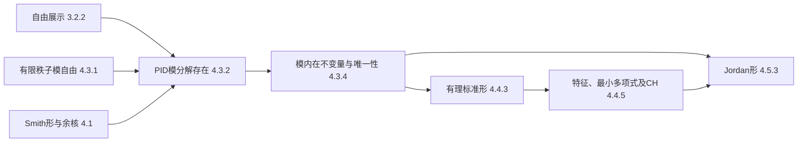
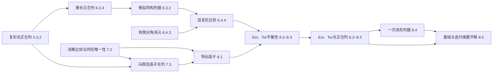

# 核心定理证明依赖审校表

本表覆盖第二卷第 1—7 章、第四卷第 5—8 章的选定核心结果，供后续数学复审定位已检查的证明链。未列入的结果和调用没有因此通过审核。

## 如何使用本表

每行给出稳定标签、适用范围、证明位置、直接前提及已读的代表性调用；完整陈述以源码为准。编号可能随排版变化，复审以标签定位。

“完整证明”“证明概要”“引用结果”“前瞻”说明结果在本书中的论证地位；“核读通过”“已补明”“待核读”说明本轮编辑工作。这两类状态互不替代，也不由选读星号或编译成功决定。选读星号表示默认学习次序中的地位；专题路线仍须选取其目标所需的结果。

只把实际支持证明的一步记为前提；回顾、前瞻与应用另记用途。后续调用列只覆盖已经阅读的段落，不能从检索命中或构建成功推断完整复审。

## 本轮结果与仍须追踪的范围

- 所列核心构造未检出需要改变主结论或修补循环证明的缺口。发现第二卷范畴等价判据的对象选择范围、张量右正合性外侧作用版本的同态条件需要写清，均已修订。第二卷§4.4的多项式余核到循环向量的计算复合、§4.5的有限维循环子空间版本已经补明；这两处的原分类结论保留。
- Smith形到模分类先证明关系核有限，再处理有限矩阵；算子模的挠性来自有限维迭代关系，未预借 Cayley–Hamilton 定理。矩阵子式的唯一性与模内在不变量的唯一性各有证明职责。
- 第四卷的Ext/Tor平衡性使用逐对角有限的双复形比较，不使用后置谱序列。消解可以无限延伸，但第n总次数仍只有有限个位置；左右模和Hom微分符号均须保留。
- 本轮实际输入中，第一卷A.1.6、A.1.11、A.1.12及11.2.2的陈述与证明已核读。第四卷第一编的交换范畴、广义元素、蛇引理、五引理及自然性仅核对所需版本；未由本轮宣布第1—4章完成复审。
- 本轮核心结果的正文证明无需外部文献定理填补。源码中的对照阅读引文不是本表已核验的外部版本；后续确实以外部一般结果为前提时，另记所用版本、定位与假设。
- 第三卷第13章、第15—20章等连续依赖链、三篇样章的全部训练和教学组织、全套课程执行表及目标读者试读还须继续。具体处理见[实质性修订问题记录](实质性修订问题记录.md)，未将它们记为完成。

## 核心论证顺序

下图画出部分主要论证的实际承接；每一箭头的适用条件仍须按后面的条目核对。

## 证明依赖与应用回读

| 位置 | 论证职责 | 本轮检查 |
|---|---|---|
| 第二卷§1.4的有理/Jordan标准形 | 前瞻：先在已给循环子空间或Jordan块上计算 | 主证明归第4章，不将第1章前瞻当作已证一般分解。 |
| 第四卷§5.4的有限长度Euler特征 | 数值应用：调用第二卷命题12.2.5长度可加性 | Grothendieck群等式本身先由两条短正合列与有限求和证明；有限长度应用不成为消解基础的先修。第二卷第12章原证明不属于本轮主体审校范围。 |
| 第三卷第15—21章与第四卷第5—8章 | 工具学习与交换代数应用 | 第三卷现有最小背景及其就地证明保留；详表逐步扩展到第三卷，不能从卷间来回阅读直接判为逻辑循环。 |
| 第四卷§10.2.1–2 | 一般截短判据与短正合列同调维数不等式 | 核读这两段的直接前提为本卷第8章和§10.1，不使用§10.2.3局部应用。§10.1已核代表性调用，尚非本轮整章复审。 |
| 第四卷§10.2.3 | 交换代数应用，可在学习第三卷后回读 | 已改标题与粗体阅读说明；调用第三卷17.1.2、17.1.3、17.2.3时明写交换Noether局部环及有限模，第三卷原证明不由此应用反向建立。 |
| 第四卷§17.4有界消解模型 | 高级应用：另用第15章CE消解 | 双复形位于有界方向，逐对角有限；CE存在与比较属于该高级应用的新增前提，不参与第7—8章基础证明。第15章未在本轮完整复审。 |

## 第二卷第一至四章

### 第1章

| 记录号、结果与稳定标签 | 陈述及决定适用范围的假设 | 证明位置、直接前提与核对结果 | 后续调用及使用范围 | 本书证明状态；本轮审校 |
|---|---|---|---|---|
| B2-01 `b2:thm:vector-basis-extension`，1.1.4 | k为域，V为k向量空间；每个线性无关子集可扩充为基。V由有限S生成时，可只从S补入新向量。 | [§1.1](../Book2/Part01/Chapter01/Section0101.tex)，完整；任意维分支调用已证的跨卷结果并复述论证。 直接前提：有限分支调用 `b2:lem:finite-exchange`：S有限，故无关集大小受限。任意维分支调用第一卷A.1.6 `b1:prop:A-basis-extension`：k确为域，无关性只涉及有限关系；采用选择公理及Zorn引理。已核该跨卷陈述和证明。 | [§1.2](../Book2/Part01/Chapter01/Section0102.tex)泛函延拓与分离：先取U的基，再扩充到V。另[第五章习题解:117](../Book2/Part01/Chapter05/Chapter05.tex)在无限积空间上延拓泛函，属于训练调用。 | 通过。有限与任意维分支没有混用算法含义；无限基存在依赖已声明的选择原则。 |
| B2-02 `b2:thm:vector-dimension`，1.1.5 | k为域，V任意维；任意两组基等势，维数为共同基数，零空间维数为0。 | [§1.1](../Book2/Part01/Chapter01/Section0101.tex)，完整。 直接前提：有限分支用有限交换引理。无限分支用第一卷A.1.12 `b1:prop:finite-support-cardinality` 和A.1.11 `b1:prop:cantor-bernstein`：两基均无限，各展开支集有限且其并覆盖原基。有限支集计数采用AC；已核跨卷证明。 | [§3.1](../Book2/Part01/Chapter03/Section0301.tex)自由模秩不变性：R/m为域，取商后确得该域上的有限支集坐标空间。 | 通过。不能将此基数等式作有限整数式相减，源码已明确区分。 |
| B2-03 `b2:thm:rank-nullity`，1.1.12 | k为域，f:V→W线性，V有限维；`dim V = dim ker f + dim im f`。W无需有限维。 | [§1.1](../Book2/Part01/Chapter01/Section0101.tex)，完整。 直接前提：`b2:prop:quotient-basis` 用于U=ker f；V有限维使减法为有限整数减法。`b2:prop:linear-first-isomorphism` 给V/ker f与im f的同构；同构送基到基。 | [§1.2](../Book2/Part01/Chapter01/Section0102.tex)矩阵与转置同秩的正文推导：该处V、W均有限维，并先用对偶像与零化子公式。 | 通过。该后续位置是实质正文推导，非另一个有编号定理；不将无限维自映射的单满性等同。 |
| B2-04 `b2:prop:dual-map`，1.2.8 | k为域，f:V→W、g:W→Z线性，维数任意；对偶复合逆序，`ker f*=(im f)^circ`、`im f*=(ker f)^circ`；f单射当且仅当f*满射，f满射当且仅当f*单射。 | [§1.2](../Book2/Part01/Chapter01/Section0102.tex)，完整。 直接前提：对偶定义和泛函延拓分离引理 `b2:lem:functional-extension`。给定mu在ker f上为零，先在im f上定义lambda_0(f(v))=mu(v)，核条件保证良定义；再延拓到W。反向单满性使用分离结论。 | [§1.2](../Book2/Part01/Chapter01/Section0102.tex)调用式 `b2:eq:dual-kernel-image` 推转置秩公式。第五章自然性使用对偶的已定义作用；仅复用记号不额外登记为本命题全部结论的必要依赖。 | 通过。任意维结论的关键是泛函延拓，而非有限维维数计数。 |
| B2-05 `b2:thm:double-dual`，1.2.9 | k为域，评价映射j_V:V→V**；V有限维时j_V同构。对任意维V、W及线性f:V→W，总有 `j_W f = f** j_V`。 | [§1.2](../Book2/Part01/Chapter01/Section0102.tex)，完整。 直接前提：`b2:prop:evaluation-injective` 给单射；有限维对偶基 `b2:prop:dual-basis` 使F∈V**对应有限和 `sum F(eps_i)e_i`，证明满射。自然性直接逐泛函计算，未用有限维。 | [§1.2](../Book2/Part01/Chapter01/Section0102.tex)有限维零化子维数；[§5.2](../Book2/Part01/Chapter05/Section0502.tex)自然双对偶同构证明：有限维只用于分量可逆。 | 通过。与依赖选基的V→V*同构分开；无限维不宣称评价满射。 |
| B2-06 `b2:prop:minimal-polynomial-divisibility`，1.3.5 | k为域，V非零有限维，T∈End_k(V)；存在唯一首一最小多项式m_T，且对任意p∈k[t]，`p(T)=0`当且仅当m_T整除p。 | [§1.3](../Book2/Part01/Chapter01/Section0103.tex)，完整。 直接前提：以基像记录自同态得到End_k(V)维数n²，故I,T,…,T^(n²)相关；域上首项可除。带余除法和多项式代入的乘法性给整除断言。未使用Cayley-Hamilton。 | [§1.3](../Book2/Part01/Chapter01/Section0103.tex)循环基证明用最小关系及带余除法。4.4.5重新从循环商识别m_T，不因记号重复就登记为对本命题证明的循环调用。 | 通过。非零性保证最小多项式次数正；零空间的m_T=1在后文另作约定。 |
| B2-07 `b2:prop:coprime-operator-decomposition`，1.3.8 | k为域，V维数任意，T线性；a,b∈k[t]互素且a(T)b(T)=0，则 `V=ker a(T) ⊕ ker b(T)`，两核均T不变。 | [§1.3](../Book2/Part01/Chapter01/Section0103.tex)，完整。 直接前提：第一卷11.2.2 `b1:prop:euclidean-algorithm` 的Bézout结论；k[t]为Euclid整环，互素使gcd为单位，且a,b不可能同时为0。算子多项式彼此交换，使两个分量分别落在另一核中。已核跨卷Euclid证明。 | 本节在 `(T-lambda I)(T-mu I)=0`、lambda≠mu时作已核应用。4.5.1采用PID初等因子再辨认实际核的另一条证明，不能将相似结论误作显式调用。 | 通过。无需有限维、特征零或代数闭；后续调用未穷尽。 |
| B2-08 `b2:prop:cyclic-polynomial-quotient`，1.4.5 | k为域，V非零有限维，T线性，v≠0，p=m_(T,v)；`k[t]/(p) → k[T]v`，类f↦f(T)v，为k线性同构，并将乘t对应为T。 | [§1.4](../Book2/Part01/Chapter01/Section0104.tex)，完整。 直接前提：最小向量关系的整除性质使核恰为(p)；`b2:prop:linear-first-isomorphism` 给商空间到像的同构。保持t作用直接由 `(tf)(T)v=T f(T)v` 得到，尚未假定一般循环分解。 | [§4.5](../Book2/Part01/Chapter04/Section0405.tex)Jordan链的等价表述使用这一循环商对应。该引理允许环境V任意维，但已给有限次数关系，因此应作用于有限维的循环子空间，而非默认整个V有限维。 | 通过；后续调用已在Jordan链证明中明确限制到有限维W=k[T]v，见问题D-07。 |

### 第2章

| 记录号、结果与稳定标签 | 陈述及决定适用范围的假设 | 证明位置、直接前提与核对结果 | 后续调用及使用范围 | 本书证明状态；本轮审校 |
|---|---|---|---|---|
| B2-09 `b2:prop:quotient-module`，2.2.3 | R任意含幺环，M为幺性左R模，L≤M；陪集运算给M/L左模，商映射q满。对左模同态g:M→P，存在唯一g_bar使g=g_bar q，当且仅当g(L)=0。 | [§2.2](../Book2/Part01/Chapter02/Section0202.tex)，完整。 直接前提：子模封闭性保证代表元变化在加法和左作用下仍落在L；g在L上为0保证下降良定义；q满保证唯一性。非交换时没有移动标量次序。 | [§3.2](../Book2/Part01/Chapter03/Section0302.tex)展示的映射条件；[§6.1](../Book2/Part01/Chapter06/Section0601.tex)张量泛性质中取R=Z，关系子群恰被平衡映射零化。 | 通过。R不必交换或Noether；关系的全部生成元为0即可使其生成子模为0。 |
| B2-10 `b2:thm:module-first-isomorphism`，2.2.7 | R任意含幺环，f:M→N为幺性左R模同态；`M/ker f ≅ im f`，同构为类m↦f(m)。 | [§2.2](../Book2/Part01/Chapter02/Section0202.tex)，完整。 直接前提：B2-09用于L=ker f，先将值域限制为im f。诱导满射；零像类恰为零类，所以单射。双射模同态的逆线性在本节先已核验。 | [§4.1](../Book2/Part01/Chapter04/Section0401.tex)Smith余核；[§4.4](../Book2/Part01/Chapter04/Section0404.tex)算子关系矩阵；[§6.4](../Book2/Part01/Chapter06/Section0604.tex)张量右正合；[§12.2](../Book2/Part03/Chapter12/Section1202.tex)Jordan-Hölder比较A/(A∩B)与M/B，已核各核像。 | 通过。后续均实际写明或可直接核对核与像，没有用模大小相同代替同构。 |
| B2-11 `b2:prop:regular-hom-endomorphism`，2.2.6 | R任意含幺环，M幺性左R模；Hom_R(R,M)经f↦f(1)与M作交换群同构。以复合为乘法，End_R(R)与R^op为保幺环同构。 | [§2.2](../Book2/Part01/Chapter02/Section0202.tex)，完整。 直接前提：左线性迫使f(r)=r f(1)。当M=R，右乘u_a复合u_b等于u_(ba)，故必须取反环。未把一般Hom无条件当作左R模。 | [§11.2](../Book2/Part03/Chapter11/Section1102.tex)正则双模自同态；[§13.3](../Book2/Part03/Chapter13/Section1303.tex)Artin-Wedderburn从End_R(R)恢复R；[§16.3](../Book2/Part04/Chapter16/Section1603.tex)Morita反向取End_S(S)，环名替换正确。 | 通过。反环与左/右乘次序一致，是后续非交换结构论的实际前提。 |
| B2-12 `b2:thm:module-product-universal`，2.4.3 | R任意含幺环，左模族(M_i)由集合I编号，N为左模；任意同态族f_i:N→M_i唯一合成为f:N→prod M_i，满足所有p_i f=f_i。I可无限或空。 | [§2.4](../Book2/Part01/Chapter02/Section0204.tex)，完整。 直接前提：直积逐坐标模结构；每个f_i线性保证合成线性，所有坐标值唯一决定f。没有有限支集限制。 | [§7.2](../Book2/Part01/Chapter07/Section0702.tex)足够多内射模：逐分量延拓后合成为到任意积的同态，无限族选择已说明用AC。5.3仅作范畴语言回顾，另记为回顾。 | 通过。与余积箭头方向不同；空指标集得到零模。 |
| B2-13 `b2:thm:module-sum-universal`，2.4.4 | R任意含幺环，左模族(M_i)由集合I编号，N为左模；任意g_i:M_i→N唯一合成为g:direct sum M_i→N，满足g iota_i=g_i。元素像由有限支集求和。 | [§2.4](../Book2/Part01/Chapter02/Section0204.tex)，完整。 直接前提：同时扩充有限支集到其有限并集，验证和；左作用逐项保持。每个直和元素为有限个分量嵌入之和，保证唯一性。 | [§7.1](../Book2/Part01/Chapter07/Section0701.tex)任意直和投射：各限制的提升由直和泛性质合并，qg=f逐分量验证。无限族提升选择采用AC。 | 通过。映出无限直积不能套用此结论；源必须为有限支集直和。 |

### 第3章

| 记录号、结果与稳定标签 | 陈述及决定适用范围的假设 | 证明位置、直接前提与核对结果 | 后续调用及使用范围 | 本书证明状态；本轮审校 |
|---|---|---|---|---|
| B2-14 `b2:thm:free-module-universal`，3.1.2 | R任意含幺环，F为有基(e_i)的幺性左R模；对任意左模N与任意像n_i，唯一左线性f满足f(e_i)=n_i。反向：一族元素对全部N及指定像满足该性质，则它为F的基。 | [§3.1](../Book2/Part01/Chapter03/Section0301.tex)，完整。 直接前提：正向由唯一有限基展开定义。反向用坐标自由模E=R^(I)建立g:E→F与h:F→E；两边的唯一性分别保证hg、gh为恒等。未预先把待判元素族当作基。 | [§3.2](../Book2/Part01/Chapter03/Section0302.tex)生成族给自由满射；[§5.1](../Book2/Part01/Chapter05/Section0501.tex)自由-忘却伴随；[§6.1](../Book2/Part01/Chapter06/Section0601.tex)以R=Z构造自由交换群。 | 通过。指标I是集合；像的指定为集合数据，虚线延拓才是模同态。 |
| B2-15 `b2:prop:free-lifting`，3.1.3 | R任意含幺环，F自由左模，q:M→N满，f:F→N线性；存在g:F→M使qg=f。一般不唯一。 | [§3.1](../Book2/Part01/Chapter03/Section0301.tex)，完整。 直接前提：对每个基元选q的原像，再用B2-14线性延拓。无限基时选择原像族采用AC；延拓唯一性只相对于已选原像。 | [§3.2](../Book2/Part01/Chapter03/Section0302.tex)有限展示核，两个自由源和满射都满足条件；[§7.1](../Book2/Part01/Chapter07/Section0701.tex)自由直和因子投射性的反向构造。 | 通过。是投射模/消解之前的提升基础；不把整个提升称为唯一。 |
| B2-16 `b2:thm:free-rank-invariance`，3.1.4 | R非零交换含幺环，I、J为集合；R^(I)与R^(J)同构推出I、J等势。因此该类环上自由模的基数为其秩。 | [§3.1](../Book2/Part01/Chapter03/Section0301.tex)，完整。 直接前提：用Zorn在真理想中取极大m，并在本证明核验R/m为域。模同构对应mF与mG，商为(R/m)^(I)、(R/m)^(J)；应用B2-02。非零性保证存在真理想，交换性保证域商。 | [§4.3](../Book2/Part01/Chapter04/Section0403.tex)PID模自由秩唯一性：PID确非零且交换；[§8.1](../Book2/Part02/Chapter08/Section0801.tex)有限自由张量基的秩含义。 | 通过。不推广到零环或一般非交换环；没有提前使用张量积。 |
| B2-17 `b2:prop:module-presentation`，3.2.2 | R任意含幺环，M左模；有自由模展示R^(J)→R^(I)→M，末箭头满且像等于核，故M≅R^(I)/im d。指定n_i诱导M→N，当且仅当全部关系在N中成立；成立时唯一。 | [§3.2](../Book2/Part01/Chapter03/Section0302.tex)，完整。 直接前提：取M与关系模的全体元素为生成族；B2-14给自由映射。B2-10给商同构，B2-09把下降条件化为零化全部关系生成元。J可以无限；d不要求单射。 | [§4.3](../Book2/Part01/Chapter04/Section0403.tex)有限生成PID模：选有限生成族得到R^n→M，随后才证明核有有限基。 | 通过。不混同“所有模有展示”与“有限生成模有有限展示”。 |
| B2-18 `b2:prop:finite-presentation-kernel`，3.2.4 | R任意含幺环，M有限展示；任意有限秩自由满射p:R^n→M的核有限生成。左理想I满足R/I有限展示，当且仅当I作为左R模有限生成。 | [§3.2](../Book2/Part01/Chapter03/Section0302.tex)，完整。 直接前提：给定有限展示q:R^s→M的核L有限生成；B2-15构造u、v，qu=p、pv=q。K=ker p写成v(L)+(id-vu)(R^n)，两项均有限生成。环无需交换；没有调用尚未引入的拉回或Schanuel引理。 | [§7.4](../Book2/Part01/Chapter07/Section0704.tex)无限积环的循环商：有限支集理想不有限生成，故商不有限展示。已核这是具体例子的论证，非一般环分类。 | 通过。两个自由模的秩有限是有限生成结论的实质条件。 |
| B2-19 `b2:thm:split-exact-sequence`，3.3.4 | R任意含幺环，0→A-i→B-p→C→0短正合；p有截面、i有缩回、存在theta:A⊕C→B同构且theta iota_A=i、p theta=pi_C三者等价。 | [§3.3](../Book2/Part01/Chapter03/Section0303.tex)，完整。 直接前提：从s定义theta(a,c)=i(a)+s(c)，正合性给满射、p与i的单射条件给单射。theta给缩回；缩回给s(c)=b-i r(b)，对不同原像之差用ker p=im i消去。 | [§7.1](../Book2/Part01/Chapter07/Section0701.tex)投射等价刻画；[§7.2](../Book2/Part01/Chapter07/Section0702.tex)内射与左端短列分裂；[§13.2](../Book2/Part03/Chapter13/Section1302.tex)半单环判据；[§15.3](../Book2/Part03/Chapter15/Section1503.tex)投射覆盖核为零。 | 通过。比较给定短列时须保持i、p；抽象B≅A⊕C不是所陈述的分裂条件。 |
| B2-20 `b2:cor:free-quotient-splits`，3.3.5 | R任意含幺环，0→A→B-p→F→0短正合，F自由左模，则该列分裂。 | [§3.3](../Book2/Part01/Chapter03/Section0303.tex)，完整。 直接前提：B2-15沿满射p提升id_F得到截面；B2-19把截面转换为给定短列的相容分解。无需A自由或B有限生成。 | 第7章的投射模刻画将同一方法推广到投射商，实际证明改用投射定义与B2-19；这是推广，不能把B2-20误记成所有投射模证明的唯一依据。 | 通过。后续代表性用途已辨明，未穷尽具体训练调用。 |
| B2-21 `b2:lem:short-five`，3.3.6 | R任意含幺环，两行短正合，竖箭头alpha、beta、gamma与水平箭头交换；alpha、gamma均单射则beta单射，均满射则beta满射，均同构则beta同构。 | [§3.3](../Book2/Part01/Chapter03/Section0303.tex)，完整。 直接前提：单射分支将beta(b)=0传到商，再沿i取原像，最后用i'、alpha单射。满射分支先在商端提升，再将误差写成i'(a')并用alpha满射修正。全部条件在证明中实际使用。 | 3.4节首回顾它的图追踪方法；五引理的证明独立展开两个方向，属于方法承接，不把回顾句记为依赖已证短五引理的必要证明边。 | 通过。相同端点并不产生相容中间映射，源码反例保留该区别。 |
| B2-22 `b2:thm:five-lemma`，3.4.1 | R任意含幺环，两行各含五项的左模正合列形成交换图；f1满、f2与f4同构、f5单，则f3同构。 | [§3.4](../Book2/Part01/Chapter03/Section0304.tex)，完整。 直接前提：正合性和交换性逐次提升并修正；单射证明只用f1满及f2、f4单，满射证明只用f2、f4满及f5单。不调用蛇引理或分类定理。 | 本轮未核到后续正文中显式调用此标签的代表性证明；第四卷长正合列相关调用不在本表核读范围，不能据此写成“无后续调用”。 | 通过。没有把所有五条竖箭头同构作为前提。 |
| B2-23 `b2:thm:snake-lemma`，3.4.2 | R任意含幺环，上行A-u→B-v→C→0、下行0→A'-u'→B'-v'→C'正合，竖箭头alpha、beta、gamma交换；得到从ker alpha经ker beta、ker gamma、coker alpha、coker beta到coker gamma的正合列及delta。若u单或v'满，才可分别添首、末0。 | [§3.4](../Book2/Part01/Chapter03/Section0304.tex)，完整；证明在下一小节，一个proof内给完。 直接前提：v满先选b，gamma(c)=0与交换性使beta(b)落在im u'，u'单使a'唯一；商去im alpha消除b的选择。线性、四个中间位置及条件式端点逐项证明。正号约定为u'(a')=beta(b)时delta(c)=[a']。 | [§3.4](../Book2/Part01/Chapter03/Section0304.tex)蛇自然性用原构造选同一组提升并送到另一图；第三章习题连接映射计算属于训练，不能倒作正文唯一前提。 | 通过。并未在一般陈述中偷加u单或v'满；后续符号须保持同一约定。 |

### 第4章

| 记录号、结果与稳定标签 | 陈述及决定适用范围的假设 | 证明位置、直接前提与核对结果 | 后续调用及使用范围 | 本书证明状态；本轮审校 |
|---|---|---|---|---|
| B2-24 `b2:prop:smith-cokernel`，4.1.2 | R为PID，A为m×n矩阵，P、Q在R上可逆，D=PAQ已是Smith形，非零对角元d1,…,dr；`coker A ≅ direct sum R/(d_i) ⊕ R^(m-r)`，具体同构为原类x↦类Px。 | [§4.1](../Book2/Part01/Chapter04/Section0401.tex)，完整。 直接前提：Q满使D(R^n)=P(A(R^n))；P及逆对应关系子模。对角余核的坐标满射核为D(R^n)，用B2-10。当前命题以标准形已给定为前提，不依赖后面尚未证明的存在性。 | [§4.3](../Book2/Part01/Chapter04/Section0403.tex)模结构存在；[第四章习题解:58](../Book2/Part01/Chapter04/Chapter04.tex)矩形整数矩阵核、余核与P^-1坐标；[A04](../Book2/Appendices/AppendixA/SectionA04.tex)F5[t]余核。 | 通过。自由余核坐标来自零行m-r，核自由方向来自零列n-r，两者没有混同。 |
| B2-25 `b2:thm:smith-normal-form`，4.1.4 | R为PID，K为其分式域，A任意m×n矩阵（含零尺寸、零矩阵、秩亏）；存在P∈GL_m(R)、Q∈GL_n(R)使PAQ为非零对角元成整除链的矩形Smith形；非零对角元数等于rank_K A。 | [§4.1](../Book2/Part01/Chapter04/Section0401.tex)，完整。 直接前提：就地给Bézout幺模二行矩阵及其转置，PID使(a,b)为主理想且有Bézout系数。`b2:lem:pid-ascending-chain` 保证每次非整除步骤严格增大的主元理想最终稳定；对子块归纳，a整除全部子块项的条件使后续整除链保持。 | [§4.3](../Book2/Part01/Chapter04/Section0403.tex)PID模存在；[§4.5](../Book2/Part01/Chapter04/Section0405.tex)扩域后保留P(t)、Q(t)；[A01](../Book2/Appendices/AppendixA/SectionA01.tex)算法为Euclid环上的执行与应用，不是主证明位置。 | 通过。没有假定任意GL矩阵可拆为通常三类初等矩阵，也没有将任意PID的存在性称为可实现算法。 |
| B2-26 `b2:thm:smith-uniqueness`，4.2.4 | R为PID，A已有Smith形d1整除…整除dr且各非零；`I_j(A)=(d1...dj)`（1≤j≤r），j>r时为0。r及各d_j相伴类唯一；选正整数/首一等代表才获得唯一元素。 | [§4.2](../Book2/Part01/Chapter04/Section0402.tex)，完整。 直接前提：`b2:prop:determinantal-ideal-invariance` 由本节Cauchy-Binet引理完整证明，适用于交换环及幺模变换。标准形整除链保证全部j阶子式被前j项乘积整除，前j行列子式给反向包含。PID为整环，允许除去非零前项乘积。 | [第四章习题解:86](../Book2/Part01/Chapter04/Chapter04.tex)满行秩整数格指数；[A04](../Book2/Appendices/AppendixA/SectionA04.tex)多项式证书用子式独立复核。 | 通过。这里只是固定尺寸矩阵等价的唯一性；模分类的展示无关性仍须B2-29，不将两者混成同一证明。 |
| B2-27 `b2:thm:pid-free-submodule`，4.3.1 | R为PID，N≤R^n，n有限；N自由，且有至多n元的基。 | [§4.3](../Book2/Part01/Chapter04/Section0403.tex)，完整。 直接前提：对n归纳，第一坐标像为主理想(a)。a=0降到n-1；a非零取v，先生成N=Rv+N0，再由整环消去ca=0证明无关。证明不使用一般PID模分类。 | [§4.3](../Book2/Part01/Chapter04/Section0403.tex)有限生成M的关系核；[§12.4](../Book2/Part03/Chapter12/Section1204.tex)Noether反例中只将R=Z[s]的子模看作Z²子模，调用的PID是Z，并未误称Z[s]为PID。 | 通过。所证范围为有限秩环境，恰好足够建立有限生成模的有限展示；不擅加无界秩版本。 |
| B2-28 `b2:thm:pid-module-structure`，4.3.2 | R为PID，M有限生成；`M ≅ R^f ⊕ R/(d1) ⊕ ... ⊕ R/(ds)`，f、s≥0，d_i非零非单位且成整除链；挠子模正是循环商之和，M/t(M)≅R^f。 | [§4.3](../Book2/Part01/Chapter04/Section0403.tex)，完整，当前只承诺存在与挠部分描述。 直接前提：B2-17取有限自由满射；B2-27使关系核具有有限基，才得到有限矩阵。B2-25、B2-24对角化并解释余核；删去单位因子的零分量。R为整环，使自由坐标无挠。 | [§4.4](../Book2/Part01/Chapter04/Section0404.tex)算子V_T有限生成且挠，故自由部分为0；[§7.3](../Book2/Part01/Chapter07/Section0703.tex)PID上任意无挠模的平坦性，只逐个对其有限生成无挠子模用本定理。 | 通过。未从“有限生成”在一般环上推“有限展示”，也未把无穷生成无挠模判为自由。 |
| B2-29 `b2:thm:pid-elementary-divisors`，4.3.4 | R为PID，M有限生成，选不可约元相伴类代表p；`M ≅ R^f ⊕ direct sum M_p`，仅有限多个M_p非零，每个M_p为有限个R/(p^e)之和，e≥1。f、各p指数多重集及非单位不变因子相伴类由M同构类型唯一确定。 | [§4.3](../Book2/Part01/Chapter04/Section0403.tex)，完整。 直接前提：B2-28给存在；紧邻正文用ACC证明PID的素元分解并用显式Bézout公式证明CRT。B2-16对非零交换R给自由秩唯一。层商p^(j-1)M_p/p^j M_p为R/(p)向量空间，维数数出指数≥j的块；相邻差恢复多重集，再左补零组装整除链。 | [§4.4](../Book2/Part01/Chapter04/Section0404.tex)有理标准形唯一性；[§4.5](../Book2/Part01/Chapter04/Section0405.tex)Jordan主分量；[第四章习题解:95](../Book2/Part01/Chapter04/Chapter04.tex)同尺寸矩阵由余核恢复完整Smith形。 | 通过。唯一性取自模内部的无挠商与主分量层商，不依赖固定展示尺寸。 |
| B2-30 `b2:prop:operator-polynomial-matrix`，4.4.2 | k任意域，A∈M_n(k)，V_A为t作用等于A的k[t]模；`V_A ≅ coker(tI-A)`。评价eps:sum t^j v_j↦sum A^j v_j满，核恰为(tI-A)k[t]^n。 | [§4.4](../Book2/Part01/Chapter04/Section0404.tex)，完整。 直接前提：模结构已由多项式代入建立。望远镜恒等式 `(t^j I-A^j)=(tI-A)sum t^(j-1-h)A^h` 给核的反向包含；常数向量给满射，再用B2-10。没有仅检查n条关系成立就断言它们生成核。 | [§4.5](../Book2/Part01/Chapter04/Section0405.tex)在k[t]及L[t]两次使用相应算子模展示；[§4.4](../Book2/Part01/Chapter04/Section0404.tex)把非单位Smith因子与算子不变因子联系。 | 通过。计算衔接O-11已补明：用评价复合将Smith余核代表送回V，单位因子行跳过。 |
| B2-31 `b2:thm:rational-canonical-form`，4.4.3 | k任意域，V有限维，T线性；唯一首一非常数整除链f1,…,fs使V_T为各k[t]/(f_i)直和，V=0取空链；某基下T为各C(f_i)直和。相似当且仅当整除链相同。无需k无限或多项式分裂。 | [§4.4](../Book2/Part01/Chapter04/Section0404.tex)，完整。 直接前提：V的k基为有限k[t]生成集；每个v有有限迭代关系，故挠。k[t]为PID，B2-28、B2-29给存在唯一。带余除法给循环商基；`b2:prop:operator-similarity-modules` 把保持t作用的同构对应到矩阵相似。 | [§4.4](../Book2/Part01/Chapter04/Section0404.tex)在该基中计算特征和最小多项式；4.5使用主分量分解。F2不可约三次友矩阵例为应用，第一章claim为前瞻，均不倒作前提。 | 通过。分类存在性未预借CH或Jordan；循环向量恢复的计算衔接O-11已补明。 |
| B2-32 `b2:prop:operator-characteristic-minimal`，4.4.5 | k为域，V非零有限维，T的不变因子为首一f1整除…整除fs；`chi_T=prod f_i`、`m_T=f_s`、`dim V=sum deg f_i`，因此m_T整除chi_T且chi_T(T)=0。零空间另约定chi=m=1。 | [§4.4](../Book2/Part01/Chapter04/Section0404.tex)，完整。 直接前提：B2-31的分块基；就地完整证明的 `b2:lem:companion-characteristic` 给各块特征多项式。循环商全模被g零化等价于f_i整除g，整除链使最小共同关系为f_s。 | [§4.5](../Book2/Part01/Chapter04/Section0405.tex)判定chi与m是否分裂相同；[§4.5](../Book2/Part01/Chapter04/Section0405.tex)扩域后多项式不变。9.4明确给任意交换环上的另一证明，未被本证明预借。 | 通过。这是当前域上CH的主要证明位置；特征与最小多项式相同或已知，通常仍不足以决定相似类。 |
| B2-33 `b2:thm:jordan-canonical-form`，4.5.3 | k任意域，V有限维，T线性；存在由k中lambda构成的Jordan块直和，当且仅当chi_T在k上分裂，也等价于m_T在k上分裂；存在时每个特征值的块大小和重数唯一，仅排列可变。 | [§4.5](../Book2/Part01/Chapter04/Section0405.tex)，完整；零空间为空分解的平凡情况。 直接前提：`b2:prop:jordan-splitting-primary` 由B2-29给主分量并用互素Bézout辨认其为实际核；`b2:lem:jordan-chain-block` 按逆排(t-lambda)幂基取得上次对角1。唯一性就地计算核幂维数；异特征值块可逆性有有限几何级数公式。 | [§4.5](../Book2/Part01/Chapter04/Section0405.tex)块计数公式；[第七章习题解:149](../Book2/Part01/Chapter07/Chapter07.tex)平方零算子的块只能1或2，t²分裂对任意k均成立，属于训练调用。 | 通过。不要求代数闭或特征零，只要求给定多项式在当前k中分裂；不可分扩域的幂指数另由B2-36处理。 |
| B2-34 `b2:prop:jordan-kernel-dimensions`，4.5.4 | k为域，V有限维，chi_T在k上分裂，lambda为特征值；c(0)=0、c(r)=dim ker(T-lambda I)^r。大小恰r的块数为 `2c(r)-c(r-1)-c(r+1)`，总块数c(1)，最大块大小为m_T中该一次因子指数。 | [§4.5](../Book2/Part01/Chapter04/Section0405.tex)，完整。 直接前提：B2-33证明中 `c(r)=sum min(r,d_j)` 的差分公式；本节主分量命题确定最大指数，友矩阵/块特征多项式确定代数重数。未先假定全部链基已求出。 | [§4.5](../Book2/Part01/Chapter04/Section0405.tex)可对角化判据：分裂且最大块大小1。七维核维数例为已核应用，可先判型但不能代替求换基矩阵。 | 通过。原型数据与实际链基计算明确分开；几何重数和代数重数含义正确。 |
| B2-35 `b2:prop:scalar-extension-invariant-factors`，4.5.6 | k⊆L为任意域扩张，A∈M_n(k)；在k[t]中取得的首一不变因子在L[t]中仍相同，故特征和最小多项式不变。不可约分解不作不变承诺。 | [§4.5](../Book2/Part01/Chapter04/Section0405.tex)，完整。 直接前提：B2-30把两域上的算子分别写成tI-A余核；B2-25给k[t]上的P,Q，其逆仍有k[t]条目，故在L[t]仍可逆。整除链、首一和正次数保持；B2-29唯一性识别因子，B2-32给chi、m公式。 | 第四章关于实矩阵在C上相似推出在R上相似的解答调用该结论，属于训练；其原理为同一首一链而非选择一个实的复换基矩阵。跨卷后续未穷尽。 | 通过。改变的是空间k^n→L^n，不将原k^n直接冒充L向量空间；扩张可分性不需要。 |
| B2-36 `b2:prop:scalar-extension-elementary-divisors`，4.5.7 | k⊆L任意域扩张，q^e为A的一个初等因子，q在k[t]首一不可约，e≥1；若q在L[t]分解为互异首一不可约q_j的h_j次幂，则贡献初等因子q_j^(e h_j)，重复次数保留；若L分裂chi，所得指数为Jordan块大小。 | [§4.5](../Book2/Part01/Chapter04/Section0405.tex)，完整。 直接前提：B2-29及循环商带余基先写成C(q^e)；原换基在L上仍可逆。各q_j^(e h_j)互素，核与显式Bézout拼接证明CRT满射；不同原q已有的Bézout等式扩域后保持互素。 | [§4.5](../Book2/Part01/Chapter04/Section0405.tex)F2(s)中t²-s不可约、在s=u²后变成(t-u)²的例子，实际得到J2(u)。该例是应用，非一般命题的唯一依据。 | 通过。不可分情况下h_j可大于1，未误把所有扩域后块指数一律记为原e。 |

### 前瞻与主证明位置

| 稳定label与当前编号 | 本轮定位 | 角色及审校判定 |
|---|---|---|
| `b2:claim:rational-canonical-goal`，1.4.3 | [§1.4](../Book2/Part01/Chapter01/Section0104.tex) | 明确前瞻，主要证明为B2-31（4.4.3）。第一章只在已经给定循环向量时计算友矩阵；没有将一般循环分解当作前置工具。 |
| `b2:claim:jordan-canonical-goal`，1.4.4 | [§1.4](../Book2/Part01/Chapter01/Section0104.tex) | 明确前瞻，主要证明为B2-33（4.5.3）。第一章核维数计算只分析已给Jordan块，不反推任意算子已有这种分解。 |

以上两项不能登记为“第一章已完成证明”，也不能登记为第四章分类所调用的已证结果。

### 第4章的算法、结构与训练衔接

| 阶段 | 实际已核内容 | 训练或执行位置 | 边界与下一轮最小处理 |
|---|---|---|---|
| Smith存在性 | 4.1.4用Bézout幺模变换及主元理想ACC给存在；任意PID未默认有Euclid函数或有效表示。 | 4.2.4及[4.2.4小节](../Book2/Part01/Chapter04/Section0402.tex)明确要求相等、整除、商、Bézout系数和单位处理可执行。附录[算法A.1](../Book2/Appendices/AppendixA/SectionA01.tex)只在Z或有效域的一元多项式环上执行。 | 证明与执行没有混写。不增复杂度承诺；一般PID存在结论不等于程序输入协议。 |
| 原矩阵证书 | PAQ=D、P/Q可逆、非零对角元整除链三项共同核验；P更新为EP，Q更新为QF。 | [第四章矩形习题](../Book2/Part01/Chapter04/Chapter04.tex)同时恢复核、余核及原坐标；[对角修复习题](../Book2/Part01/Chapter04/Chapter04.tex)将diag(6,10)修成diag(2,30)。两份解答已逐项核读。 | 训练覆盖零列、单位项与不满足整除链的对角矩阵。P^-1作用于余核生成元，Q作用于核基，源码未混用。 |
| 矩阵唯一性到模唯一性 | 4.2.4恢复固定矩阵数据；4.3.4从模内在层商恢复非单位因子，允许不同尺寸展示。 | [同尺寸展示习题](../Book2/Part01/Chapter04/Chapter04.tex)证明余核同构与同尺寸幺模等价的对应，并用多一个单位项的展示解释不能删尺寸条件。 | 该桥已具备完整证明及训练，不需再增加同类定理或泛泛“分类唯一”说明。 |
| 算子关系到循环基 | 4.4.2得到V_A≅coker(tI-A)，4.1.2给多项式余核生成元P(t)^-1 e_i，4.4.3再取得各循环商基。 | [4.4说明段](../Book2/Part01/Chapter04/Section0404.tex)现已给出评价复合及循环链的相似换基公式。[A.4.2](../Book2/Appendices/AppendixA/SectionA04.tex)有直接给定循环向量v、构造S=(v,Tv,T²v)并检验TS=SC(f)的完整有理数算例。 | O-11已补明：保留各因子原行号，对deg(g_j)>0的行取v_j=eps(P(t)^-1 e_j)，再合并循环链为S；单位行跳过。 |
| 原基域到Jordan数据 | 4.5.3要求分裂，4.5.4用核幂维数判块；4.5.7保留扩域根重数h_j。 | [4.5七维例](../Book2/Part01/Chapter04/Section0405.tex)从差分取得4、2、1三块；[不可分扩域例](../Book2/Part01/Chapter04/Section0405.tex)区分原指数e与扩域后的e h_j。 | 判定块型与求具体链向量、换基矩阵是两项任务。正文已说明这一差别，不把核维数表称为完整换基算法。 |

## 第二卷第五至七章

审校对象：当前 TeX 源码。核读正文、所用直接输入和代表性后续调用；随后对U1、U2补明条件，正文编辑与构建见问题记录。编号取自本轮读取的 `tmp/build/Book2/Book2.aux`，该文件当时修改时间为 2026-09-26 22:52:25。标签与源码陈述逐项对应，编号识别不被当作数学证明。

本表记录 43 条具名结果。第6.3节主定理的自然性续证、反环交换因子公式、自由满射提供投射对象的存在性，以及第7.4节的 Ext/Tor 前瞻另作说明。后续调用仅列实际核读的代表，未穷尽同卷或跨卷调用；没有读过的调用明记待核读。没有给出全套数学正式定稿或接受结论。

### 两处条件及处理

- U1（问题D-08）：原§5.4.4未充分限定从本质满函子同时选择对象代表的范围。现已与第四卷的相应判据一致，分别给出等价的正向性质、已给代表和同构族时的反向构造、小范畴在选择公理下的等价判据；大范畴明确给定选择数据，或在指定更大宇宙中成为小范畴。有限维向量空间与矩阵范畴的例子亦写明宇宙范围。拟逆的态射计算和自然性证明保留。
- U2（问题D-09）：原§6.4.2的“相容的剩余作用”现明确包含原正合列同态保留变化因子的外侧作用，证明中据此验证张量同态的相容性。群版本、左右变量版本及后续Morita应用保留。只赋予双模结构而不要求原同态保留外侧作用不足：例如N=N''=k²，底映射为恒等，分别令右k[t]作用为(a,b)t=(b,0)和零作用，该底映射便不保留t作用。

### 约定与输入

各行中的环均含幺，模均幺性；左右侧别按行明确写出，未另假定环交换、Noether 或模有限。整环和 PID 按本书的交换含幺非零约定使用。范畴的 Hom 是集合；积与直和的指标是集合。默认张量积先是交换群，外侧模结构需要双模数据。

“完整”记录当前所给结果的数学论证，不表示所有更早基础输入都在此重新奠基。下列输入的相关陈述与使用段已核；更早的全套证明链没有无限递归重审。

| 输入 | 标签/编号及位置 | 本轮使用的精确条件与核读范围 |
|---|---|---|---|---|
| E01 自由模泛性质 | `b2:thm:free-module-universal` 3.1.2；[陈述及证明](../Book2/Part01/Chapter03/Section0301.tex) | 左模、有集合指标基，任意指定像族唯一延伸；核读有限坐标公式及反向基判据。以 \(R=\mathbb Z\) 构造自由交换群。 |
| E02 商模泛性质 | `b2:prop:quotient-module` 2.2.3；[陈述及证明](../Book2/Part01/Chapter02/Section0202.tex) | 左模子模 L；仅当 g(L)=0 时唯一下降。代表元无关、线性及唯一性已核。 |
| E03 第一同构 | `b2:thm:module-first-isomorphism` 2.2.7；[陈述及证明](../Book2/Part01/Chapter02/Section0202.tex) | M/ker f→im f；满射 g 时把 N/ker g 识别成 N''，不凭名字省略核。 |
| E04 短正合的核/余核 | `b2:prop:short-exact-kernel-cokernel` 3.3.2；[陈述及证明](../Book2/Part01/Chapter03/Section0303.tex) | 0→A→B→C→0 的左模列；pf=0 或 gi=0 给带指定映射的唯一分解，已核。 |
| E05 积/直和 | `b2:thm:module-product-universal` 2.4.3、`b2:thm:module-sum-universal` 2.4.4；[积](../Book2/Part01/Chapter02/Section0204.tex)、[直和](../Book2/Part01/Chapter02/Section0204.tex) | 全部为同一侧模，集合指标；积不要求有限支集，直和求值只用有限支集。两证明已核。 |
| E06 自由提升 | `b2:prop:free-lifting` 3.1.3；[陈述及证明](../Book2/Part01/Chapter03/Section0301.tex) | 自由左模沿左模满射提升；无限基逐项选原像采用选择公理，已明写。 |
| E07 分裂 | `b2:thm:split-exact-sequence` 3.3.4；[陈述](../Book2/Part01/Chapter03/Section0303.tex)及[证明](../Book2/Part01/Chapter03/Section0303.tex) | 截面、缩回、尊重 i/p 的直和同构三向；代表元无关及相容式已核。 |
| E08 有限维双对偶 | `b2:thm:double-dual` 1.2.9；[输入](../Book2/Part01/Chapter01/Section0102.tex) | 有限维 V 才要求 j_V 为同构；本轮核其基坐标满射段，第5.2节自然性另直接证明，不假定 W 有限。 |
| E09 PID 模结构 | `b2:thm:pid-module-structure` 4.3.2；[输入](../Book2/Part01/Chapter04/Section0403.tex) | 有限生成 PID 模；无挠时循环商部分为零，因而自由。已核此陈述、有限秩子模归约和当前使用方向；Smith存在、唯一性与分类的链条见同轮第二卷第一至四章记录。 |
| E10 环局部化 | 第一卷正文在本节引用为定理13.2.2 | 当前使用 R 交换、分母含1乘法封闭并允许0；第6.4节对模的等价、运算和零判据已就地重验。前卷环构造全证明仍列待独立复审，未把编号检索算数学通过。 |
| E11 选择/Zorn | `b1:thm:A-zorn`；[Zorn陈述](../Book1/Appendices/AppendixA/SectionA01.tex)、[概要](../Book1/Appendices/AppendixA/SectionA01.tex) | 非空集合偏序、每条链有上界；Baer 中逐项满足。第一卷 Zorn 本身给概要，序数及递归构造未在本轮正式重审；选择公理作为本书采用的基础输入。 |
| E12 有限展示核 | `b2:prop:finite-presentation-kernel` 3.2.4；[陈述及证明](../Book2/Part01/Chapter03/Section0302.tex) | M 有限展示，任意有限秩自由满射的核有限生成。已核 K=v(L)+(1−vu)R^n；只用于第7.4节反例的非有限展示判断。 |

### 代表性后续实质调用

以下只列已实读的代表，不是调用穷尽表。各“通过”仅表示该处使用本表结果的条件和推理吻合，不是给后续整个章节定稿结论。

| 代号 | 当前结果/位置 | 所用核心结果 | 实际核对 |
|---|---|---|---|
| C01 | `b2:thm:multiple-tensor-universal` 8.1.2；[调用处](../Book2/Part02/Chapter08/Section0801.tex) | 6.1.3、6.2.2 | R 在节首和定理中均为交换环，所有 M_j、N 为幺性 R 模。每次二重张量先得到 R 模，再由交换环的线性版本延伸双线性映射；不把一般非交换群版本直接当成 R 线性版本。 |
| C02 | `b2:prop:tensor-dual-symmetric-representations` 8.4.2；[调用处](../Book2/Part02/Chapter08/Section0804.tex) | 6.1.4 | k 为域、V/W 为 G 的 k 线性表示。ρ_V(g)、ρ_W(g) 是合法模同态；k 的交换性提供右/左配对；复合公式和 g^{-1} 保证表示公理。 |
| C03 | `b2:prop:exterior-alternating-universal` 9.1.4；[调用处](../Book2/Part02/Chapter09/Section0901.tex) | 6.1.3、6.2.3 | R 交换，M/L 为 R 模。p=1 单独处理；p≥2 时多线性映射先延伸到张量积，再用交替性消去定义子模。无须特征不为二或 M 自由。 |
| C04 | `b2:prop:compact-projective-finite` 16.1.5；[调用处](../Book2/Part04/Chapter16/Section1601.tex) | 7.1.2 | P 的投射性和紧性均为此方向的假设。投射给分裂自由满射，紧性使截面进入有限子直和，再由相容 qs=1 得有限生成。未由单纯‘紧’推出一般模有限生成。 |
| C05 | `b2:prop:finite-projective-hom-tensor` 16.2.1；[调用处](../Book2/Part04/Chapter16/Section1602.tex) | 7.1.7 | P 作为左 R 模有限生成投射，且有右 S 相容作用。对偶基系数在 p_i 左边；逆式中的 λ_i⊗f(p_i) 有有限和，右 R 作用给 λ_i(p)λ(p_i)，乘法次序吻合。 |
| C06 | `b2:lem:module-equivalence-structure` 16.3.1；[调用处](../Book2/Part04/Chapter16/Section1603.tex) | 5.4.5 | H 已给为左模范畴等价。零对象、集合直和与有限双积的指定映射被保留；同态加法用对角/余对角表达。核、余核的保存另给逐测试对象的证明，未假装由积保存自动推出。 |
| C07 | `b2:thm:morita-equivalence` 16.3.3；[调用处](../Book2/Part04/Chapter16/Section1603.tex) | 6.1.6、6.4.2、7.1.5 | P 是左 R 有限生成投射生成元，S=End_R(P)^{op}，P 因而是 (R,S) 双模。G=P_S⊗_S− 在第二变量使用直和及右正合版本；F=Hom_R(P,−) 使用 P 左投射而正合。额外 R 作用在固定 P 上，诱导 G 箭头自动保留它。 |
| C08 | `b2:thm:rees-fibres` 20.1.3；[调用处](../Book2/Part04/Chapter20/Section2001.tex) | 7.3.6 | 基环是 PID k[z]，不是非交换代数 A。A[z] 的非零标量多项式不零化非零向量系数多项式；Rees 子模无挠，于是平坦。不要求 Rees 代数有限生成。 |
| C09 | [双模函子的正文构造](../Book2/Part04/Chapter16/Section1602.tex)（无单独 proof 环境） | 6.3.1、7.1.4 | 当前双模为 _R P_S，变量 M 为左 R、N 为左 S；把6.3.1的环对互换后给 G=P⊗_S− 左伴随 F=Hom_R(P,−)。正文确有显式对应，属于实质调用，不因未在 proof 环境就降成纯回顾。 |

### 第五章

下表“位置/状态”的链接均指原始证明起点。同章直接前提用当前编号定位，可在相应行找到标签及证明。条件审校不把回顾、题解或前瞻自动计作直接证明前提。

| 记录号、结果与稳定标签 | 陈述及决定适用范围的假设 | 证明位置、直接前提与核对结果 | 后续调用及使用范围 | 本书证明状态；本轮审校 |
|---|---|---|---|---|
| 5.1.4 `b2:prop:free-forgetful-bijection` | \(R\) 为含幺环，\(X\) 为集合，\(M\) 为幺性左 \(R\) 模，\(F(X)=R^{(X)}\)。基上取值给出 \(\operatorname{Hom}_R(F(X),M)\cong\operatorname{Set}(X,U(M))\)；对 \(a:X'\to X,\ b:M\to M'\) 满足两变量自然性。 | [证明](../Book2/Part01/Chapter05/Section0501.tex)；完整，就地 proof。直接前提：E01；指定像族位于同一个左模 M，基指标为集合。 | 后续实质调用待核读。6.3 的自由/伴随说明是概念联系，不能据此虚记本命题为其全部证明的前提。 | 已核逆映射的存在唯一性及两种复合在每个 x' 上同值；不要求 R 交换或 M 有限。 |
| 5.2.2 `b2:prop:natural-isomorphism-components` | \(F,G,H:\mathcal C\to\mathcal D\) 为函子，\(\eta:F\Rightarrow G\) 自然。其为自然同构当且仅当各分量可逆；自然变换按分量复合。 | [证明](../Book2/Part01/Chapter05/Section0502.tex)；完整，就地 proof。直接前提：自然性定义；范畴的结合律、恒等与可逆态射消去。 | 5.2.3 的有限维结论实质调用本条；其两个函子均限制到有限维向量空间及全部线性映射。 | 分量逆的自然性由原方块左右复合逆得到；复合的方块逐步交换，未另作对象选择。 |
| 5.2.3 `b2:prop:natural-double-dual` | \(k\) 为域，\(D^2(V)=V^{**},D^2(f)=f^{**}\)。评价 \(j_V\) 在全部 \(k\) 向量空间上自然；只在有限维子范畴上断言自然同构。 | [证明](../Book2/Part01/Chapter05/Section0502.tex)；完整，就地 proof。直接前提：E08 的有限维双对偶同构；5.2.2。 | 后续实质调用待核读。第四卷的双对偶说明常回顾 E08，不能仅因主题相同就指定本条为其直接前提。 | 自然性对任意维数直接求值验证；有限维只用于各 j_V 为同构，没有把无限维评价默认满射。 |
| 5.3.3 `b2:prop:universal-object-uniqueness` | 集合 \(I\) 指标的同一对象族在范畴 \(\mathcal C\) 中有两种积（或余积）实现。存在唯一保持全部投影（或全部结构映射）的同构。 | [证明](../Book2/Part01/Chapter05/Section0503.tex)；完整，就地 proof。直接前提：积/余积定义中的全族存在唯一性。 | 5.3 的拉回/推出唯一性使用同一论证方法；这是方法迁移，不是把本条仅适用于积/余积的结论直接套到任意泛对象。 | 两次泛性质给 u、v；逐投影或逐嵌入判定两个复合为恒等。空族也有效。 |
| 5.3.5 `b2:prop:module-pullback-pushout` | \(R\) 为含幺环；\(f:M\to P,g:N\to P,u:P\to M,v:P\to N\) 都是左模同态。拉回为 \(\{(m,n)\in M\oplus N:f(m)=g(n)\}\)，推出为 \((M\oplus N)/\operatorname{im}(u,-v)\)，配以指定投影或商后嵌入。 | [证明](../Book2/Part01/Chapter05/Section0503.tex)；完整，就地 proof。直接前提：E02 商模及 E05 直和；两个映射的共同目标/共同来源必须对应。 | 7.2.2 的反向证明实质复用推出式 D=(E⊕B)/im(f,-i)；那里另证 j:E→D 单射，没有错误地假定所有推出结构映射都单射。 | 已核分母是子模、推出映射消去全部且仅有的给定关系、分解的良定义与唯一性；不要求 u、v 单射。 |
| 5.3.6 `b2:prop:hom-detects-isomorphism` | 态射 \(u:P\to Q\) 对每个 \(T\) 诱导双射 \(\mathcal C(T,P)\to\mathcal C(T,Q)\)，则 u 为同构；自然同构 \(\mathcal C(-,P)\cong\mathcal C(-,Q)\) 唯一来自一个同构的后复合。 | [证明](../Book2/Part01/Chapter05/Section0503.tex)；完整，就地 proof。直接前提：局部小的范畴约定、自然性及恒等态射；只需在 T=Q、T=P 的指定步骤使用相应满/单性。 | 后续实质调用待核读。第四卷 Yoneda 是前瞻；本命题并未以尚未证明的 Yoneda 为前提。 | 已核 uv=1_Q 和 vu=1_P；由 α_P(1_P) 恢复所有 α_T。没有只比较 Hom 集基数。 |
| 5.4.2 `b2:prop:fully-faithful-reflects-isomorphism` | 任意函子保持同构；全忠实函子还反映态射可逆，并从 F(X)≅F(Y) 推出 X≅Y。 | [证明](../Book2/Part01/Chapter05/Section0504.tex)；完整，就地 proof。直接前提：函子公理；全性提升反向态射，忠实性反映复合等式。 | 5.4.4 反向构造用于 η_X 可逆；其 F 在该方向已经假定全忠实。 | 两个方向的逆等式都已检查，不能只由全性推出反映同构。 |
| 5.4.4 `b2:thm:equivalence-criterion` | 局部小范畴间函子 \(F:\mathcal C\to\mathcal D\)。若F是等价，则全忠实且本质满；若F全忠实，且已为每个Y同时给定代表G(Y)及同构F(G(Y))→Y，则F是等价。若两范畴在所用宇宙中小，则在选择公理下，等价当且仅当全忠实且本质满。条件已补明，见U1。 | [证明](../Book2/Part01/Chapter05/Section0504.tex)；完整；U1规模条件已补明。直接前提：自然同构的分量消去；5.4.2；反向需要实际给出 Y↦(G(Y),ε_Y) 的同时选择。 | 5.4.5、C06 使用的是已给等价的正向性质；不依赖 U1 所涉及的从一般本质满数据重新选择拟逆的步骤。 | 正向的全、忠实、本质满均逐条证明；反向函子性、η/ε 自然性及可逆性齐备。在对象选择数据可得的范围内证明完整；一般类范围的选择条件已补明，见D-08。 |
| 5.4.5 `b2:prop:equivalence-preserves-universal-objects` | 已给范畴等价 F 保持初始/终止对象及已存在的集合指标积、余积，且保留指定结构映射。 | [证明](../Book2/Part01/Chapter05/Section0504.tex)；完整，就地 proof。直接前提：5.4.4 正向的全忠实与本质满；积/余积定义。 | C06：等价保持零对象与直和，随后用双积的对角/余对角表达同态加法；核、余核另行实证，未由本条自动声称所有正合性。 | 对任意测试对象只选一个同构 F(T)→Y；全忠实提升各分量，泛性质给唯一分解。积与余积方向都已展开。 |

### 第六章

| 记录号、结果与稳定标签 | 陈述及决定适用范围的假设 | 证明位置、直接前提与核对结果 | 后续调用及使用范围 | 本书证明状态；本轮审校 |
|---|---|---|---|---|
| 6.1.3 `b2:thm:tensor-universal` | \(R\) 含幺，\(M_R,{}_RN\) 为幺性模，\(A\) 为交换群，b 双可加且 R 平衡。唯一群同态 \(\widetilde b:M\otimes_RN\to A\) 满足 \(\widetilde b(m\otimes n)=b(m,n)\)；带指定平衡映射的实现唯一到唯一相容同构。 | [证明](../Book2/Part01/Chapter06/Section0601.tex)；完整，就地 proof。直接前提：E01 取 R=Z、基 M×N；E02 取子群 H 为三类关系的生成子群。 | 6.1.4、6.2.2、6.2.3、6.3.1 的平衡映射构造已核；代表性后续 C01、C03 已核。 | 每类关系均被 b 零化；纯张量生成保证唯一；双向分解给唯一同构。所得首先是交换群，不擅加 R 模结构。 |
| 6.1.4 `b2:prop:tensor-maps` | 右模同态 f:M→M' 与左模同态 g:N→N' 诱导唯一群同态 f⊗g；它保持恒等、复合，并在单个变量的同态上可加。 | [证明](../Book2/Part01/Chapter06/Section0601.tex)；完整，就地 proof。直接前提：6.1.3；f、g 分别保留正确侧的 R 作用。 | 6.4.2 中 id⊗g 等箭头的构造；C02 的群张量表示，以 R=k 的交换域作用把两因子配成右/左模。 | 已核 f(mr)⊗g(n)=f(m)⊗g(rn)；复合与可加性在生成元上验证。 |
| 6.1.5 `b2:prop:tensor-free-coordinate` | 带集合基的右自由模 \(M=\bigoplus_i e_iR\) 与左模 N 满足 \(M\otimes_RN\cong N^{(I)}\)；域上的两组基给有限支集的唯一双指标张量坐标。 | [证明](../Book2/Part01/Chapter06/Section0601.tex)；完整，就地 proof。直接前提：6.1.3；右自由坐标唯一、每个元素有限支集；E05。 | 7.3.7 反向在任意右自由 F 的有限个坐标中识别 Ax=0；有限性来自所选 k_i 的有限支集，不是 F 有限秩。 | 正向平衡来自 (r_i r)n=r_i(rn)，反向有限和；相互复合确为恒等。域上系数可放入一个因子，不预用尚未赋予的外侧结构。 |
| 6.1.6 `b2:prop:tensor-direct-sums` | 右模族 (M_i) 与左模 N 满足 \((\bigoplus_iM_i)\otimes_RN\cong\bigoplus_i(M_i\otimes_RN)\)；固定右模、在左变量取直和亦成立。两版本均自然。 | [证明](../Book2/Part01/Chapter06/Section0601.tex)；完整，就地 proof。直接前提：6.1.3、6.1.4；E05；直和有限支集。 | 7.3.4 使用左变量的直和版本；C07 中 G=P_S⊗_S− 使用第二变量版本，侧别吻合。 | 正向确实落入直和；反向由包含映射合成；两复合在相应纯张量上为恒等。左右变量两个版本都给出。 |
| 6.2.2 `b2:prop:tensor-bimodule` | \({}_SM_R,{}_RN_T\) 为幺性双模，则 \(M\otimes_RN\) 有唯一 (S,T) 外侧作用 s(m⊗n)=sm⊗n、(m⊗n)t=m⊗nt；只给一侧就只得到该侧。 | [证明](../Book2/Part01/Chapter06/Section0602.tex)；完整，就地 proof。直接前提：6.1.3；(sm)r=s(mr)、(rn)t=r(nt)。 | 6.2.3、6.3.1 的外侧模结构；C01 的 R 线性张量泛性质，其 R 已明确交换。 | 双模相容保证各固定标量映射平衡；纯张量上检查全部模公理及两侧交换，随后由生成性推广。 |
| 6.2.3 `b2:thm:tensor-associativity-unit` | \({}_AM_R,{}_RN_S,{}_SP_T\) 为双模。指定重括号映射是自然 (A,T) 双模同构；M⊗_R R≅M、R⊗_R N≅N，并保留已有外侧作用。省略外侧结构时为群同构。 | [证明](../Book2/Part01/Chapter06/Section0602.tex)；完整，就地 proof。直接前提：6.1.3 两次；6.2.2；各相邻左右作用匹配及单位元。 | 6.4.2、7.3.3、7.3.4 的单位识别；C03 的多重张量扩张，R 为交换环且 L 为 R 模。 | 已核固定 p 后的 R 平衡、随后 S 平衡，反向两次取张量及双向恒等；单位逆用 m⊗1、1⊗n。 |
| 6.2.4 `b2:prop:bimodule-opposite-action` | 在左 S 模 P 上指定幺性右 R 作用且与 S 作用相容，等价于保幺环同态 \(R^{op}\to End_S(P)\)，r↦D_r。 | [证明](../Book2/Part01/Chapter06/Section0602.tex)；完整，就地 proof。直接前提：自同态环按复合乘法；右模结合律与双模相容。 | 已核 16.2 的 S=End_R(P)^{op}、ps=α_s(p) 右作用构造；不是将 End_R(P) 本身无反环地当作右标量环。 | D_rD_t=D_{tr}，逆向从反环同态恢复 (pr)t=p(rt)；加法与幺性均检查。 |
| 6.3.1 `b2:thm:hom-tensor-adjunction` | \({}_SP_R\)、左 R 模 M、左 S 模 N；Hom_S(P,N) 左 R 作用为 (rf)(p)=f(pr)。存在在 P、M、N 三变量自然的交换群同构 Hom_S(P⊗_R M,N)≅Hom_R(M,Hom_S(P,N))。 | [证明](../Book2/Part01/Chapter06/Section0603.tex)；完整，含[自然性续证](../Book2/Part01/Chapter06/Section0603.tex)。直接前提：6.1.3；6.2.2；本节式 (6.2) 的输入端 R 作用逐公理核对。 | C09 的 Morita 双模伴随已核；7.2.7 另给余诱导的自足显式对应，不预用抽象‘右伴随保内射’。 | 主 proof 核 Φ/Ψ 的线性、平衡、互逆；自然性续证在 6.3.2 小节，M/N 方块及双模同态 c 的前复合都实读。整体完整，不把 proof 结尾的延后句当作省略。 |
| 6.3.2 `b2:prop:scalar-change-adjunctions` | 保幺环同态 φ:R→S（不需单射）。左 S 模的限制标量有左伴随 S⊗_R−，右伴随 Hom_R({}_RS,−)，后者左 S 作用 (sf)(t)=f(ts)。 | [证明](../Book2/Part01/Chapter06/Section0603.tex)；完整，就地 proof。直接前提：6.3.1 取 P=S 的左伴随特例；右伴随在正文直接构造取值/反取值双射。 | 7.2.7 是 φ:Z→R 的余诱导模型，那里直接展开相应公式；6.3 末的商环张量式是对 6.4.3 的前瞻，不参与本条证明。 | 已核 φ(r) 的插入位置、sf 的 R 线性、S 结合律、两逆及两变量自然性；无交换、自由或有限假设。 |
| 6.4.1 `b2:lem:tensor-cokernel` | 右 R 模 M、左 R 模 N 及其 R 子模 K；H 为所有 m⊗k 生成的子群。自然同构 \((M\otimes_RN)/H\cong M\otimes_R(N/K)\)。 | [证明](../Book2/Part01/Chapter06/Section0604.tex)；完整，就地 proof。直接前提：6.1.3、6.1.4；E02；K 必须为 R 子模。 | 6.4.2 取 K=im f=ker g。由原列正合、g 满射，K 是子模，N/K≅N''，所有条件满足。 | 逆公式独立于 n 的陪集代表，平衡与两复合完整；未假定 M⊗K→M⊗N 单射。 |
| 6.4.2 `b2:thm:tensor-right-exact` | 固定右 R 模 M，左模正合尾段 N'→N→N''→0 经张量仍为群正合尾段；固定左模在右变量亦成立。外侧模版本还需原同态保留额外作用，原同态保留外侧作用的条件已补明，见U2。 | [证明](../Book2/Part01/Chapter06/Section0604.tex)；完整；U2外侧条件已补明。直接前提：6.4.1；E03；6.1.4；式 (6.1) 的反环交换因子同构。 | 7.3.2、7.3.7、7.4.2 的正合尾段已核；C07 的额外 R 左作用位于固定 P 上，诱导箭头自动 R 线性，未受 U2 反例影响。 | K=im f=ker g；核由 m⊗k 生成且等于 id⊗f 的像；g 的满射保证末端满射。右变量通过 R^{op} 正确反转。群版本完整；外侧作用的同态相容条件已补明，见D-09。 |
| 6.4.3 `b2:prop:tensor-quotient` | I 为 R 的双边理想，N 左 R、M 右 R。自然同构 (R/I)⊗_R N≅N/IN、M⊗_R(R/I)≅M/MI，分别为左/右 R/I 模同构。 | [证明](../Book2/Part01/Chapter06/Section0604.tex)；完整，就地 proof。直接前提：6.1.3；6.2.2；商模构造。双边性使 R/I 成环并使相应商作用成立。 | 已核本节 R 交换、I/J 为理想时的 (R/I)⊗(R/J)≅R/(I+J)，及整数循环模计算；6.3 末仅提前说明其结论。 | 两个代表元无关检查、逆的商关系、双向恒等及正确侧的 R/I 线性均展开。 |
| 6.4.5 `b2:prop:localization-tensor` | R 交换，Σ 含 1、乘法封闭（允许 0），N 为 R 模。自然 Σ^{-1}R 模同构 \((Σ^{-1}R)\otimes_RN\cong Σ^{-1}N\)，逆 n/s↦(1/s)⊗n。 | [证明](../Book2/Part01/Chapter06/Section0604.tex)；完整，就地 proof。直接前提：6.1.3；6.2.2；本节分式等价、运算及零判据；E10 的环局部化。 | 7.3.9 之后由本条自然识别与局部化环的平坦性得到局部化保持单射；第三卷的推广仅列前瞻，未在首轮加入通过。 | 通分差式用 u(tn−sn')=0 消去，逆良定义；加法、局部标量及同态自然性逐式核；不假定 R→Σ^{-1}R 或 N→Σ^{-1}N 单射。 |

### 第七章

| 记录号、结果与稳定标签 | 陈述及决定适用范围的假设 | 证明位置、直接前提与核对结果 | 后续调用及使用范围 | 本书证明状态；本轮审校 |
|---|---|---|---|---|
| 7.1.2 `b2:thm:projective-characterizations` | 幺性左 R 模 P：投射 ⇔ 每个满同态 B→P 有同态截面 ⇔ P 为某自由左 R 模的直和因子。 | [证明](../Book2/Part01/Chapter07/Section0701.tex)；完整，就地 proof。直接前提：E01 用底集合构造自由满射；E06 自由提升（无限基用选择公理）；E07 分裂。 | 7.3.4、7.1.5；C04 的投射紧对象有限生成，其投射前提已在陈述中给定。 | 三个蕴含各有构造；最后从自由模的提升复合投影/包含返回 P。任意模的自由满射就地给出，故同时供应足够多投射对象。 |
| 7.1.3 `b2:prop:projective-sums-summands` | 集合指标的任意左 R 投射模直和投射；投射模的直和因子仍投射。 | [证明](../Book2/Part01/Chapter07/Section0701.tex)；完整，就地 proof。直接前提：投射定义；E05；无限族各分量提升的选择公理。 | 7.1.6 反向用有限自由模的直和因子投射；原自由模由 E06 投射，条件齐备。 | 各分量提升经直和泛性质合成，qg=f 在每个分量核对；直和因子用相容 i,p，非任意嵌入。 |
| 7.1.4 `b2:prop:hom-left-exact` | 左 R 模短正合 0→A→B→C→0 与任意左模 P、E，给出协变 Hom_R(P,−) 及反变 Hom_R(−,E) 的左正合群列；不声称末项满射。 | [证明](../Book2/Part01/Chapter07/Section0701.tex)；完整，就地 proof。直接前提：E04 核/余核的唯一分解；E02。 | 7.1.5、7.2.2 的 Hom 正合刻画；C09 的左正合性解释，额外 S 作用由输入端给定。 | 已核后复合 i 的单性、前复合 q 的单性；两种中间核分别经子模与商下降；非交换环上目标只取 Ab。 |
| 7.1.5 `b2:cor:projective-hom-exact` | 左 R 模 P 投射 ⇔ Hom_R(P,−) 保持所有短正合列的完整正合性 ⇔ 所有右端为 P 的短正合列分裂。 | [证明](../Book2/Part01/Chapter07/Section0701.tex)；完整，就地 proof。直接前提：7.1.4；投射定义；7.1.2；E07。 | C07：P 是左 R 投射生成元，故 Hom_R(P,−) 正合；有限生成性负责直和，未混入本条的正合条件。 | 任意满射与其核组成短正合列，故补 Hom 的末端满射确实覆盖全部提升问题；分裂只在 P 位于商端时断言。 |
| 7.1.6 `b2:prop:finite-projective-summand` | 左 R 模 P 有限生成且投射 ⇔ P 是某有限秩自由左模 R^n 的直和因子。 | [证明](../Book2/Part01/Chapter07/Section0701.tex)；完整，就地 proof。直接前提：E01 的有限自由满射；7.1.2/7.1.3；E07。 | 7.1.7、7.4.2 及 16.1 的有限投射生成元两个分解条件已核；它们的有限生成/投射假设都有明确来源。 | 截面存在由投射性，反向由标准基的有限个投影像生成；不要求环 Noether，也不要求基数具有一般秩不变性。 |
| 7.1.7 `b2:prop:finite-dual-basis` | 左 R 模 P 有限生成投射 ⇔ 有有限 p_i 与左线性 φ_i:P→R，使 p=Σ φ_i(p)p_i；不要求 p_i 独立。 | [证明](../Book2/Part01/Chapter07/Section0701.tex)；完整，就地 proof。直接前提：7.1.6；有限自由模的左坐标及相容分裂 q,s。 | C05 的 P^*⊗_R M→Hom_R(P,M) 逆式，P 在陈述中左有限生成投射；已核 λ_i(p)λ(p_i) 的乘法次序。 | 双向均构造 q、s 且 qs=1；φ_i(p) 放在 p_i 左边，非交换时次序保持。 |
| 7.2.2 `b2:prop:injective-characterizations` | 左 R 模 E 内射 ⇔ Hom_R(−,E) 反向保持短正合列 ⇔ 所有左端为 E 的短正合列分裂。 | [证明](../Book2/Part01/Chapter07/Section0702.tex)；完整，就地 proof。直接前提：7.1.4；内射定义；E07；E02/5.3.5 的推出式。 | 后续实质调用待核读。7.2.3 的 Baer 证明可直接从内射定义出发，不把本条的线性排列误记为其必要前提。 | 反向商 D 的分母为子模；因 A⊂B，j:E→D 单射；缩回合成 g 延拓 f。没有预假定子模都有补模。 |
| 7.2.3 `b2:thm:baer-criterion` | 含幺环 R、幺性左模 E：E 内射 ⇔ 每个左理想 I⊂R 的每个左线性 f:I→E 都延到 R；等价于存在 e 使 f(a)=ae。检验全部左理想，不只有限生成者。 | [证明](../Book2/Part01/Chapter07/Section0702.tex)；完整，就地 proof。直接前提：内射定义；Zorn 输入 E11；环正则左模的映射由 1 像决定。 | 7.2.5 以 R=Z 检验所有整数理想，零理想另处理。跨卷的 Baer 应用未在本轮穷尽核读。 | 延拓对是集合偏序，非空，链并同态良定义；I={a:ab∈N} 是左理想；h'(n+rb)=h(n)+re 的代表无关、左线性及严格扩大均核。 |
| 7.2.5 `b2:thm:divisible-injective` | 交换群 D 按整数倍成为幺性 Z 模。D 内射当且仅当对每个 n>0，乘 n:D→D 满射。 | [证明](../Book2/Part01/Chapter07/Section0702.tex)；完整，就地 proof。直接前提：内射定义；7.2.3；整数理想均为 0 或 nZ。 | 7.2.6 与 7.2.8 取 D=Q/Z；已核可除性由有理数代表除以 n 得到，因而内射。 | 必要方向延拓 nZ→D 得 nx=d；充分方向取 nx=f(n)，给出全部理想的延拓；未把可除误作无挠。 |
| 7.2.6 `b2:lem:qz-separates` | 交换群 A 中任意非零 a，有加法群同态 χ:A→Q/Z 使 χ(a)≠0。 | [证明](../Book2/Part01/Chapter07/Section0702.tex)；完整，就地 proof。直接前提：7.2.5 与内射延拓定义；循环子群的结构。 | 7.2.8 对 M 的底加法群检测每个非零 m；指标 H 正是 Hom_Z(M,Q/Z)，没有误改成 Hom_R。 | 有限阶 n>1 取 1/n+Z；无限阶取 1/2+Z；先在 <a> 给非零值再延拓，不要求 χ 为任何额外 R 线性。 |
| 7.2.7 `b2:lem:coinduced-injective` | R 含幺，交换群 D 是内射 Z 模，则 J=Hom_Z(R,D)，配左 R 作用 (rf)(s)=f(sr)，为内射左 R 模。 | [证明](../Book2/Part01/Chapter07/Section0702.tex)；完整，就地 proof。直接前提：D 的内射定义；本证明中的 Hom 取值/反取值对应。6.3.2 为余诱导解释而非未证抽象保存定理。 | 7.2.8 用 D=Q/Z 已由 7.2.5 内射；每个 J 因而内射，随后用积泛性质合成延拓。 | sr 的次序、左作用结合律、α(m)(1) 与 χ(sm) 两逆、对子模限制的相容全部核；R 不要求交换。 |
| 7.2.8 `b2:thm:enough-injectives` | 任意含幺环 R 的每个幺性左模 M 都嵌入一个内射左模；不附加有限生成或 Noether 条件。 | [证明](../Book2/Part01/Chapter07/Section0702.tex)；完整，就地 proof。直接前提：7.2.5、7.2.6、7.2.7；E05 的积；集合指标 H 的各延拓选择用 AC。 | 同轮第四卷7.1、8.1的内射消解调用见B4-07-01、B4-08-01，版本与侧别已经匹配。7.2 末‘第四卷将构造内射消解’是前瞻，不作为本定理的反向依据。 | ι(m)_χ(s)=χ(sm) 左线性；非零 m 被 s=1 分量检测；任意积内射的分量延拓过程已证明。 |
| 7.3.2 `b2:prop:flat-exact` | 左 R 模 M 平坦 ⇔ −⊗_R M 把所有右 R 模短正合列变为短正合群列。 | [证明](../Book2/Part01/Chapter07/Section0703.tex)；完整，就地 proof。直接前提：平坦定义；6.4.2 的第一变量版本。 | 7.3.7 必要方向使用 K、R_R^n、I 的短正合列；所有对象为右模，M 为固定左模。 | 先由右正合性保尾端，再由平坦性补单射；任意单射与余核构成短正合列，反向覆盖定义。 |
| 7.3.3 `b2:prop:flat-torsionfree` | R 为交换含幺整环，M 为平坦 R 模，则 M 无挠。 | [证明](../Book2/Part01/Chapter07/Section0703.tex)；完整，就地 proof。直接前提：平坦定义；6.2.3 单位同构。 | 7.3.6 的必要方向，PID 本身是交换整环；不把此必要条件当作一般整环上的充分条件。 | 非零 a 的乘法 R→R 单射，张量后为 M 上乘 a；整环的交换性使所用乘法是对应的模同态。 |
| 7.3.4 `b2:thm:projective-flat` | 自由左 R 模平坦；平坦左模的集合直和与直和因子仍平坦；因此左投射模平坦。 | [证明](../Book2/Part01/Chapter07/Section0703.tex)；完整，就地 proof。直接前提：6.2.3 单位；6.1.6；7.1.2。 | 7.3.6 的有限自由子模、7.4.2 的反向投射⇒平坦均满足所需条件。 | 诱导映射分解为直和分量；直和单射逐分量检查；自由直和因子的投射刻画适用，不预用 Tor。 |
| 7.3.5 `b2:lem:tensor-directed-union` | 左 R 模 M 是一族有向子模之并，任意两项进入共同较大项；各项平坦则 M 平坦。 | [证明](../Book2/Part01/Chapter07/Section0703.tex)；完整，就地 proof。直接前提：6.1 的自由交换群/有限关系商构造；平坦定义。 | 7.3.6 取全部有限生成子模；两项进入其和，和仍有限生成，各项已由 PID 结构自由。 | 零张量的见证是有限个生成关系的整数线性组合，能放到单个后续子模；不先假定阶段张量映射单射。 |
| 7.3.6 `b2:thm:pid-flat-torsionfree` | R 为 PID、M 为任意 R 模，不要求有限生成。M 平坦当且仅当无挠。 | [证明](../Book2/Part01/Chapter07/Section0703.tex)；完整，就地 proof。直接前提：7.3.3；E09 的有限生成无挠模自由推论；7.3.4、7.3.5。 | C08 的 Rees 代数以 k[z] 为基环，k[z] 是 PID；仅用其无挠性，未偷加 Rees 有限生成。 | 无挠继承给有限生成子模，PID 结构定理应用时有限性确实满足；最后有向并恢复任意 M。 |
| 7.3.7 `b2:thm:flat-finite-relations` | 含幺环 R、幺性左模 M。平坦 ⇔ 每个有限关系 Σ a_i x_i=0 有有限分解 x_i=Σ_j b_ij y_j，且 Σ_i a_i b_ij=0；允许 t=0。 | [证明](../Book2/Part01/Chapter07/Section0703.tex)；完整，就地 proof。直接前提：7.3.2；6.4.2；6.1.5；自由右模映射与核/像构造。 | 7.3.8、7.3.9、7.4.2 已核。7.4.2 使用本证明第110行的有限关系组加强版，并有有限展示提供的全部有限关系。 | 必要方向取右线性 ρ(e_i)=a_i；充分方向先归纳同时分解有限矩阵关系，再处理 K⊂F，最后自由满射把任意 U⊂V 归约；AB 顺序不交换。 |
| 7.3.8 `b2:thm:flat-ideal-criterion` | R 为交换含幺环，M 为 R 模。M 平坦 ⇔ 每个有限生成理想 I 的 μ_I:I⊗_R M→M，a⊗m↦am，均单射；不要求 R Noether。 | [证明](../Book2/Part01/Chapter07/Section0703.tex)；完整，就地 proof。直接前提：6.4.2；6.1.5；7.3.7。 | 第三卷局部检测/完备化调用待核读。7.3.9 的当前证明直接用 7.3.7，而非因排在本条后面就记成本条的调用。 | 给任意一条有限关系取 I=(a_i)，由单射及右正合性获得 K⊗M 原像，展开得有限关系分解；有限性在系数表，不在全环。 |
| 7.3.9 `b2:prop:localization-flat` | R 交换，S 含 1、乘法封闭，允许 0∈S。S^{-1}R 作为 R 模平坦。 | [证明](../Book2/Part01/Chapter07/Section0703.tex)；完整，就地 proof。直接前提：7.3.7；E10 环分式零判据；有限通分。 | 7.3 末联合 6.4.5 的自然同构解释局部化保持单射；不将这一结论越界推成完备化平坦。 | x_i=r_i/s，uΣ a_i r_i=0；取 b_i=ur_i、y=1/(us)，得 x_i=b_i y 及 Σ a_i b_i=0；交换性与 0∈S 情形明确。 |
| 7.4.2 `b2:thm:fp-flat-projective` | 任意含幺环 R、幺性左模 M：有限展示且平坦 ⇔ 有限生成且投射。 | [证明](../Book2/Part01/Chapter07/Section0704.tex)；完整，就地 proof。直接前提：7.3.7 的有限关系组分解；E01；7.1.6；7.3.4。反例另用 E12。 | 后续实质调用待核读。无 Noether 环上的‘循环平坦不投射’反例已实读；证明未把仅有限生成当作有限展示。 | 有限展示一次给全部有限关系；x=By、AB=0 使 h:M→R^t 良定义且 gh=1。逆向 K 为有限自由模的投影像而有限生成，不需 Noether。 |

### 具名结果以外的必要记录

| 项目 | 位置/当前编号 | 证明状态与依赖审校 |
|---|---|---|---|---|
| 反环交换张量因子 | `b2:eq:tensor-opposite-swap`，式 6.1；[就地验证](../Book2/Part01/Chapter06/Section0602.tex) | 完整的无编号验证。M_R、{}_RN 分别转为左/右 R^{op} 模；原平衡关系成为目标的反向关系，交换两次为恒等。6.4.2 的第一变量右正合性确实依赖这一方向转换。 |
| 投射对象存在 | [7.1.2证明中的自由满射](../Book2/Part01/Chapter07/Section0701.tex) | 完整构造：以 P 的底集合为基取自由左模，e_p↦p 给满射；E06 使其投射。不为没有独立标签的段落杜撰“足够投射”结果编号。 |
| 单位、余单位与三角恒等式 | [6.3节具体计算](../Book2/Part01/Chapter06/Section0603.tex) | 完整的正文计算。η_M(m)(p)=p⊗m、ε_N(p⊗f)=f(p)；两种复合分别在纯张量和 Hom 函数的每个 p 上为恒等。没有声称 η、ε 各自都是同构。 |
| 有限关系组同时分解 | [7.3.7证明中的加强版](../Book2/Part01/Chapter07/Section0703.tex) | 完整：按矩阵行数归纳，取 B=B_1B_2，保持非交换乘法顺序，统一得到 x=By、AB=0。7.4.2 所需工具在此已给，不依赖习题或第四卷。可为检索便利增设无编号说明或单独引理，但当前论证并未缺失。 |
| 局部化分式构造 | [6.4节构造](../Book2/Part01/Chapter06/Section0604.tex) | 对模的等价关系、加法/标量代表元无关和零判据已实读；不预假定局部化单射。环局部化的更早证明按 E10 如实留在未重审范围。 |
| Ext/Tor 三类刻画 | [7.4节前瞻](../Book2/Part01/Chapter07/Section0704.tex) | 明示为第四卷将证明的结果。第5–7章所核证明未使用它们作前提；尤其平坦判据和内射存在不是以尚未定义的派生函子循环证明。 |

## 第四卷第五至六章

以下按论证职责选取核心结果。编号核对当前 `tmp/build/Book4/Book4.aux`；位置与证明核对 TeX 正文。一般交换范畴中的广义元素、蛇引理及其自然性、五引理来自第四卷第一编，本轮只核对所需版本，不将第一编列为已完成复审。后续调用只列实读的代表位置，不穷尽各卷所有文字提及。

| 记录号、结果与稳定标签 | 陈述及决定适用范围的假设 | 证明位置、直接前提与核对结果 | 后续调用及使用范围 | 本书证明状态；本轮审校 |
|---|---|---|---|---|
| B4-05-01：命题5.2.2，`b4:prop:complex-category-abelian` | 若 \(\mathcal A\) 是交换范畴，则 \(\operatorname{Ch}(\mathcal A)\) 是交换范畴；核、余核、像与有限双积逐次计算，短正合等价于逐次短正合。 | [§5.2.1](../Book4/Part02/Chapter05/Section0502.tex)，命题后证明。只用加性结构及核、余核泛性质；逐次构造微分，分别用核嵌入单、余核投影满证明平方为零，逐次像—余像同构的逆与微分相容。未假定一般交换范畴存在无限双积。 | §5.3连接态射构造、§6.2锥短正合列及第7章马蹄消解的逐次正合性；上述使用的范畴均为交换范畴。 | 完整证明；核读通过。 |
| B4-05-02：定义5.2.3、5.2.4及命题5.2.5，`b4:def:hom-complex`、`b4:def:tensor-complex`、`b4:prop:graded-leibniz` | 含幺环 \(R\)；Hom两输入为左模复形，\(\operatorname{Hom}^m=\prod_p\operatorname{Hom}_R(C^p,D^{p+m})\)，\(\mathrm df=\mathrm d_Df-(-1)^mf\mathrm d_C\)。张量两输入依次为右、左模复形，按对角线取直和，\(\mathrm d(x\otimes y)=\mathrm dx\otimes y+(-1)^px\otimes\mathrm dy\)。若 \(f,g\) 次数分别为 \(r,s\)，则 \(\mathrm d(gf)=(\mathrm dg)f+(-1)^sg\mathrm df\)。交换环时带符号翻转 \((-1)^{pq}\) 是复形同构。 | [§5.2.2–3](../Book4/Part02/Chapter05/Section0502.tex)，定义后两次平方计算及命题后证明。用第二卷张量积的平衡关系；逐项展开核对混合项抵消和翻转符号。Hom直积允许无界复形的恒等同态；非交换环上的张量输出仅是交换群，未凭空附加左模结构。 | §6.1的 \(H^0\operatorname{Hom}=\operatorname{Hom}_K\)；§8.2无符号投射Hom与内部Hom的每度重标识；§9.2链张量；§17.4导出Ext识别。已读§9.2、§17.4，链指标 \(C_n=C^{-n}\) 保持 \((-1)^n\)；投射计算到内部Hom的重标识为 \((-1)^{n(n+1)/2}\)，不能只改微分而不改代表。 | 定义后完整核验、命题完整证明；核读通过。 |
| B4-05-03：命题5.3.1，`b4:prop:connecting-map-construction` | 交换范畴中上链复形短正合列 \(0\to A\xrightarrow i B\xrightarrow p C\to0\)，每个整数 \(n\) 有典范 \(\delta^n:H^n(C)\to H^{n+1}(A)\)。模中按 \(p(b)=c\)、\(\mathrm db=i(a)\) 取 \([c]\mapsto[a]\)。 | [§5.3.1](../Book4/Part02/Chapter05/Section0503.tex)，命题后证明。以 \(Q^n(X)=X^n/B^n(X)\) 与 \(Z^{n+1}(X)\) 组成蛇引理图；实际核对上排右端满且中项正合、下排左端单且中项正合，竖箭头的核/余核确为相邻同调。一般交换范畴的局部提升调用4.4.2广义元素引理，连接态射调用4.4.3蛇引理；模中另验代表与提升无关。 | 命题6.2.4锥连接态射，取指定逐次截面 \(x\mapsto(0,x)\)，故连接为正的 \([x]\mapsto[f(x)]\)；§17.4一次扩张的导出态射识别仍采用内射连接类。 | 完整证明；核读通过。 |
| B4-05-04：定理5.3.2，`b4:thm:cohomology-long-exact` | 同上短正合列；\(\cdots\to H^n(A)\to H^n(B)\to H^n(C)\xrightarrow{\delta^n}H^{n+1}(A)\to\cdots\) 正合；短正合列的态射 \((a,b,c)\) 满足 \(H^{n+1}(a)\delta^n=\delta'^nH^n(c)\)。不要求复形有界或逐次分裂。 | [§5.3.2](../Book4/Part02/Chapter05/Section0503.tex)，定理后证明。调用B4-05-03及蛇引理自然性：六项列在四个内项正合，重叠箭头由核/商泛性质一致；遍历所有 \(n\) 后每项落在内项位置。自然性并非仅由同调函子性推出，连接箭头另用蛇引理自然性。 | §6.2锥列、§6.3短正合拟同构比较；§7.3加性函子应用马蹄列；§8.2平衡同构与连接相容；附录C.1连续群余链。已读C.1，紧空间到离散系数的余链像有限，所以满射系数能逐次连续提升，才可应用本定理。 | 完整证明；核读通过。 |
| B4-05-05：命题5.4.4，`b4:prop:grothendieck-universal` | \(\mathcal A\) 本质小交换范畴，\(G\) 交换群；同构不变赋值 \(\lambda\) 在每条短正合列上可加，当且仅当唯一通过 \(K_0(\mathcal A)\to G\) 分解。本质小交换范畴间的正合函子诱导 \(K_0\) 同态。 | [§5.4.2](../Book4/Part02/Chapter05/Section0504.tex)，命题后证明。自由交换群泛性质及商群泛性质；关系正好被可加赋值消去。定义5.4.3明写同构类是集合，不能对真类直接取自由群；环的投射模 \(K_0\) 只是后文推广的前瞻，并未作为此处前提。 | 定理5.4.6将Grothendieck群等式送入数值群；附录B.2以指定正合结构进一步推广，使用目的为推广，非本章证明输入。 | 完整证明；核读通过。 |
| B4-05-06：定理5.4.6，`b4:thm:euler-poincare` | 本质小交换范畴中的有界复形 \(C\)，\(\sum_n(-1)^n[C^n]=\sum_n(-1)^n[H^n(C)]\) 于 \(K_0(\mathcal A)\)；任何短正合列可加不变量有相同等式。 | [§5.4.3](../Book4/Part02/Chapter05/Section0504.tex)，定理后证明。只用 \(0\to Z^n\to C^n\to B^{n+1}\to0\) 与 \(0\to B^n\to Z^n\to H^n\to0\)，再以有界性保证有限求和抵消；最后用B4-05-05。有限长度数值版本另调用第二卷命题12.2.5长度可加性，该应用输入不参与Grothendieck群等式或消解基础的证明。 | 推论5.4.7有界有限维/有限长度拟同构的Euler不变量；附录B.2的有界复形Euler类。已读后者所重述的两条短正合列；不能将有限交错和无条件推广到无界复形。 | 完整证明；核读通过。 |
| B4-06-01：命题6.1.2及其后识别，`b4:prop:homotopy-cohomology` | 交换范畴中若 \(f-g=\mathrm dh+h\mathrm d\)，则所有 \(H^n(f)=H^n(g)\)；同伦是与加法和复合相容的等价关系。左 \(R\)-模复形的 \(\operatorname{Hom}_K(C,D)=H^0\operatorname{Hom}_R^\bullet(C,D)\)。 | [§6.1.1](../Book4/Part02/Chapter06/Section0601.tex)，命题后证明及紧接公式。把差限制在余圈上使其经边界分解；零、负和相加同伦检验等价关系，复合前后用链映射条件。Hom识别调用B4-05-02在次数 \(-1\) 的微分公式，边界确是 \(\mathrm dh+h\mathrm d\)。 | §7.2消解比较后的导出对象独立性：加性函子先保持同伦，再取同调；§17.4导出Hom计算使用整个同伦类，不把任意逐次同构当作复形映射。 | 完整证明；核读通过。 |
| B4-06-02：命题6.1.4，`b4:prop:contractible-split-exact` | 交换范畴中 \(C\) 可缩，当且仅当 \(C\) 零调且每条 \(0\to Z^n(C)\to C^n\to Z^{n+1}(C)\to0\) 分裂。无有界假设。 | [§6.1.2](../Book4/Part02/Chapter06/Section0601.tex)，命题后证明。正向限制收缩同伦即得截面；反向用所选分裂 \(C^n\simeq Z^n\oplus Z^{n+1}\) 写微分与同伦矩阵。每度公式独立，未使用无界的无限递归提升。 | §6.3域上复形分解的条件辨析；本节 \(\mathbb Z\xrightarrow2\mathbb Z\to\mathbb Z/2\) 与 \(\mathbb Z/4\) 周期自由复形是零调不可缩反例，排除“一般环上正合即可缩”。这些是反例用途，不是后续定理前提。 | 完整证明；核读通过。 |
| B4-06-03：命题6.2.3，`b4:prop:cylinder-factorization` | 加性范畴中任意复形映射 \(f:C\to D\)，柱的 \(j(c)=(0,c,0)\)、\(r(y,c,a)=y+f(c)\)、\(s(y)=(y,0,0)\) 满足 \(rj=f\)、\(rs=1\)、\(sr\simeq1\)；\(j\) 逐次分裂单，其商复形是Cone。交换范畴中所得列短正合。 | [§6.2.1](../Book4/Part02/Chapter06/Section0602.tex)，命题后证明。柱微分为 \((\mathrm dy+f(a),\mathrm dc-a,-\mathrm da)\)，逐项平方为零；核验收缩 \(h(y,c,a)=(0,0,-c)\) 给 \(\mathrm dh+h\mathrm d=1-sr\)。此处加性范畴足够使用分裂双积与分裂商，不借未存在的一般核余核。 | 第16章三角结构列为构造输入（导航已定位，未在本轮重审第16章）；本轮已检查§6.2锥与柱的比较。 | 完整证明；核读通过。 |
| B4-06-04：命题6.2.4，`b4:prop:cone-long-exact` | 交换范畴中 \(f:C\to D\)，逐次分裂 \(0\to D\to\operatorname{Cone}(f)\to C[1]\to0\)，连接 \(H^n(C[1])\to H^{n+1}(D)\) 为 \(H^{n+1}(f)\)，于是有自然锥长正合列。 | [§6.2.2](../Book4/Part02/Chapter06/Section0602.tex)，命题后证明。核验锥微分矩阵及移位的负号；调用B4-05-03、04，指定截面计算连接，没有额外负号。逐次分裂并不声称复形列分裂。 | 命题6.3.2锥拟同构判据；§16.3锥三角的同调正合性已核读调用段；该应用在交换范畴中取同调，三角加性定义本身另有职责。 | 完整证明；核读通过。 |
| B4-06-05：命题6.2.6，`b4:prop:cone-sign-compatibility` | 加性范畴中：若 \(f-g=\mathrm dh+h\mathrm d\)，则 \((y,x)\mapsto(y+h(x),x)\) 给Cone同构；整数 \(r\) 的 \(\operatorname{Cone}(f[r])\to\operatorname{Cone}(f)[r]\) 为 \(\operatorname{diag}(1,(-1)^r)\)；Cone恒等映射可缩。 | [§6.2.3](../Book4/Part02/Chapter06/Section0602.tex)，命题后证明。逐个核验比较矩阵与微分交换及收缩；移位同伦亦须乘 \((-1)^r\)。不以“记号不同”省略比较映射。 | §9.2张量与锥比较需要移位分量乘 \((-1)^p\)，已核读；§17.4扩张类识别亦逐度处理Hom符号。后两者各自行核验其比较，不能原样复制本命题的常数矩阵。 | 完整证明；核读通过。 |
| B4-06-06：命题6.3.2，`b4:prop:cone-quasi-isomorphism` | 交换范畴中 \(f\) 拟同构当且仅当Cone(f)零调；可复合 \(f,g\) 的 \(f,g,gf\) 任意两个拟同构则第三个也是。 | [§6.3.1](../Book4/Part02/Chapter06/Section0603.tex)，命题后证明。B4-06-04锥长正合列给每度核/余核消失；三取二只用同调函子保持复合及同构消去。无需有界性。 | 推论6.4.4两次使用锥判据；§9.2有界平坦张量把张量后锥正合转回拟同构。后者的有界性属于总化步骤，不是锥判据本身。 | 完整证明；核读通过。 |
| B4-06-07：命题6.3.3，`b4:prop:short-exact-quasi-comparison` | 交换范畴中两条复形短正合列之间的态射，三个竖直映射若有两个拟同构，则第三个也是。 | [§6.3.1](../Book4/Part02/Chapter06/Section0603.tex)，命题后证明。调用B4-05-04自然长正合列和第一编五引理；围绕待证项取前后各两项，其余四箭头确来自另两个复形的同调同构。不是将三取二套到不可复合的三个竖箭头。 | 可用于消解短正合列的比较；本轮未核读到以此稳定标签直接引用的后续证明，不以用途推测代替实际调用记录。 | 完整证明；核读通过。 |
| B4-06-08：命题6.3.4，`b4:prop:field-complex-splitting` | 域 \(k\) 上任意向量空间复形 \(C\) 与零微分复形 \(H(C)\) 同伦等价，因此向量空间复形间任意拟同构是同伦等价；选择通常不典范。 | [§6.3.2](../Book4/Part02/Chapter06/Section0603.tex)，命题后证明。各度选 \(Z^n=B^n\oplus V^n\)、\(C^n=Z^n\oplus W^n\)，以 \(W^{n-1}\simeq B^n\) 的逆构造同伦，再对 \(H(f)\) 取逆并复合。依赖向量空间短正合列分裂；不能推广到一般模。 | §6.3反例作适用范围对照；第17章章末域上导出态射计算是训练应用（未作为后文隐藏证明前提；解答不在本轮完整审核范围）。 | 完整证明；核读通过。 |
| B4-06-09：引理6.4.3，`b4:lem:bounded-double-complex` | 交换范畴中的反交换双复形，每条对角线非零项有限；所有纵列正合则总复形正合，横行版本亦成立。 | [§6.4.2](../Book4/Part02/Chapter06/Section0604.tex)，引理后证明。依次提升纵余圈并消去最低横指标；只涉及总次数 \(n,n-1\) 两条对角线的有限位置并集，故停止。一般交换范畴调用广义元素有限次共用满态射，未使用无限选择/收敛或谱序列。 | 推论6.4.4；§9.2有界平坦张量：两输入有下界使每度对角线有限，每列由平坦性保持正合。无界反例不能套本引理。 | 完整证明；核读通过。 |
| B4-06-10：推论6.4.4，`b4:cor:double-complex-comparison` | 交换范畴中双复形映射 \(u:E\to F\)，E、F均逐对角有限；若逐纵列为拟同构，则Tot(u)拟同构，横行版本相同。 | [§6.4.2](../Book4/Part02/Chapter06/Section0604.tex)，推论后证明。令 \(G^{p,q}=F^{p,q}\oplus E^{p,q+1}\)，竖微分取列锥，横微分 \(\operatorname{diag}(\mathrm d_h^F,-\mathrm d_h^E)\)。实算反交换且Tot(G)=Cone(Tot(u))；用B4-06-06、09两次。G的第n对角线来自F的n、E的n+1对角线，仍有限。 | §8.2 Ext第一象限、§8.3 Tor链第一象限（改上链指标为第三象限），两者每度至多n+1项；§11.4群作用比较的Hom(bar,I)第一象限；§17.4有界方向的CE模型（\(p\ge m,q\ge0\)或对偶反向）；附录C.3有限Čech覆盖第一象限。已核读上述代表调用的总化范围。§17.4还调用第15章CE消解，属于那一应用的新增前提；不反向参与第7–8章基础证明。 | 完整证明；核读通过。 |

## 第四卷第七至八章

后续调用未穷尽。第5–6章基础按本表对应条目引用，第一编蛇引理作为已证输入登记，不由本段推成第一编已完成复审。跨卷内射存在、整数可除判据及投射蕴含平坦见本表第二卷7.2.8、7.2.5、7.3.4；当前编号、对象范围及左右作用与调用相符。

| 记录号、结果与稳定标签 | 陈述及决定适用范围的假设 | 证明位置、直接前提与核对结果 | 后续调用及使用范围 | 本书证明状态；本轮审校 |
|---|---|---|---|---|
| B4-07-01：命题7.1.2及存在性准备，`b4:prop:free-resolution-exists`；定义7.1.1、7.1.3、7.1.5，`b4:def:projective-resolution`、`b4:def:injective-resolution`、`b4:def:enough-projectives-injectives` | 含幺环 \(R\) 上任意幺性左模有自由、从而投射消解；右模在反环上同样成立。不要求有限生成、Noether性或有限长度。一般交换范畴只有在有足够多投射/内射对象时，才能对核/余核迭代构造对应消解。 | [§7.1](../Book4/Part02/Chapter07/Section0701.tex)，命题证明37–39行、内射构造60–68行。逐次以核的底集合为自由基，满射到核后接核嵌入，像与下一核相等；逐基提升证明自由项投射。内射方向反复处理余核，调用第二卷7.2.8，并写出 \(J=\operatorname{Hom}_{\mathbb Z}(R,\mathbb Q/\mathbb Z)\)、\((rf)(s)=f(sr)\) 及分离映射，左作用正确。整数内射例使用第二卷7.2.5。 | §7.2、§7.3只在消解已给定时作比较与马蹄结论；§8.2取第二变量内射消解，§8.3取第一变量右投射消解，均为含幺环模范畴，符合存在性范围。 | 自由构造完整证明，内射存在为跨卷已证输入加本卷迭代；本卷构造核读通过。第二卷输入见本表第二卷第7章条目，当前编号、条件与调用已匹配。 |
| B4-07-02：定理7.2.1，`b4:thm:resolution-comparison` | 交换范畴中，\(P_\bullet\to M\) 为投射消解，\(Q_\bullet\to N\) 为任意非负增广正合链复形，则 \(M\to N\) 提升为增广链映射。对偶方向要求目标为内射消解、源为任意非负增广正合上链复形。 | [§7.2.1](../Book4/Part02/Chapter07/Section0702.tex)，证明24–28行。零次沿目标增广满射提升；归纳残差落在目标微分核中，正合性给下一项到核的满射，源项投射才允许继续提升。对偶化将核、投射提升换成余核、内射延拓。未误要求链方向目标投射或上链方向源内射。 | §7.2.3双向提升恒等；§7.3.3选两端比较映射。已读§9.1第108行更换高阶扩张计算的消解，源确为固定投射消解、目标增广正合。 | 完整证明；核读通过。 |
| B4-07-03：命题7.2.2，`b4:prop:comparison-homotopy-unique` | 同7.2.1的源投射、目标增广正合条件下，提升同一对象态射的两个链映射同伦；目标内射的上链延拓有对偶结论。 | [§7.2.2](../Book4/Part02/Chapter07/Section0702.tex)，证明38–49行。令 \(h=u-v\)，归纳构造 \(s_n:P_n\to Q_{n+1}\)，使 \(h_n=\mathrm d_Qs_n+s_{n-1}\mathrm d_P\)、\(s_{-1}=0\)。同一增广保证零次可提升；上一层同伦等式和 \(\mathrm d_P^2=0\) 使归纳残差为余圈，再由正合性和投射性提升。 | §7.2.3比较复合与恒等；§7.3.3第95行排除图中比较选择的影响；§8.2第67行、§8.3第49行用于平衡同构的自然性和选择独立。 | 完整证明；核读通过。同伦唯一没有被写成映射本身唯一。 |
| B4-07-04：推论7.2.3，`b4:cor:resolutions-homotopy-equivalent` | 同一对象的任意两份投射消解在提升恒等的意义下同伦等价且同伦唯一，内射消解对偶成立。任意到加性范畴的加性函子逐次作用后保留这些同伦等价。 | [§7.2.3](../Book4/Part02/Chapter07/Section0702.tex)，证明59–61行、传递律63行。用B4-07-02双向提升，再用B4-07-03使复合同伦于恒等；加性函子保留加法和复合，不需正合。取同调后的识别使用B4-06-01。 | §8.1第43行用于导出定义的选择独立、恒等、复合与传递律。应用中的函子加性，取同调的目标在§8.1另要求交换范畴。 | 完整证明；核读通过。未把“目标加性”误当作一般同调对象已存在。 |
| B4-07-05：引理7.3.1，`b4:lem:horseshoe-step` | 交换范畴中 \(0\to A\xrightarrow i B\xrightarrow q C\to0\) 正合，\(p_A:P_A\to A\)、\(p_C:P_C\to C\) 满且仅需 \(P_C\) 投射。选 \(qt=p_C\)，则 \(p_B=(ip_A,t)\) 满，三个核组成短正合列。 | [§7.3.1](../Book4/Part02/Chapter07/Section0703.tex)，证明31–39行。上下两排分别为双积分裂列与给定短正合列，竖图由 \(qt=p_C\)、\(qi=0\) 交换；定理4.4.3 `b4:thm:snake-lemma` 的版本适用。\(p_A,p_C\) 的余核为零，所以核列右端满且 \(\operatorname{coker}p_B=0\)。 | §7.3.2第53行在零次及以后每个核列反复使用，右端源项来自给定投射消解，所需满射来自其正合性，条件逐层保持。 | 完整证明；核读通过。第一编蛇引理登记为范围外已证输入，未由本段宣称完整复审。 |
| B4-07-06：定理7.3.2，`b4:thm:horseshoe` | 交换范畴中给定短正合列和两端投射消解，能取 \(P_n^B=P_n^A\oplus P_n^C\)，构造增广相容、逐次分裂的消解短正合列。内射版本在反范畴成立。已有两端消解即可，不另需全范畴的足够多对象假设。 | [§7.3.2](../Book4/Part02/Chapter07/Section0703.tex)，证明52–56行、块微分66–71行。按B4-07-05构造满射和核列；包含、投影由核图产生而与微分相容，有限双积投射逐分量提升验证。非对角块 \(h_n\) 满足 \(\mathrm d^Ah+h\mathrm d^C=0\)，未把微分误取成直和。 | §7.3.3及§8.2第67行、§8.3第70行用于连接态射与平衡比较的相容图，输入均是已有两端消解的模短正合列。 | 完整证明；核读通过。逐次分裂未被误推成复形分裂或原扩张分裂。 |
| B4-07-07：命题7.3.3，`b4:prop:horseshoe-functor-sequence` | 源、目标均为交换范畴，\(F\) 加性；马蹄的逐次分裂消解短正合列经 \(F\) 后仍逐次分裂，产生自然连接态射和同调长正合列；投射、内射方向均成立。 | [§7.3.3](../Book4/Part02/Chapter07/Section0703.tex)，证明79–96行。\(F\) 保留分裂态射等式，故无需正合；B4-05-04给长正合列。自然性实际构造 \(w_n=\left(\begin{smallmatrix}u_n&y_n\\0&v_n\end{smallmatrix}\right)\)：零次差落在目标左端，之后残差被目标微分零化，由 \(P_n^C\) 投射提升；\(n=1\)另按增广检验。B4-07-03排除同调上选择影响。 | §8.1第52行构造导出长列；§8.2第67行、§8.3第49/70行检验平衡同构与连接相容。Hom、张量均加性，分裂性保证施加后正合，未隐含原函子正合。 | 完整证明；核读通过。 |
| B4-07-08：定理7.4.1，`b4:thm:pid-free-submodule` | 主理想整环 \(R\) 上任意秩自由模的子模自由；因此任意 \(R\) 模有长度至多一的自由消解，不限于有限生成模。 | [§7.4.1](../Book4/Part02/Chapter07/Section0704.tex)，证明28–32行。良序排列自由基，后继商经坐标投影为 \(R\) 的理想；主理想性提供生成元，整环性保证新自由因子零交。极限层利用有限支集，任意有限关系按最大下标消去；最后用B4-07-01取自由满射。 | §8.2例8.2.4、§8.3例8.3.4的两项消解中 \(R\) 为PID、\(a\ne0\)，乘 \(a\) 单射，故二次以上Ext/Tor消失确有短消解依据。 | 完整证明；核读通过。任意秩推广有超限论证，未只引用有限秩结论。 |
| B4-07-09：定义7.4.2、命题7.4.3，`b4:def:koszul-preview`、`b4:prop:koszul-resolution` | 交换含幺环，有限列 \(x_1,\ldots,x_r\) 生成真理想，各 \(x_i\) 在此前商环上乘法单射，则增广Koszul复形是商环的有限自由消解。不需Noether或局部假设。 | [§7.4.2](../Book4/Part02/Chapter07/Section0704.tex)，定义41–49行、证明56–68行。删除顺序反号及系数交换证明平方为零；按是否含 \(e_r\) 分解，商在次数 \(n\) 为 \(K'_{n-1}\)、微分为 \(\mathrm d'\)，未误称标准带负微分移位。B4-05-04的连接为 \((-1)^{n-1}x_r\)，唯一影响非零同调的 \(n=1\)处为正号；正则性消去最后一次核。 | §8.3第82–88行、§8.5例8.5.6的 \(x,y\) 在多项式环或原点局部化中满足正则性与真理想条件。已读§12.4第127行，\(x_i-y_i\)逐次商仍是多项式环，最终商非零，同样符合假设。 | 完整的本卷第二证明；核读通过。第三卷相关结果是另一证明位置，不是本轮唯一依据。 |
| B4-07-10：例7.4.4，`b4:exm:homogeneous-bar` | 任意群 \(G\)、交换环 \(k\)；以 \(G^{n+1}\)为基、同时左乘、交错删除及增广构成平凡左 \(kG\) 模 \(k\) 的自由消解。不要求群有限、系数模投射或 \(k\) 为域。 | [§7.4.3](../Book4/Part02/Chapter07/Section0704.tex)，例内82–89行。每轨道唯一首坐标为1给自由 \(kG\) 基；删除成对抵消；插入1给底层 \(k\) 模收缩，足以证明正合。正文明确收缩一般不 \(G\) 等变，未误推 \(kG\) 复形可缩。 | 已读§11.1第95–107行的命题11.1.5 `b4:prop:group-bar-resolution`，重新核对三个步骤，并经Ext投射模型和反向群作用计算Tor。两种基环得到同一系数复形，不要求系数在 \(k\) 上投射。 | 群bar例内完整构造；核读通过。第91行一般代数bar是明确预告，双模与归一化详情另归第12章，不登记为本节完成的一般理论。 |
| B4-08-01：定义8.1.1、命题8.1.2，`b4:def:derived-functors`、`b4:prop:derived-degree-zero` | 交换范畴间加性 \(F\)，足够多内射/投射分别定义右/左导出；态射经消解比较定义。零次认同 \(F\) 还分别需左/右正合；对应内射/投射对象的正次导出消失。 | [§8.1.1](../Book4/Part02/Chapter08/Section0801.tex)，定义31–41行、良定43行、零次证明48–50行。B4-07-02、03、04及B4-06-01保证选择独立、恒等与复合；左正合识别 \(F(I^0)\to F(I^1)\) 的核，右正合对偶识别余核。相应对象取集中零次的消解。 | §8.2的 \(\operatorname{Hom}_R(M,-)\) 加性左正合，左模范畴有足够多内射；§8.3的 \(-\otimes_RN\) 加性右正合，右模范畴有足够多投射，故零次分别是Hom和张量。 | 定义良定及零次完整证明；核读通过。未把只有加性时的零次导出无条件认同原函子。跨卷足够多内射见本表第二卷7.2.8，当前编号与调用已匹配。 |
| B4-08-02：定义8.1.3–5及定理8.1.6，`b4:def:delta-functor`、`b4:def:universal-delta-functor`、`b4:def:effaceable`、`b4:thm:derived-universal` | 交换范畴间上同调δ-函子，全部正次可消去，则任意 \(T^0\to U^0\) 唯一延拓为δ-态射。对偶同调版本方向为 \(U_0\to T_0\) 延拓成 \(U_\bullet\to T_\bullet\)。可消去要求某单态射诱导零态射，非要求其目标取值为零；对偶用满态射。 | [§8.1.2–3](../Book4/Part02/Chapter08/Section0801.tex)，证明93–113行。用 \(A\to E\) 消去正次、\(Q=E/A\)，长正合性给 \(T^{n-1}(Q)\twoheadrightarrow T^n(A)\)；低次自然性消掉其核而唯一下降。共同直和嵌入检验选择独立，\((j_A,j_Bf)\)检验自然性，原列映入 \(0\to A\to E\to E/A\to0\)检验连接相容。同时反转源、目标范畴，确实反转同调泛性方向。 | §8.2/§8.3的Hom、张量导出由B4-08-01满足正次可消去，属于此泛性框架。第13章与附录的其他调用尚待核读，本行不把检索命中列为已核调用。 | 完整证明；核读通过。未以“存在消解”代替延拓的自然性与唯一性。 |
| B4-08-03：定义8.2.1、定理8.2.2，`b4:def:ext`、`b4:thm:ext-balanced` | 含幺环，幺性左模 \(M,N\)，任意投射 \(P_\bullet\to M\)及内射 \(N\to I^\bullet\)消解。\(\operatorname{Hom}_R(P_\bullet,N)\)用 \(\delta f=f\mathrm d_P\)计算内射定义的Ext，对第一变量反变、第二变量协变，并兼容两变量连接；不需交换或有限生成，一般先是交换群。 | [§8.2.2](../Book4/Part02/Chapter08/Section0802.tex)，证明52–68行、符号70行。\(D^{p,q}=\operatorname{Hom}_R(P_p,I^q)\)、\(p,q\ge0\)，横微分预合成，纵微分 \((-1)^p\mathrm d_I\)，实为反交换，每对角有限。投射与内射定义使列/行Hom正合，边缘增广逐列/行拟同构，适用B4-06-10；比较和马蹄图给自然性及连接相容。内部Hom的另一符号经每度 \((-1)^{n(n+1)/2}\) 重标识核对正确。 | §8.2第99行用于第二变量长列；§8.4第29行投射消失判据用投射模型。已读§11.1第104行以自由群bar计算Ext，\(R=kG\)及平凡左模/左系数模侧别符合。 | 完整证明；核读通过。只用B4-05-04与B4-06-10，未以尚后的Ext长列循环证明平衡性，未用谱序列。 |
| B4-08-04：定理8.2.3，`b4:thm:ext-long-exact` | 含幺环；短正合列及固定另一变量均为左模。第一变量给反向Hom/Ext箭头，第二变量给正向箭头，两列自然且保留零次Hom项。 | [§8.2.3](../Book4/Part02/Chapter08/Section0802.tex)，证明98–100行。第一方向固定内射消解，\(\operatorname{Hom}(-,I^q)\)逐次正合；第二方向固定投射消解，\(\operatorname{Hom}(P_p,-)\)逐次正合。B4-05-04给同调长列，第二方向用B4-08-03识别Ext；未要求原模列分裂。 | §8.4第29行从Hom满射恢复提升/延拓；§8.5第49–55、71–72行取正次片段作平移，测试对象均为左模。 | 完整证明；核读通过，零次项和连接方向正确。 |
| B4-08-05：定义8.3.1、定理8.3.2，`b4:def:tor`、`b4:thm:tor-balanced` | 含幺环；\(M\)幺性右模、\(N\)幺性左模。右投射消解定义的 \(\operatorname{Tor}_n^R(M,N)\)也由任意左投射消解 \(Q_\bullet\to N\)计算，\(n\ge0\)，对两变量自然。一般环不因此允许交换两变量。 | [§8.3.2](../Book4/Part02/Chapter08/Section0803.tex)，证明42–50行。\(D_{p,q}=P_p\otimes_RQ_q\)，\(\mathrm d_h=\mathrm d_P\otimes1\)、\(\mathrm d_v=(-1)^p1\otimes\mathrm d_Q\)反交换。投射平坦使两种增广逐列/行拟同构；原证明第47行已写自由张量直和及投射直和因子论证。改 \(E^{a,b}=D_{-a,-b}\)后位于第三象限，\(\operatorname{Tot}(E)^{-n}=\bigoplus_{p+q=n}D_{p,q}\)仍只有 \(n+1\)项且 \((-1)^p=(-1)^a\)，适用B4-06-10，不需后置谱序列。 | §8.3第70行第二变量长列与连接相容；§8.5的两侧Tor平移保持右/左侧别。已读§12.4第127行，在交换包络环上用Koszul计算张量一侧同调，符合平衡条件。 | 完整证明；核读通过。第二卷投射蕴含平坦见本表第二卷7.3.4，当前编号及左右侧别已匹配；本处重述足以核对用法。对称性在第52行另加环交换及 \((-1)^{pq}\)翻转。 |
| B4-08-06：定理8.3.3，`b4:thm:tor-long-exact` | 含幺环，\(M\)右模、\(N\)左模。右模第一变量短正合列或左模第二变量短正合列，分别给 \(\operatorname{Tor}_n(M'',N)\to\operatorname{Tor}_{n-1}(M',N)\) 或 \(\operatorname{Tor}_n(M,N'')\to\operatorname{Tor}_{n-1}(M,N')\)，\(n\ge1\)；右端保留普通张量后接0。 | [§8.3.3](../Book4/Part02/Chapter08/Section0803.tex)，证明69–71行。第一方向用B4-07-06、07的逐次分裂马蹄列；第二方向用B4-08-05改在左侧取消解，或固定右投射项利用平坦。B4-05-04链版本给长列，平衡性保证两种构造相容。 | §8.4第41–46行检验张量保单射；§8.5正次数和低次平移。已读§10.1第73–74行以平坦消解拆短正合列逐次平移，未误要求平坦项投射。 | 完整证明；核读通过，没有要求原张量函子正合。 |
| B4-08-07：定理8.4.1，`b4:thm:ext-projective-injective` | 含幺环的左模 \(P,I\)。\(P\)投射当且仅当 \(\operatorname{Ext}_R^1(P,N)=0\)对所有左模 \(N\)；\(I\)内射当且仅当 \(\operatorname{Ext}_R^1(M,I)=0\)对所有左模 \(M\)。各自等价于全部正次数消失。 | [§8.4.1](../Book4/Part02/Chapter08/Section0804.tex)，证明28–30行。正向取集中零次模型及B4-08-03；反向对满射取核、对单射取余核，用B4-08-04使相应Hom箭头满，恰恢复投射提升/内射延拓定义。全体测试量词在逆向实际使用。 | §8.5第99行检验固定合冲；已读§10.1第68–71行检验第 \(d\)个合冲或余合冲并截短，消失确对所有相应左模成立，\(d=0\)另用一次判据。 | 完整证明；核读通过，未把单个测试模消失误判成整体性质。 |
| B4-08-08：定理8.4.2，`b4:thm:tor-flat-criterion` | 含幺环，左模 \(N\)平坦，当且仅当 \(\operatorname{Tor}_1^R(M,N)=0\)对所有右模 \(M\)，也等价于全部正次消失；右模版以左模测试。 | [§8.4.2](../Book4/Part02/Chapter08/Section0804.tex)，证明40–47行。平坦保持投射消解正合；逆向对任意右模单射 \(A\to B\)取商 \(C\)，B4-08-06的 \(\operatorname{Tor}_1(C,N)\to A\otimes N\to B\otimes N\)给单射，再配合张量右正合得到平坦。反环给相反侧版本。 | §8.4第57–62行非零一次Tor排除无挠理想平坦；已读§10.1第73–74行由对所有右测试模的 \(\operatorname{Tor}_1(T,K_d)=0\)推出 \(K_d\)平坦。 | 完整证明；核读通过，未弱化全体测试量词。 |
| B4-08-09：定义8.5.1、定理8.5.2，`b4:def:syzygy-basic`、`b4:thm:dimension-shift-basic` | 含幺环，左模短正合列 \(0\to K\to P\to M\to0\)且 \(P\)投射。左模 \(N\)、右模 \(A\)及 \(i\ge1\)给 \(\operatorname{Ext}^i(K,N)\simeq\operatorname{Ext}^{i+1}(M,N)\)、\(\operatorname{Tor}_{i+1}(A,M)\simeq\operatorname{Tor}_i(A,K)\)。右模列则Tor在第一变量平移；零次保留Hom与张量正合段。 | [§8.5.1](../Book4/Part02/Chapter08/Section0805.tex)，证明48–56行。B4-08-04、06相关片段的两端正次由投射Ext消失和投射平坦的Tor消失零化，连接成为同构。\(i\ge1\)必需；自然性相对于给定短正合列，不把其核无条件当作典范函子。 | §8.5第99行迭代；已读§9.1第86–92行用正次平移加第一步低次余核表达，把高阶Ext写成合冲Hom模掉限制像，并未套 \(i=0\)同构。 | 完整证明；核读通过，左右侧别及低次例外保持。 |
| B4-08-10：命题8.5.3，`b4:prop:injective-dimension-shift` | 含幺环、幺性左模短正合列 \(0\to N\to I\to C\to0\)，\(I\)内射。左模 \(M\)、\(i\ge1\)给 \(\operatorname{Ext}^i(M,C)\simeq\operatorname{Ext}^{i+1}(M,N)\)；零次为 \(\operatorname{Hom}(M,I)\to\operatorname{Hom}(M,C)\)的余核表达 \(\operatorname{Ext}^1(M,N)\)。 | [§8.5.2](../Book4/Part02/Chapter08/Section0805.tex)，证明71–73行。B4-08-04第二变量长列及B4-08-07内射正次消失，连接给同构；零次没有删Hom项。 | §8.5第96/99行迭代余合冲；已读§10.1第71行检验内射消解第 \(d\)个余核并截短，所有对象为左模且内射项确来自固定消解。 | 完整证明；核读通过。商对象依内射嵌入选择，不与复形移位 \([1]\)混同。 |
| B4-08-11：引理8.5.4，`b4:lem:schanuel` | 含幺环，同一幺性左模 \(M\)的两条短正合列，中间 \(P,P'\)都投射，则 \(K\oplus P'\simeq K'\oplus P\)。不要求交换或有限生成。 | [§8.5.2](../Book4/Part02/Chapter08/Section0805.tex)，证明80–82行。纤维积 \(P\times_M P'\)的两投影形成核分别为 \(K,K'\)的短正合列，右端投射使两列分裂，从同一对象两分解得到同构。 | 第84行解释不同合冲选择只在添加投射因子后同构。已读§10.1的维数判据使用平移和消失判据，并非Schanuel显式调用；更后调用尚待核读。 | 完整证明；核读通过。未宣称 \(K\simeq K'\)或无选择的典范同构。 |
| B4-08-12：命题8.5.5，`b4:prop:iterated-dimension-shift` | 含幺环，固定左模 \(M\)的投射消解、\(r\ge0\)、\(i\ge1\)。\(\operatorname{Ext}^i(\Omega^rM,N)\simeq\operatorname{Ext}^{i+r}(M,N)\)，右测试模 \(A\)的Tor同样平移；固定 \(N\)内射消解有余合冲公式。\(\Omega^rM\)投射当且仅当 \(\operatorname{Ext}^{r+1}(M,N)=0\)对所有左模 \(N\)。 | [§8.5.3](../Book4/Part02/Chapter08/Section0805.tex)，证明98–100行、截短102–107行。逐个短正合列用B4-08-09，内射方向用B4-08-10；再令 \(i=1\)用B4-08-07检验合冲投射。有限消解给高次消失，再使任意消解相应合冲投射，支持第107行“任意消解”。 | 已读§9.1第86–92行的高阶扩张Hom余核；§10.1第68–74行以消失条件截短投射/内射/平坦消解。那里 \(d\ge0\)，正次平移只在 \(d>0\)用，\(d=0\)另检验。 | 完整证明；核读通过。结论针对给定消解与比较同构，未许诺不带选择的具体合冲函子。 |
| B4-08-13：例8.5.6，`b4:exm:local-shift-koszul` | 域 \(k\)，\(R=k[x,y]_{(x,y)}\)，\(\mathfrak m=(x,y)R\)，剩余域 \(k\)。Koszul给长度二自由消解，\(\operatorname{Tor}_2(k,k)\simeq k\)，平移给 \(\operatorname{Tor}_1(\mathfrak m,k)\simeq k\)，故 \(\mathfrak m\)不投射；对应第二合冲为 \(R\)而投射。 | [§8.5.4](../Book4/Part02/Chapter08/Section0805.tex)，例内114–119行。\(R\)与 \(R/(x)\simeq k[y]_{(y)}\)均整环，参数理想为真，符合B4-07-09；张量剩余域后微分零。B4-08-06或09移位，投射蕴含平坦及正次Tor消失阻止提前截短。 | 本例是第8章工具的具体核验及第三卷阅读联系；第三卷局部代数应用尚待对应条目核读，不在本行宣称复审通过。 | 例内完整依据与长度判定；核读通过。没有仅凭“两个参数”猜测最短消解长度。 |
